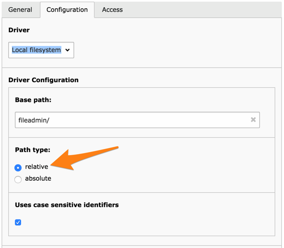
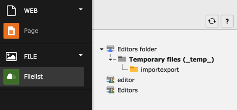

.. include:: ../../../Includes.txt

.. _access-filemounts-more:

======================
More About File Mounts
======================

File mounts require a little more description of the concepts provided
by TYPO3 CMS. All files are handled by an application layer called
the "File Abstraction Layer" (FAL). You can find more information
about the basic concepts of :ref:`FAL <fal-concepts>`.

The FAL is comprised of the following components:

Drivers
  Drivers are what makes it possible to access a given type of media
  storage. The Core provides a driver to access the local file system.
  Extensions exist that provide a driver for remote systems, like SFTP
  or platforms like Amazon S3.

Storages
  A File Storage uses a driver to connect to a given storage system.
  It is defined by a path pointing into that storage system. There can
  be several storages using the same driver and pointing to different
  "directories". The storage configuration depends on the driver it uses.

  Thanks to the storage and its driver, the user is able to browse
  files from within the TYPO3 CMS backend as if they were stored locally.

File Mounts
  As discussed before, a file mount is the element which is used to
  actually give access to users to some directories. A file mount is always
  related to a storage.

.. _access-filemounts-more-local-driver:

Paths for Local Driver Storage
==============================

The File Storages based on the "local file system" driver have an
option for relative or absolute paths.

"Relative" means that the given path is relative to the :file:`fileadmin/`
folder (or whatever other folder was configured using
:code:`$GLOBALS['TYPO3_CONF_VARS']['BE']['fileadminDir']`.
Absolute paths are full paths starting at the root of the file system
(i.e. :code:`/` on Unix systems).

.. important::

   If the :file:`fileadmin/` location is not changed, be aware
   that all files beneath it will be accessible via a browser,
   since this directory is located below the web root. This is
   perfectly fine in most cases, and indeed generally a desired
   behaviour. Just be careful what kind of files you store in that
   place, as they will be publicly accessible.

Absolute paths outside of the web root
must be explicitly declared in the global configuration option
:code:`$GLOBALS['TYPO3_CONF_VARS']['BE']['lockRootPath']`. Any absolute
path that you want to declare in a File Storage needs to have its
first part match the value of :code:`$GLOBALS['TYPO3_CONF_VARS']['BE']['lockRootPath']`
(or of the web root, which can be retrieved with :code:`\TYPO3\CMS\Core\Core\Environment::getPublicPath()`).

As an example, let's say you want to define two storages, one
pointing to :file:`/home/foo/bar` and one pointing to
:file:`/home/foo/baz`. You could declare
:code:`$GLOBALS['TYPO3_CONF_VARS']['BE']['lockRootPath']` to be
equal to :code:`/home/foo/`.

.. _access-filemounts-home-directories:

Home Directories
================

TYPO3 CMS also features the concept of "home directories". These are paths
that are automatically mounted if they are present at a path
configured in the global configuration. Thus they don't need to have a file
mount record representing them - they just need a properly named
directory to be present.

.. note::

   That last sentence is important. The directories need to exist.
   They are not created automatically.

The parent directory of user/group home directories is defined by
:code:`$GLOBALS['TYPO3_CONF_VARS']['BE']['userHomePath']` and
:code:`$GLOBALS['TYPO3_CONF_VARS']['BE']['groupHomePath']`
respectively. Let's say we define the following:

.. code-block:: php

	$GLOBALS['TYPO3_CONF_VARS']['BE']['userHomePath'] = '1:user_homes/';

The first part of the definition (before the colon :code:`:`) is
the id of a File Storage. The second part is a path relative to
that File Storage. Assuming File Storage with a uid of "1" is the
default one pointing to :file:`fileadmin/`, the following path
needs to exist on the server: :file:`/path/to/web/root/fileadmin/user_homes/`.

Then a directory needs to exist for each user. Again let's assume that
we have a user with a uid of "3" and a username of "editor", either
of those paths would have to exist:

- :file:`/path/to/web/root/fileadmin/user_homes/3/`
- :file:`/path/to/web/root/fileadmin/user_homes/3_editor/`

The second possibility is more explicit, but will break if the
username is changed.

The same goes for groups, but only using the uid.
Assuming a group called "editors" with a uid of "1",
and:

.. code-block:: php

	$GLOBALS['TYPO3_CONF_VARS']['BE']['groupHomePath'] = '1:groups/';

we have to create a directory :file:`/path/to/web/root/fileadmin/groups/1/`.

Having set up all these properties and folders, the user
should see the following when moving to the **FILE > Filelist**
module:

where only the first mount was explicitly assigned to that user.
A different icon visually distinguishes automatic file mounts.

.. note::

   If the :code:`$GLOBALS['TYPO3_CONF_VARS']['BE']['userUploadDir']` option is
   also used, it is appended to the user home directory name. Thus a value
   of :code:`_uploads` would mean that our home directories become
   :file:`/path/to/web/root/fileadmin/user_homes/3_uploads/`
   or :file:`/path/to/web/root/fileadmin/user_homes/3_editor_uploads/`.

   This does not apply to group home directories.

The concept of home directories can be efficiently combined with
the TSconfig :ref:`defaultUploadFolder <t3tsconfig:useroptions>` option,
which automatically directs all files uploaded by the user to the
given directory.
