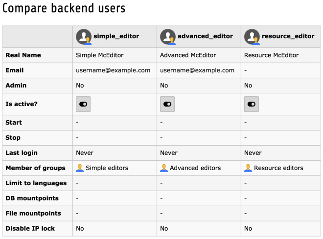
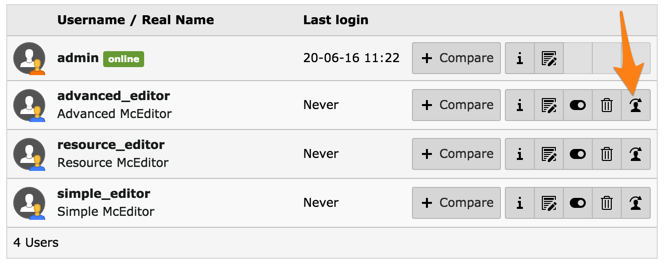
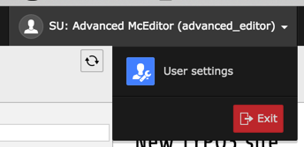

.. include:: /Includes.rst.txt
.. index:: 
   Backend; Backend users module
   Module; Backend users
.. _access-backend-users-module:

====================
Backend users module
====================

The :guilabel:`SYSTEM > Backend users` module offers a convenient way
of working with backend users and groups. It provides a list of both
users and groups. The users list can be searched and filtered.

Comparing Users or Groups
=========================

The :guilabel:`Backend users` module offers the possibility to compare users.
Just add users using the
"+ Compare" button and then hit the "Compare user list" button.
For example, this is the comparison of the three different editors
provided by the `Introduction Package`:pn::

The same functionality is available for user groups, including a comparison
of their inherited permissions.

Impersonating Users ("Switch to")
=================================

We can impersonate (switch) to a user by clicking the :guilabel:`Switch to user`
action icon:

You will then be logged in as that user (note how the user name
is prefixed with "SU" for "Simulated User"). To "switch back",
use the "Exit" button (which replaces the usual "Logout"
button).

