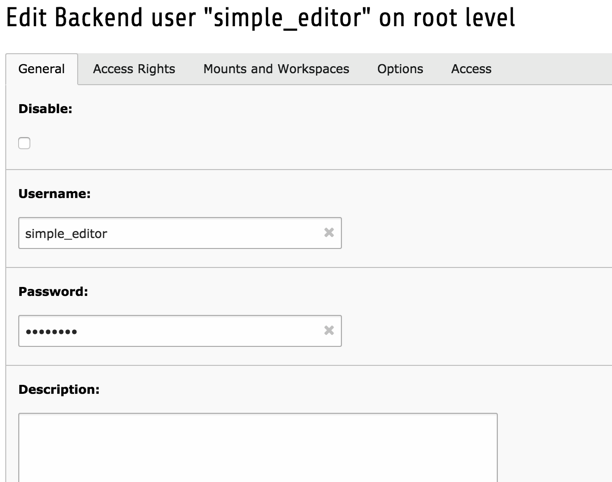
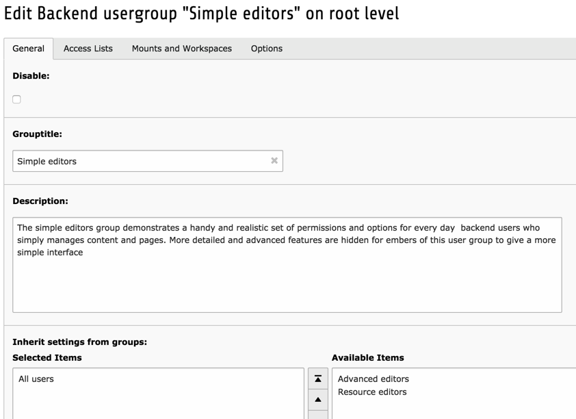
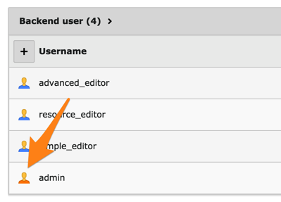
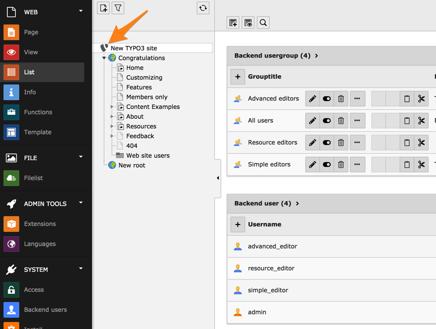

.. include:: /Includes.rst.txt

.. _access-users-groups:

================
Users and Groups
================

TYPO3 CMS features an access control system based on users and groups.

.. _access-users-groups-users:

Users
=====

Each user of the backend must be represented with a single record in
the table "be\_users". This record contains the username and password,
other meta data and some permissions settings.

The above screenshot shows a part of the editing form for the backend
user "simple\_editor" from the Introduction Package. If you have an Introduction
Package available, you can check further properties of that user. It is
part of the "Simple editors" group, has a name, an email address and
its default language for the backend is English.

It is possible to assign rights directly to a user, but it is much better
done using groups. Furthermore groups offer far more options.

.. _access-users-groups-groups:

Groups
======

Each user can also be a member of one or more groups (from the
"be\_groups" table) and each group can include sub-groups. Groups
contain the main permission settings you can set for a user. Many
users can be a member of the same group and thus share permissions.

When a user is a member of many groups (including sub-groups) then the
permission settings are added together so that the more groups a user
is a member of, the more access is granted to him.

This screenshot shows just an extract of the group editing form.
It contains many more fields!

.. _access-users-groups-admin:

The "admin" User
================

There is a special kind of backend users called "Admin".
When creating a backend user, just check the "Admin!" box in the
"General" tab and that user will become an administrator.
There's no need to set further access options for such a user:
an admin user can access every single feature of the TYPO3 CMS
backend, like the "root" user on a UNIX system.

All systems must have at least one "admin" user and most systems
should have *only* "admin" users for the developers - not for any
editor. Make sure to *not* share TYPO3 accounts with multiple users
but create dedicated accounts for everyone.
Not even "super users" should be allowed "admin" access since that
will most likely grant them access to more than they need.

Admin users are differentiated with an orange icon.

.. note::

   There's no other level between admin and ordinary users.
   This seems to be a strong limitation, especially
   when you consider that ordinary users may not access TypoScript
   templates.

   However, there is a security reason for this. From a TypoScript template,
   you can call a PHP script. So - in effect - a user with access to
   TypoScript can run arbitrary PHP code on the server, for example
   in order to create an admin account for himself. This type of escalation
   cannot be allowed.

.. _access-users-groups-location:

Location of Users and Groups
============================

Since both backend users and backend groups are represented by records
in the database, they are edited just as any other record in the
system. However backend users and groups are configured to exist
*only* in the root of the page tree where *only* admin users have
access:

Records located in the page tree root are identified by having their
"pid" fields set to zero. The "pid" field normally contains the
relation to the page where a record belongs. Since no pages can have
the id of zero, this is the id of the root. Notice that only "admin"
users can edit records in the page root!

If you need non-admin users to create new backend users, have a look
at the TYPO3 system extension `sys_action` for a possible solution.
