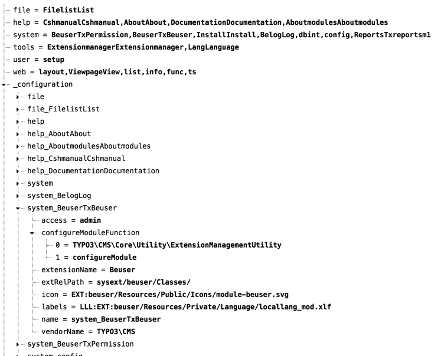

.. include:: ../../../Includes.txt

.. _backend-modules-api:

==================
Backend Module API
==================

As for frontend plugins, you can use :ref:`Fluid templates <t3extbasebook:fluid-start>` to
create the view and :ref:`controller actions <t3extbasebook:controlling-the-flow-with-controllers>`
for the functionality.

.. tip::

   The :ref:`extension builder <extension-builder>` can be used to generate basic code
   for a new extension. You can also use this to create backend modules.

.. _backend-modules-api-registration:

Registering new Modules
=======================

Modules added by extensions are registered in the file :ref:`ext_tables.php <ext-tables.php>`
using the following API:

.. code-block:: php

    // Module System > Backend Users
    \TYPO3\CMS\Extbase\Utility\ExtensionUtility::registerModule(
        'Beuser',
        'system',
        'tx_Beuser',
        'top',
        [
            \TYPO3\CMS\Beuser\Controller\BackendUserController::class => 'index, show, addToCompareList, removeFromCompareList, removeAllFromCompareList, compare, online, terminateBackendUserSession, initiatePasswordReset',
            \TYPO3\CMS\Beuser\Controller\BackendUserGroupController::class => 'index, addToCompareList, removeFromCompareList, removeAllFromCompareList, compare'
        ],
        [
            'access' => 'admin',
            'icon' => 'EXT:beuser/Resources/Public/Icons/module-beuser.svg',
            'labels' => 'LLL:EXT:beuser/Resources/Private/Language/locallang_mod.xlf',
        ]
    );

Here the module ``tx_Beuser`` is declared as a submodule of the already existing
main module ``system``.

Parameters:

#. The first argument contains the extension name (in UpperCamelCase)
   or the extension key (in lower_underscore). Since TYPO3 10.0,
   you should no longer prepend the vendor name here, see
   :doc:`t3core:Changelog/10.0/Deprecation-87550-UseControllerClassesWhenRegisteringPluginsmodules`.
#. **Main module** name, in which the new module will be placed,
   for example 'web' or 'system'.
#. **Submodule key**: This is an identifier for your new module.
#. **Position** of the module: Here, the module should be placed at the ``top`` of the main
   module, if possible. If several modules are declared at the same position, the last one wins.
   The following positions are possible:

   * ``top``: the module is prepended to the top of the submodule list
   * ``bottom`` or empty string: the module is appended to the end of the submodule list
   * ``before:<submodulekey>``: the module is inserted before the submodule identified by ``<submodulekey>``
   * ``after:<submodulekey>``: the module is inserted after the submodule identified by ``<submodulekey>``

#. Allowed **controller => action** combinations. Since TYPO3 10.0 you should
   use fully qualified class names here, see
   :doc:`t3core:Changelog/10.0/Deprecation-87550-UseControllerClassesWhenRegisteringPluginsmodules`.
#. **Module configuration**: The following options are available:

   * ``access``: can contain several, separated by comma

     * ``admin``: the module is accessible to admins only
     * ``user``: the module can be made accessible per user
     * ``group``: the module can be made accessible per usergroup

   * Module ``icon``
   * A language file containing ``labels`` like the module title and description,
     for building the module menu and for the display of information in the
     **About Modules** module (found in the main help menu in the top bar).
     The `LLL:` prefix is mandatory here and is there for historical reasons.

.. note::
   When registering frontend plugins, you must define which actions are not to be stored
   in the cache. This is not necessary for backend modules, because the actions are
   generally not being cached in the backend.

Registering a Toplevel Module
=============================

Toplevel modules like "Web" or "File" are registered with the same API:

.. code-block:: php

    \TYPO3\CMS\Extbase\Utility\ExtensionUtility::registerModule(
        'MyExtension',
        'mysection',
        '',
        '',
        [],
        [
            'access' => '...',
            'icon' => '...',
            'labels' => '...',
        ]
    );

This adds a new toplevel module ``mysection``. This identifier can now
be used to add submodules to this new toplevel module:

.. code-block:: php

    \TYPO3\CMS\Extbase\Utility\ExtensionUtility::registerModule(
        'MyExtension',
        'mymodule1',
        'mysection',
        '',
        [],
        [
            'access' => '...',
            'labels' => '...'
        ]
    );

.. note::
   The main module name should contain only lowercase characters. Do not use an underscore or dash.

.. _backend-modules-api-tbemodules:

$TBE\_MODULES
=============

When modules are registered, they get added to a global array called
:php:`$GLOBALS['TBE_MODULES']`. It contains the list of all registered
modules, their configuration and the configuration of any existing
navigation component (the components which may be loaded into the
navigation frame).

:php:`$GLOBALS['TBE_MODULES']` can be explored using the
**SYSTEM > Configuration** module.

The list of modules is parsed by the class :php:`\TYPO3\CMS\Backend\Module\ModuleLoader`.

Configuration With TypoScript
=============================

Backend modules can, like frontend plugins, be configured via TypoScript. While the frontend plugins
are configured with :ts:`plugin.tx_[pluginkey]`, for the configuration of the backend
:ts:`module.tx_[pluginkey]` is used.

Example for configuring the paths of Fluid files:

.. code-block:: typoscript

   module.tx_example {
       view {
           templateRootPaths {
               10 = EXT:example/Resources/Private/Backend/Templates/
           }
           layoutRootPaths {
              10 = EXT:example/Resources/Private/Backend/Layouts/
           }
       }
   }
