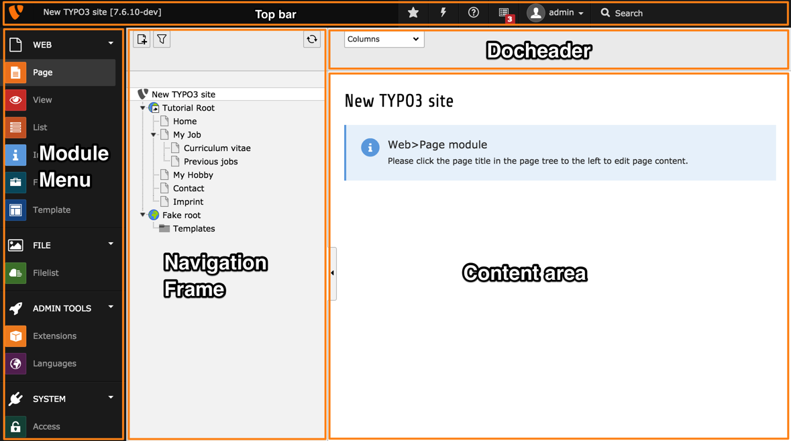

.. include:: ../../../Includes.txt

.. _backend-modules-structure:

=================
Backend Interface
=================

The backend interface is essentially driven by the "backend"
system extension and extended by many other system extensions.

It is divided into the following main areas:

Top bar
  The top bar is always present. It is itself divided into two
  areas: the logo and top bar tools.

  The logo can be changed using the :php:`$GLOBALS['TBE_STYLES']['logo']`
  setting. Additional top bar tools can be registered using
  :php:`$GLOBALS['TYPO3_CONF_VARS']['BE']['toolbarItems']`.

Module menu
  This is the main navigation. All modules are structured in main
  modules (which can be collapsed) and submodules which is where
  the action really happens.

  The module menu can be opened or closed by using the icon on the top left.

  New main or submodules are registered using the
  :php:`\TYPO3\CMS\Extbase\Utility\ExtensionUtility::registerModule()`
  API.

  .. note::

     In the TYPO3 CMS world, "module" is typically used for
     the backend. Extension components which add features in the frontend
     are referred to as "plugins".

Navigation frame
  Any backend module may have a navigation frame or not. This frame
  will typically display the page tree or the folder tree, but
  custom navigation frames are possible.

  The current location (i.e. page or frame) is carried over between
  navigation frames when changing modules. This means, for example, that
  when you move from the **WEB > Page** module to the **WEB > List**
  module, the same page stays selected in the page tree.

Docheader
  This part is always located above the Content area. It will generally
  contain a drop-down menu called the "Function menu", which allows to
  navigate into the various functions offered by the module. When editing
  it will also contain all the buttons necessary for saving, closing or
  reverting. It may contain additional buttons for shortcuts
  or any specific feature needed by the module.

Content area
  This is the actual work area. Any information to show or content
  to edit will be displayed here.

Contextual menus
  (Right) clicking on record icons will often reveal a contextual menu.
  New functions can be added to the contextual menus, but the
  mechanisms vary: the page tree behaves differently than the
  rest of the backend.

  .. figure:: ../../../Images/BackendModulesContextualMenu.png
     :alt: A typical contextual menu appear when clicking on a record icon
