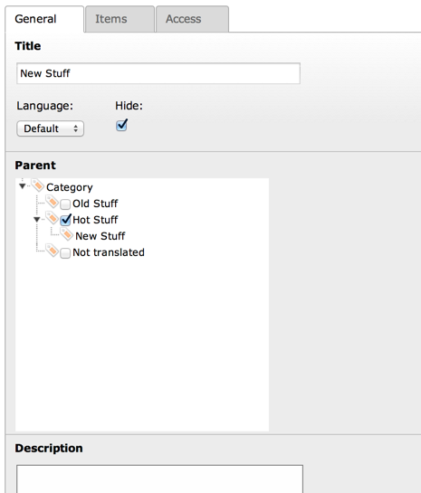
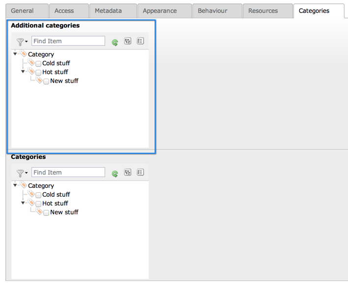

.. ==================================================
.. FOR YOUR INFORMATION
.. --------------------------------------------------
.. -*- coding: utf-8 -*- with BOM.

.. include:: ../../Includes.txt

.. _categories:

System categories
-----------------

Since version 6.0, TYPO3 CMS provides a generic categorization system.
Categories can be created in the backend like any other type of record.
Any table can be made categorizable and thus be attached to system
categories.

Since version 6.2, pages, content elements and files are categorizable by default.

.. _categories-using:

Using categories
^^^^^^^^^^^^^^^^

.. _categories-managing:

Managing categories
"""""""""""""""""""

System categories are defined just like any other record. Each category
can have a parent, making for a tree-like structure.

   A category with a parent defined

The "items" tab shows all related records, i.e. all records that have been marked
as belonging to this category.

.. _categories-activating:

Making a table categorizable
""""""""""""""""""""""""""""

There are two way to activate categories on a given table. The first one is to
use the global setting :code:`$GLOBALS['TYPO3_CONF_VARS']['SYS']['defaultCategorizedTables']`.
It is a comma-separated list of tables for which categories should be activated.
The default value is :code:`pages,tt_content,sys_file_metadata`.

.. important::

   It is recommended to avoid changing this setting. You should rather use the
   API described just below so as to avoid overriding a default which may
   change in future versions of TYPO3 CMS. The API is also more powerful.

The second way is to call :code:`\TYPO3\CMS\Core\Utility\ExtensionManagementUtility::makeCategorizable()`.
This method adds a new entry into the registry managed by
:ref:`\\TYPO3\\CMS\\Core\\Category\\CategoryRegistry <t3cmsapi:TYPO3\\CMS\\Core\\Category\\CategoryRegistry>`.
The registry will take care of adding the relevant :ref:`$TCA <t3tca:start>` definition to
create a field for making relations to the system categories.
The call to :code:`makeCategorizable()` must be located in an extension's
:file:`ext_tables.php` file or (since TYPO3 CMS 6.2.1) in a file from
the :file:`Configuration/TCA/Overrides` folder.

The default :code:`$GLOBALS['TCA']` structure provided by the registry
can be overridden by an array options passed to :code:`makeCategorizable()`.
The example below illustrates how this is done:

.. code-block:: php

	// Add an extra categories selection field to the pages table
	\TYPO3\CMS\Core\Utility\ExtensionManagementUtility::makeCategorizable(
		'examples',
		'pages',
		// Do not use the default field name ("categories"), which is already used
		'tx_examples_cats',
		array(
			// Set a custom label
			'label' => 'LLL:EXT:examples/Resources/Private/Language/locallang.xlf:additional_categories',
			// This field should not be an exclude-field
			'exclude' => FALSE,
			// Override generic configuration, e.g. sort by title rather than by sorting
			'fieldConfiguration' => array(
				'foreign_table_where' => ' AND sys_category.sys_language_uid IN (-1, 0) ORDER BY sys_category.title ASC',
				'treeConfig' => [
				   'rootUid' => 7,
				],
			),
			// string (keyword), see TCA reference for details
			'l10n_mode' => 'exclude',
			// list of keywords, see TCA reference for details
			'l10n_display' => 'hideDiff',
		),
	);

The above code will add a categories field to the "pages" table,
which will be called `tx_examples_cats`. The :php:`fieldConfiguration`
part of the options array is the one which overrides the base
:php:`$TCA` structure. In this case we would like categories to be
listed alphabetically instead of using the "sorting" field.

There is another option `treeConfig` with :php:`'rootUid' => 7,`.
This is usefull if you want to start the category tree at a special category.
Just provide the uid of the category to start with.

If no :code:`label` part is set in the options array, the field will
be labelled "Categories".

By default, the field will be an exclude-field. The :code:`exclude` part
can be used to override this.

This is the result of the above code:

   The newly added field to define relations to categories (on top of the default one)

.. _categories-flexforms:

Using categories in flexforms
"""""""""""""""""""""""""""""

It is possible to create relations to categories also in
:ref:`Flexforms <t3tca:columns-flex>`, although this has
to be done manually since no API exists for this.

The code will look something like:

.. code-block:: xml

	<settings.categoriesList>
		<TCEforms>
		<exclude>1</exclude>
		<label>Categories:</label>
		<config>
			<type>select</type>
			<autoSizeMax>50</autoSizeMax>
			<foreign_table>sys_category</foreign_table>
			<foreign_table_where> AND sys_category.sys_language_uid IN (-1, 0) ORDER BY sys_category.sorting ASC</foreign_table_where>
			<MM>sys_category_record_mm</MM>
			<MM_opposite_field>items</MM_opposite_field>
			<MM_match_fields>
				<tablenames>tt_content</tablenames>
				<fieldname>tx_myextension_categories</fieldname>
			</MM_match_fields>
			<maxitems>9999</maxitems>
			<renderMode>tree</renderMode>
			<size>10</size>
			<treeConfig>
				<appearance>
					<expandAll>1</expandAll>
					<showHeader>1</showHeader>
				</appearance>
				<parentField>parent</parentField>
			</treeConfig>
		</config>
		</TCEforms>
	</settings.categoriesList>

Properties :code:`tablenames` and :code:`fieldname` would need
to be adjusted.

.. _categories-api:

System categories API
^^^^^^^^^^^^^^^^^^^^^

Beyond :code:`makeCategorizable()`, class
:ref:`\\TYPO3\\CMS\\Core\\Category\\CategoryRegistry <t3cmsapi:TYPO3\\CMS\\Core\\Category\\CategoryRegistry>`
has many other methods related to the management of
categorized table. The best way to discover is to follow
the link above and explore the methods provided by this class.
They are all quite specialized and should not be needed
most of the time.

.. _categories-collections:

Category collections
^^^^^^^^^^^^^^^^^^^^

The :ref:`\\TYPO3\\CMS\\Core\\Category\\Collection\\CategoryCollection <t3cmsapi:TYPO3\\CMS\\Core\\Category\\Collection\\CategoryCollection>`
classe provides the API for retrieving records related
to a given category. Since TYPO3 CMS 6.2, it is extended by class
:ref:`\\TYPO3\\CMS\\Frontend\\Category\\Collection\\CategoryCollection <t3cmsapi:TYPO3\\CMS\\Frontend\\Category\\Collection\\CategoryCollection>`
which does the same job but in the frontend, i.e.
respecting all enable fields and performing version
and language overlays.

The main method is :code:`load()` which will return a
traversable list of items related to the given category.
Here is an example usage, taken from the RECORDS content object:

.. code-block:: php

	$collection = \TYPO3\CMS\Frontend\Category\Collection\CategoryCollection::load(
		$aCategory,
		TRUE,
		$table,
		$relationField
	);
	if ($collection->count() > 0) {
		// Add items to the collection of records for the current table
		foreach ($collection as $item) {
			$tableRecords[$item['uid']] = $item;
			// Keep track of all categories a given item belongs to
			if (!isset($categoriesPerRecord[$item['uid']])) {
				$categoriesPerRecord[$item['uid']] = array();
			}
			$categoriesPerRecord[$item['uid']][] = $aCategory;
		}
	}

As all collection classes in the TYPO3 CMS Core implement the
Iterator interface, it is also possible to use expected methods like
:code:`next()`, :code:`rewind()`, etc. Note that methods such as
:code:`add()` will only add items to the collection temporarily.
The relations are not persisted in the database.

.. _categories-typoscript:

Usage with TypoScript
^^^^^^^^^^^^^^^^^^^^^

*(since TYPO3 CMS 6.2)*

In the frontend, it is possible to get collections of
categorized records loaded into a RECORDS content object
for rendering. Check out the
:ref:`categories property <t3tsref:cobj-records-properties-categories>`.

The HMENU object also has a :ref:`"categories" special type <t3tsref:hmenu-special-categories>`,
to display a menu based on categorized pages.
