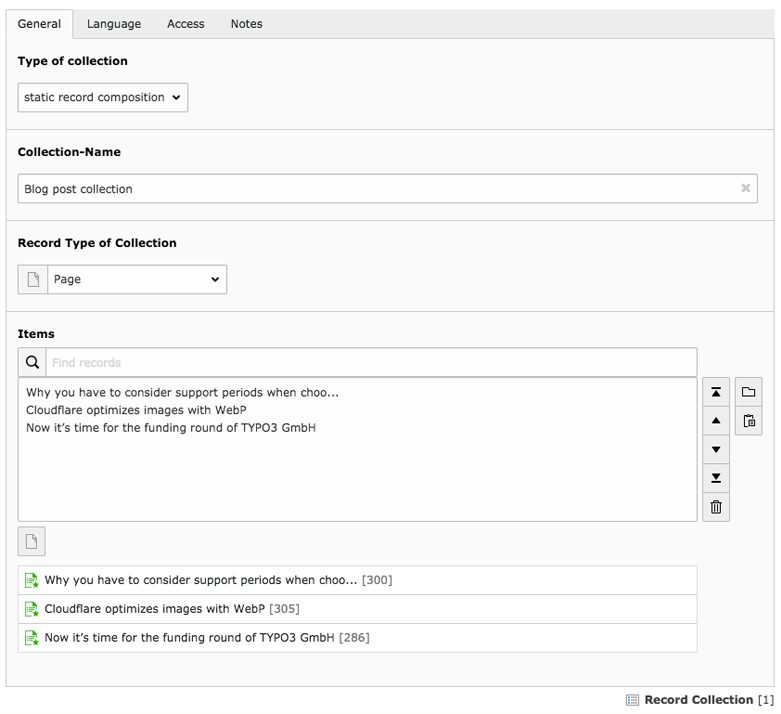
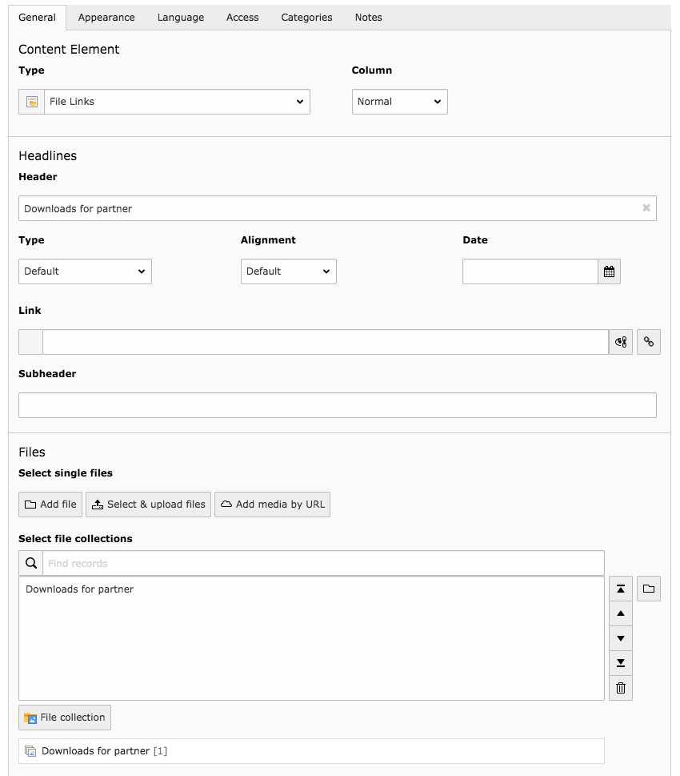
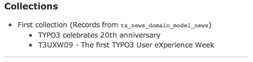

.. ==================================================
.. FOR YOUR INFORMATION
.. --------------------------------------------------
.. -*- coding: utf-8 -*- with BOM.

.. include:: ../../Includes.txt

.. _collections:

System collections
------------------

Since TYPO3 CMS 4.7 there exists a generic interface for managing
collections of records. The :ref:`File Abstraction Layer <t3fal:start>` itself extends
this mechanism for managing file collections.

.. _collections-records:

Record collections
^^^^^^^^^^^^^^^^^^

Record collections are managed via the TYPO3 backend.
They can only be created in Folders.

   A collection of news items

.. note::

   In the above image, the third record in the collection is actually a page.
   This will be ignored in all process using the Collections API, because the
   chosen table prevails.

Record collections are stored in the "sys_collection" table. The selected records
are stored in the "sys_collection_entries" table.

Record collections can also have a type. Only the "static" type exits so far.
Others might be added in the future.

.. _collections-files:

File collections
^^^^^^^^^^^^^^^^

File collections are similar in principle, but reference files.
They are used by the "File links" (download) content element.

   A "File links" content element referencing a file collection

File collections are stored in the "sys_file_collection" table. The selected files
are stored in the "sys_file_reference" table.

Note that a file collection may also reference a folder, in which case
all files inside the folder will be returned when calling that collection.

.. figure:: ../../Images/Collections/FolderCollection.png
   :alt: A folder collection

   A file collection referencing a folder

.. _collections-api:

Collections API
^^^^^^^^^^^^^^^

The TYPO3 CMS Core provides an API to enable usage of collections
inside extensions. The most important classes are:

:code:`\TYPO3\CMS\Core\Collection\RecordCollectionRepository`
  Used to retrieve collections. It's not exactly an Extbase repository
  but functions in a similar way. The default "find" methods refer
  to the "sys_collection" table and will fetch "static"-type collections.
  Method :code:`findByTypeAndTableName()` makes it possible to fetch
  collections from other tables and of a different type.

:code:`\TYPO3\CMS\Core\Collection\StaticRecordCollection`
  This class models the static record collection. It is important to note
  that collections returned by the repository (described above) are "empty".
  If you need to access their records, you need to load them first, using
  method :code:`loadContents()`. On top of some specific API methods,
  this class includes all setters and getters that you may need to access
  the collection's data. For accessing the selected records, just loop
  on the collection (see example).

:code:`\TYPO3\CMS\Core\Resource\Collection\StaticFileCollection`
  Similar to the static record collection, but for files.

:code:`\TYPO3\CMS\Core\Resource\Collection\FolderBasedFileCollection`
  Again similar, but for file collections based on a folder.

.. _collections-example:

Example
^^^^^^^

The `"examples" extension <http://typo3.org/extensions/repository/view/examples>`_
provides a simple frontend plugin to demonstrate
usage of collections. Here is what happens in the controller:

.. code-block:: php
   :emphasize-lines: 13-15

	/**
	 * Renders the list of all existing collections and their content
	 *
	 * @return void
	 */
	public function indexAction() {
		// Get all existing collections
		/** @var \TYPO3\CMS\Core\Collection\AbstractRecordCollection $collections */
		$collections = $this->collectionRepository->findAll();

		// Load the records in each collection
		/** @var \TYPO3\CMS\Core\Collection\StaticRecordCollection $aCollection */
		foreach ($collections as $aCollection) {
			$aCollection->loadContents();
		}

		// Assign the "loaded" collections to the view
		$this->view->assign('collections', $collections);
	}

The base is code is quite simple: all collections are fetched and passed
to the view. The one specific step is the loop over all collections to load
their referenced records. Remember that a collection is otherwise "empty".

In the view we can then either use collection member variables as usual
(like their title) or put them directly in a loop to iterate over the
record selection:

.. code-block:: xml

	<f:section name="main">
		<ul>
			<f:for each="{collections}" as="collection">
				<li>
					{collection.title} (Records from <code>{collection.itemTableName}</code>)
					<ul>
						<f:for each="{collection}" as="record">
							<li>{record.title}</li>
						</f:for>
					</ul>
				</li>
			</f:for>
		</ul>
	</f:section>

Note that the above code is a bit rough as it assumes that each record
has a "title" property. This may of course not be the case and proper
checks should be made.

Here is what the result may look like (the exact result will obviously
depend on the content of the selection):

   Typical output from the "Collections" plugin of extension "examples"

