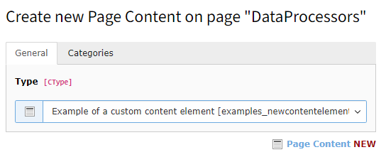
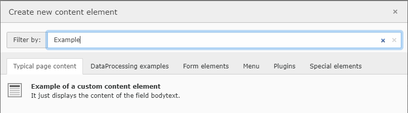
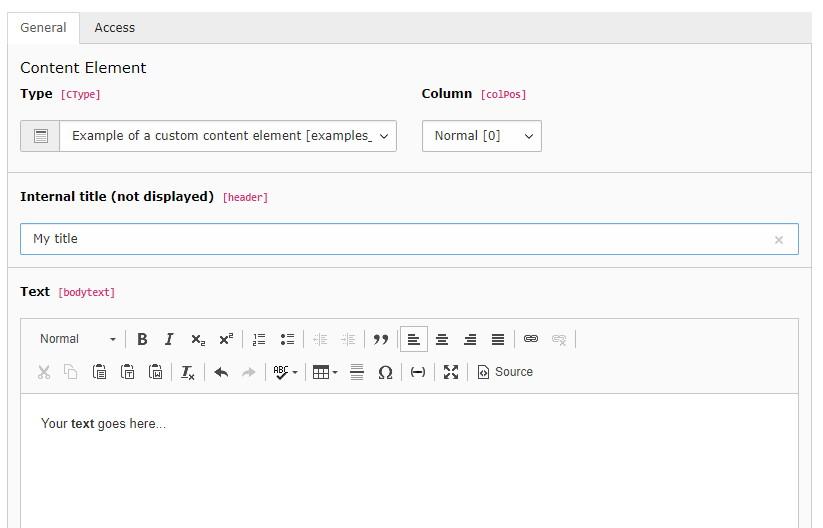
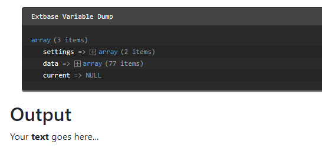
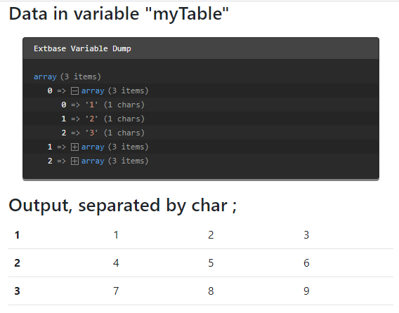

.. include:: /Includes.rst.txt
.. index:: 
   Content elements; custom
   pair: Create; Content elements
.. _adding-your-own-content-elements:

=================================
Creating a custom content element
=================================

This page explains how to create your own custom content element types. These
are comparable to the predefined content elements supplied by TYPO3. The latter
can be found in the system extension `fluid_styled_content`.

A content element can be based on fields already available in the `tt_content`
table.

It is also possible to add extra fields to the `tt_content`
table, see :ref:`ConfigureCE-Extend-tt_content`.

The data of the content element is then passed to a TypoScript object, in most
cases to a :ref:`cobj-fluidtemplate`.

Some data might need additional :ref:`ConfigureCE-DataProcessors`. Data
processors are frequently used for example to process files
(:ref:`t3tsref:FilesProcessor`) or to fetch related records
(:ref:`t3tsref:DatabaseQueryProcessor`).

A data processor can also be used to convert a string to an array,
as is done for example in the *table* content element with the field `bodytext`.

In these cases Fluid does not have to deal with these manipulations or transformation.

You can find the example below in the TYPO3 Documentation Team extension
`examples <https://extensions.typo3.org/extension/examples/>`__.

Prerequisites
=============

The following examples require the system extension
:ref:`fluid_styled_content <fsc:start>`.

It can be installed via Composer with:

.. code-block:: console

   composer req typo3/cms-fluid-styled-content

.. index:: Extension devolopment; Custom content element
.. _AddingCE-use-an-extension:

Use an extension
================

We recommend to create your own extension for adding content elements.
The following example uses the extension key `examples`.

Here you can find information on how to
:ref:`create an extension <extension-create-new>`.

.. index:: Content element; Registration
.. _RegisterCE:
.. _AddingCE-TCA-Overrides-tt_content:

Register the content element
============================

First we need to define the key of the new content element type. We use
`examples_newcontentelement` throughout the simple example.

Next the key needs to be added to the select field `CType`. This will make it
available in :guilabel:`Type` dropdown in the backend.

The following call needs to be added to the file
:file:`Configuration/TCA/Overrides/tt_content.php`.

.. code-block:: php

   // Adds the content element to the "Type" dropdown
   \TYPO3\CMS\Core\Utility\ExtensionManagementUtility::addTcaSelectItem(
      'tt_content',
      'CType',
       [
           'LLL:EXT:examples/Resources/Private/Language/locallang.xlf:examples_newcontentelement_title',
           'examples_newcontentelement',
           'content-text',
       ],
       'textmedia',
       'after'
   );

Now the new content element is available in the backend form. However it
currently contains no fields but the CType field.

.. index:: Content element; Icon
.. _AddingCE-Icon:

About the icon
--------------

You can either use an existing `icon from the TYPO3 core
<https://typo3.github.io/TYPO3.Icons/icons/content.html>`__  or register your
own icon using the :ref:`Icon API <icon>`. In this example we use the icon
`content-text`, the same icon as the :guilabel:`Regular Text Element` uses.

.. index:: Content element; Wizard
.. _AddingCE-PageTSconfig:

Add it to the new content element wizard
========================================

Content elements in the :guilabel:`New Content Element Wizard` are easier
to find for editors. It is therefore advised to add the new content element
to this wizard.

.. code-block:: typoscript

   mod.wizards.newContentElement.wizardItems {
      // add the content element to the tab "common"
      common {
         elements {
            examples_newcontentelement {
               iconIdentifier = content-text
               title = LLL:EXT:examples/Resources/Private/Language/locallang.xlf:examples_newcontentelement_title
               description = LLL:EXT:examples/Resources/Private/Language/locallang.xlf:examples_newcontentelement_description
               tt_content_defValues {
                  CType = examples_newcontentelement
               }
            }
         }
         show := addToList(examples_newcontentelement)
      }
   }

The content element wizard configuration is described in detail in
:ref:`content-element-wizard`.

.. index:: Content element; Backend form
.. _ConfigureCE-Fields:

Configure the backend form
==========================

Then you need to configure the backend fields for your new content element in
the file :file:`Configuration/TCA/Overrides/tt_content.php`:

.. code-block:: php

   // Configure the default backend fields for the content element
   $GLOBALS['TCA']['tt_content']['types']['examples_newcontentelement'] = [
      'showitem' => '
            --div--;LLL:EXT:core/Resources/Private/Language/Form/locallang_tabs.xlf:general,
               --palette--;;general,
               header; Internal title (not displayed),
               bodytext;LLL:EXT:frontend/Resources/Private/Language/locallang_ttc.xlf:bodytext_formlabel,
            --div--;LLL:EXT:core/Resources/Private/Language/Form/locallang_tabs.xlf:access,
               --palette--;;hidden,
               --palette--;;access,
         ',
      'columnsOverrides' => [
         'bodytext' => [
            'config' => [
               'enableRichtext' => true,
               'richtextConfiguration' => 'default',
            ],
         ],
      ],
   ];

Now the backend form for the new content elements looks like this:

.. index:: Content element; Frontend rendering
.. _ConfigureCE-Frontend:

Configure the frontend rendering
================================

The output in the frontend gets configured in the setup TypoScript. See
`Add TypoScript to your extension <t3tsref:extdev-add-typoscript>` about how
to add TypoScript.

In the :file:`examples` extension the TypoScript can be found at
:file:`Configuration/TypoScript/setup.typoscript`

The Fluid templates for our custom content element will be saved in our
extension. Therefore we need to add the path to the
:ref:`t3tsref:cobj-fluidtemplate-properties-templaterootpaths`:

.. code-block:: typoscript

   lib.contentElement {
       templateRootPaths.200 = EXT:examples/Resources/Private/Templates/
   }

You can use any index (`200` in this example), just make sure it is unique.
If needed you can also add paths for partials and layouts.

Now you can register the rendering of your custom content element:

.. code-block:: typoscript

   tt_content {
       examples_newcontentelement =< lib.contentElement
       examples_newcontentelement {
           templateName = NewContentElement
       }
   }

The :`lib.contentElement` path is defined in file
:file:`EXT:fluid_styled_content/Configuration/TypoScript/Helper/ContentElement.typoscript`.
and uses a :ref:`t3tsref:cobj-fluidtemplate`.

We reference :ref:`fluid_styled_contents <fsc:start>`
:typoscript:`lib.contentElement` from our new content element and only change
the Fluid template to be used.

The Fluid template is configured by the
:ref:`t3tsref:cobj-fluidtemplate-properties-templatename` property as
`NewContentElement`.

This will load a :file:`NewContentElement.html` template file from the path
defined at the :typoscript:`templateRootPaths`.

In the example extension you can find the file at :file:``

`tt_content` fields can now be used in the Fluid template by accessing them via the `data` variable.
The following example shows the text entered in the richtext enabled field `bodytext`, using the html
saved by the richtext editor:

.. code-block:: html

   <html data-namespace-typo3-fluid="true"
      xmlns:f="http://typo3.org/ns/TYPO3/CMS/Fluid/ViewHelpers">
      <h2>Output.</h2>
      
<f:format.html>{data.bodytext}</f:format.html>

   </html>

All fields of the table :php:`tt_content` are now available in the variable
`data`. Since we saved the content of `bodytext` in the richt text editor we
have to run it through `f:format.html` to resolve all links and other
formatting. Read more about :ref:`fluid`.

.. tip::

   During development you can output all available variables in a Fluid
   template by adding :html:`<f:debug>{_all}</f:debug>`

Below you can see the example output of the new content element and a
dump of all available data:

.. _AddingCE-Extended-Example:

Extended example: Extend tt_content and use data processing
===========================================================

You can find the complete example in the  TYPO3 Documentation Team extension
`examples <https://extensions.typo3.org/extension/examples/>`__. The steps for
creating a simple new content element as above need to be repeated. We use the
key *examples_newcontentcsv* in this example.

We want to output comma separated values (CSV) stored in the field bodytext.
As different programs use different separators to store CSV we want to make
the separator configurable.

.. index::
   pair: Content element; Extending tt_content
   Extension devolopment; Extending tt_content
.. _ConfigureCE-Extend-tt_content:

Extending tt_content
--------------------

If the available fields in the table tt_content are not sufficient you can add
your own fields. In this case we need a field :php:`tx_examples_separator` from 
which to choose the desired separator.

.. index::
   Files;EXT:{extkey}/ext_tables.sql
   Tables;tt_content
.. _ConfigureCE-Extend-tt_content-database:

Extending the database schema
~~~~~~~~~~~~~~~~~~~~~~~~~~~~~

First we extend the database schema by adding the following to the file
:file:`ext_tables.sql`:

.. code-block:: sql

   CREATE TABLE tt_content (
      tx_examples_separator VARCHAR(255) DEFAULT '0' NOT NULL,
   );

.. tip::

   Remember to do a database compare in the Install Tool after changing the
   database schema.

.. index::
   pair: Content element; TCA
   Files; EXT:{extkey}/Configuration/TCA/Overrides/tt_content.php
.. _ConfigureCE-Extend-tt_content-tca:

Defining the field in the TCA
~~~~~~~~~~~~~~~~~~~~~~~~~~~~~

Then we add the new field to the TCA definition in file 
:file:`Configuration/TCA/Overrides/tt_content.php`::

   $temporaryColumn = [
      'tx_examples_separator' => [
         'exclude' => 0,
         'label' => 'LLL:EXT:examples/Resources/Private/Language/locallang_db.xlf:tt_content.tx_examples_separator',
         'config' => [
            'type' => 'select',
            'renderType' => 'selectSingle',
            'items' => [
               ['Standard CSV data formats', '--div--'],
               ['Comma separated', ','],
               ['Semicolon separated', ';'],
               ['Special formats', '--div--'],
               ['Pipe separated (TYPO3 tables)', '|'],
               ['Tab separated', "\t"],
            ],
            'default' => ','
         ],
      ],
   ];
   \TYPO3\CMS\Core\Utility\ExtensionManagementUtility::addTCAcolumns('tt_content', $temporaryColumn);
   
You can read more about defining fields via TCA in the :ref:`t3tca:start`.

Now the new field can be used in your Fluid template just like any other 
tt_content field:

.. code-block:: html

   <h2>Content separated by sign {data.tx_examples_separator}</h2>

.. note::
   
   As we are working with pure Fluid without Extbase here the new field can 
   be used right away. It need not be added to a model.

.. index:: pair: Content element; Data processing
.. _ConfigureCE-DataProcessors:

Data processing
---------------

Data processors can be used for data manipulation or fetching before the 
variables get passed on to the template. 

This is done in the 
:ref:`dataProcessing <t3tsref:cobj-fluidtemplate-properties-dataprocessing>`
section where you can add an arbitrary number of data processors.

You can see a complete list of available
:ref:`data processors in the Typoscript Reference
<t3tsref:cobj-fluidtemplate-properties-dataprocessing>` or write a :ref:`custom
data processor <content-elements-custom-data-processor>`.

Each processor has to be added with a fully qualified class name and optional
parameters to be used in the data processor:

.. code-block:: typoscript

   tt_content {
      examples_newcontentcsv =< lib.contentElement
      examples_newcontentcsv {
         templateName = DataProcCsv
         dataProcessing.10 = TYPO3\CMS\Frontend\DataProcessing\CommaSeparatedValueProcessor
         dataProcessing.10 {
            fieldName = bodytext
            fieldDelimiter.field = tx_examples_separator
            fieldEnclosure = "
            maximumColumns.field = imagecols
            as = myTable
         }
      }
   }

You can now iterate over the variable `myTable` in the Fluid template, in this
example :file:`Resources/Private/Templates/ContentElements/DataProcCsv.html`

.. code-block:: html

   <h2>Output, separated by char {data.tx_examples_separator}</h2>
   <table class="table table-hover">
      <f:for each="{myTable}" as="columns" iteration="i">
         <tr>
            <th scope="row">{i.cycle}</th>
            <f:for as="column" each="{columns}">
               <td>{column}</td>
            </f:for>
         <tr>
      </f:for>
   </table>

The output would look like this (we added a debug of the variable `myTable`):

