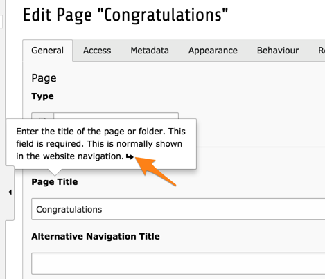
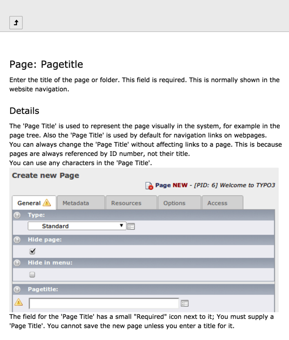
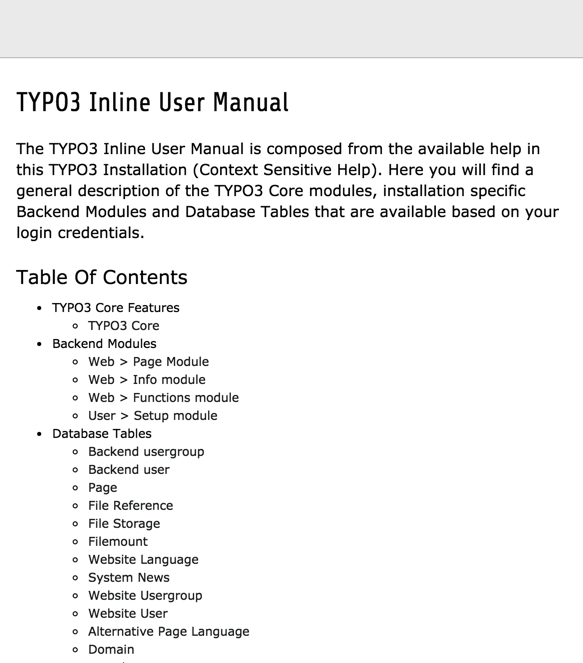

.. include:: ../../Includes.txt

.. _csh:

============================
Context Sensitive Help (CSH)
============================

TYPO3 CMS offers a full API for adding Context Sensitive Help to
backend modules and - especially - to all database tables and fields.
CSH then appears either as a help icon in the docheader (for modules)
or as a popup on field labels when editing database records.
The text is meant to help the user understand what the module does
or what the database field means.

   Viewing the context sensitive help of the "Title" field of the "pages" table

When hovering over a help icon or a field label with CSH,
the cursor transforms into a question mark. Clicking on the
element triggers the appearance of the popup window.

If the CSH contains more information, the bubble help displays a small
icon after the text (as in the screenshot above). Clicking on that icon
opens a popup window with lengthier explanations, possible enriched
with images.

   Popup help window for the "Title" field of the "pages" table

Clicking on the "Back" icon at the top of the popup window leads
to a table of contents of all the available CSH.

   Popup help window with the table of contents of all available help topics

.. toctree::
   :maxdepth: 5
   :titlesonly:
   :glob:

   TcaDescr/Index
   CshFiles/Index
   ImplementingCsh/Index

