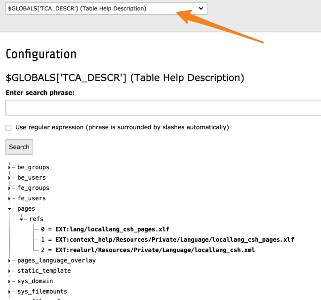

.. include:: /Includes.rst.txt

.. _csh-tca-descr:

=====================
The $TCA\_DESCR Array
=====================

The global array :php:`$TCA_DESCR` is reserved to contain CSH labels. CSH
labels are loaded as they are needed. Thus the class rendering the
form will make an API call to the global language object to have the
CSH labels loaded - if any - for the relevant table.

Basically, the :php:`$TCA_DESCR` array contains references to the
registered language files. As it gets used, it is filled with the
actual labels. This task is performed by method
:php:`\TYPO3\CMS\Core\Localization\LanguageService::loadSingleTableDescription()`.

The content of the :php:`$TCA_DESCR` array can be reviewed in the
**SYSTEM > Configuration** module:

   List of file references for the CSH labels of the "pages" table

As can be seen, several files can be registered for the same table.
This makes it possible to:

- override existing CSH labels (for example for providing more dedicated help)

- extending existing labels

- add CSH labels for fields added by the extension

.. _csh-tca-descr-keys:

Keys in $TCA\_DESCR
===================

Each file is registered with :php:`$TCA_DESCR` using a key. For a
database table, this is simple the table name. For backend modules you
can use the following syntax:

.. code-block:: text

	_MOD_[main module]_[module name]

For the **WEB > Info** module, the key is:

.. code-block:: text

	_MOD_web_info

The loaded labels will be available in :php:`$TCA_DESCR[(key)]['columns']`.
