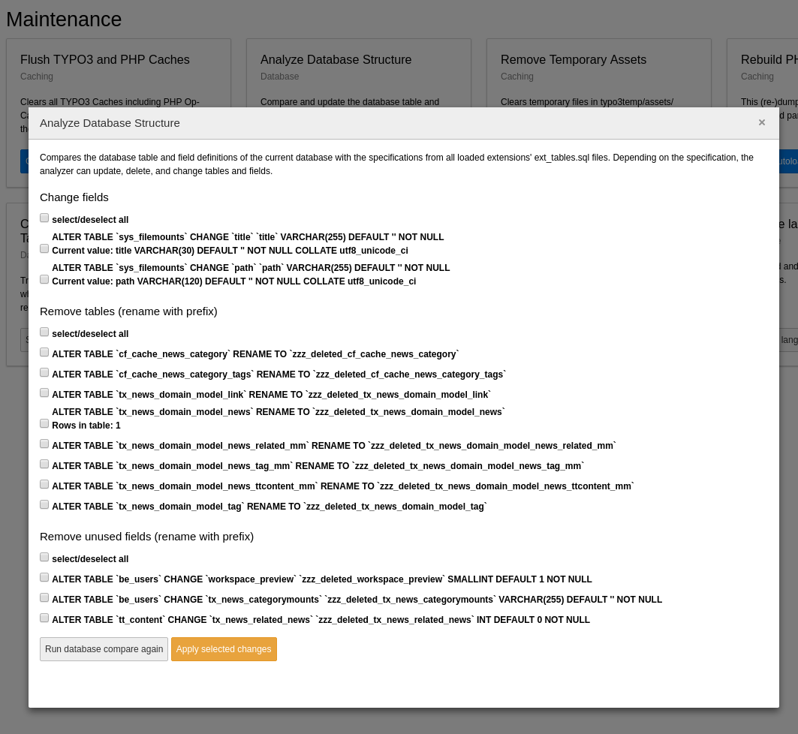

.. include:: /Includes.rst.txt
.. index:: Database; Upgrade
.. _database-upgrade:

===================================
Upgrade table and field definitions
===================================

Each extension in TYPO3 CMS can bring the file :file:`ext_tables.sql` that
defines which tables and fields the extension needs. Gathering all
:file:`ext_tables.sql` thus defines the full set of tables, fields and
indexes of a TYPO3 instance to unfold its full feature set. Some functionality
in the install tool can compare the defined set with the current active
database schema and shows options to align those two by adding fields,
removing fields and so on.

When you upgrade to newer versions of the TYPO3 CMS or upgrade an extension,
the data definition of tables and fields might have changed.
The TYPO3 CMS install tool will detect such changes.

When you install a new extension, any change to the database
is automatically performed. When you upgrade to a new major
version of TYPO3 CMS, you should normally go through the Upgrade
Wizard, whose first step is to perform all necessary database
changes:

.. figure:: ../../../Images/DatabaseUpgradeWizard.png
   :alt: The Upgrade Wizard indicating that the database needs updates

   The upgrade wizard indicating that the database needs updates

When performing smaller updates, after updating extensions or - in
general - if you want to check the sanity of your system,
you can go to **ADMIN TOOLS > Maintenance > Analyze Database Structure**:

   The Database analyzer is part of the maintenance area

What this tool does is collating the information from all
:file:`ext_tables.sql` files of active extensions and compare it with
the current database structure. It then proposes to perform the necessary changes,
grouped by type: creating new tables, adding new fields to existing
tables, altering existing fields, dropping unused tables and fields.

You can choose which updates you want to perform. You can even
decide not to create new fields and tables, although that will
very likely break your installation.

More information about the process of upgrading TYPO3 CMS can be found in
the :ref:`Installation and Upgrade Guide <t3install:upgrade>`.

.. index::
   File; EXT:{extkey}/ext_tables.sql
   Database; CREATE TABLE
.. _database-exttables-sql:

The ext\_tables.sql files
=========================

As mentioned before, all data definition statements are stored in
files called :file:`ext_tables.sql` which may be present in any
extension.

The peculiarity is that these files may not always contain
a complete and valid SQL data definition. For example,
system extension "dashboard" defines a new table for storing
dashboards:

.. code-block:: sql

   CREATE TABLE be_dashboards (
       identifier varchar(120) DEFAULT '' NOT NULL,
       title varchar(120) DEFAULT '' NOT NULL,
       widgets text
   );

This is a complete and valid SQL data definition. However
community extension "news" extends the "tt_content"
table with additional fields. It also provides these changes
in the form of a SQL :code:`CREATE TABLE` statement:

.. code-block:: sql

   CREATE TABLE tt_content (
      tx_news_related_news int(11) DEFAULT '0' NOT NULL,
      KEY index_newscontent (tx_news_related_news)
   );

The classes which take care of assembling the complete SQL data
definition will compile all the :code:`CREATE TABLE` statements
for a given table and turn it into a single :code:`CREATE TABLE`
statement. If the table already exists, missing fields are isolated
and :code:`ALTER TABLE` statements are proposed instead.

What this means is that - as an extension developer - you should always
have only :code:`CREATE TABLE` statements in your :file:`ext_tables.sql`
files, the system will handle them as needed.
