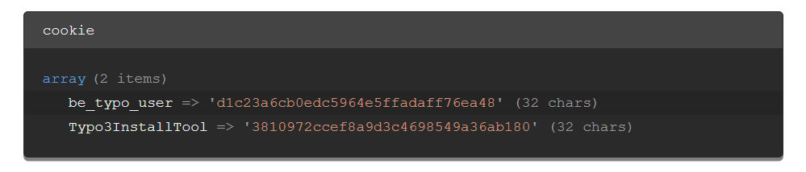

.. include:: /Includes.rst.txt

.. _examples-debug:

=========
Debugging
=========

Let's take a look at what debugging possibilities TYPO3 provides.

Debugging PHP Code
==================

The TYPO3 Core provides a simple :code:`debug()` (defined in
:file:`EXT:core/Classes/Core/GlobalDebugFunctions.php`). It wraps around
:code:`\TYPO3\CMS\Core\Utility\DebugUtility::debug()` and will output debug
information only if it matches a set of IP addresses (defined in
:code:`$GLOBALS['TYPO3_CONF_VARS']['SYS']['devIPmask']`).

For example, the following code::

   debug($_COOKIE, 'cookie');

will produce such an output:

   Typical TYPO3 debug output

In general, look at class :code:`\TYPO3\CMS\Core\Utility\DebugUtility` for useful
debugging tools.

Backend Debug Mode
==================

To display additional debug information in the backend, set :code:`$GLOBALS['TYPO3_CONF_VARS']['BE']['debug']`
in the :file:`LocalConfiguration.php` and log in with an administrator account.

It shows for example the names of fields and in case of select, radio and checkbox
fields the values in addition, which are generated by the `FormEngine`. These can be used to
set access permissions or configuration using TSConfig.

If EXT:lowlevel is installed, the name of the database table or field is appended
to the select options in the “Full Search” module.

Additionally, in debug mode, the page renderer does not compress or concatenate JavaScript or CSS
resources.

Backend Language Debug
======================

Setting :code:`$GLOBALS['TYPO3_CONF_VARS']['BE']['languageDebug']`
in the :file:`LocalConfiguration.php` displays the language labels (with
file and key) in the TYPO3 backend :code:`FormEngine`.
