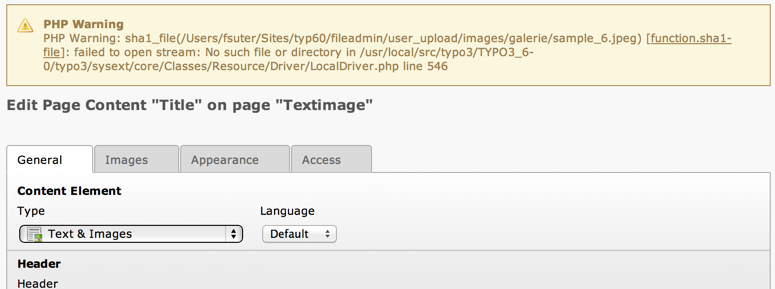
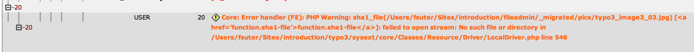
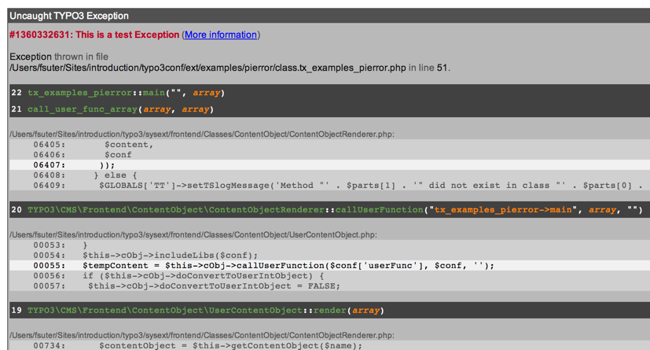
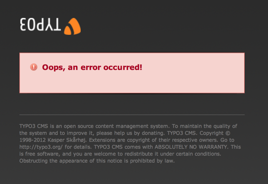
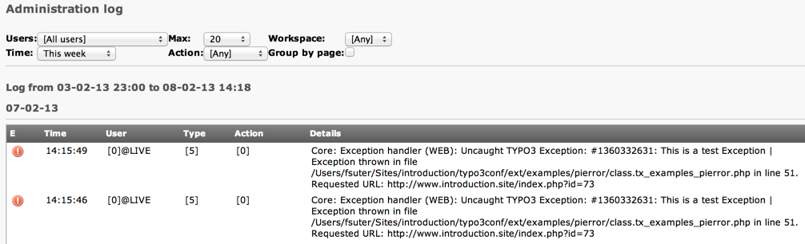
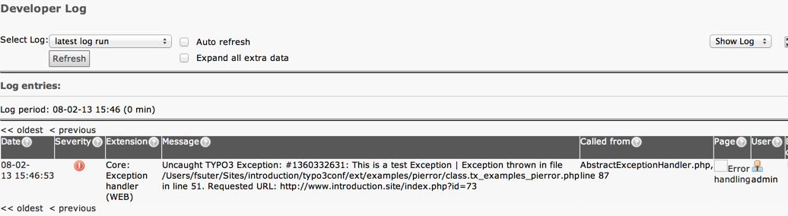

.. include:: ../../../Includes.txt

.. _error-handling-screenshots:

Screenshots
^^^^^^^^^^^

This section shows some sample output to demonstrate the capabilities
of error and exception handling in TYPO3.

   A PHP warning in the TYPO3 Backend

   A PHP exception caught and displayed in the admin panel

   An exception shown by the debug exception handler

   An exception shown by the production exception handler

   PHP exceptions caught and displayed in Admin Tools > Log

   PHP exceptions caught and displayed in Developer's Log
   (requires an extension like `devlog <http://typo3.org/extensions/repository/view/devlog>`_)
