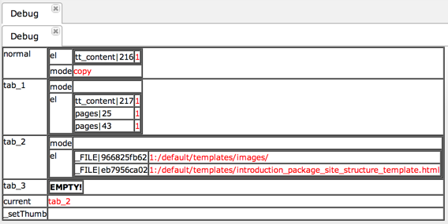
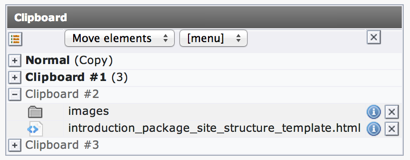

.. include:: /Includes.rst.txt

.. _examples-clipboard:

=========
Clipboard
=========

You can easily access the internal clipboard in TYPO3 from your
backend modules::

   /** @var $clipboard \TYPO3\CMS\Backend\Clipboard\Clipboard */
   $clipboard = \TYPO3\CMS\Core\Utility\GeneralUtility::makeInstance(\TYPO3\CMS\Backend\Clipboard\Clipboard::class);
   // Read the clipboard content from the user session
   $clipboard->initializeClipboard();
   \TYPO3\CMS\Core\Utility\DebugUtility::debug($clipboard->clipData);

In this simple piece of code we instantiate a clipboard object and make it
load its content. We then simply dump this content into the BE module's debug
window, with the following result:

   A dump of the clipboard in the debug window

This tells us what objects are registered on the default tab ("normal")
(a content element with id 216 in "copy" mode) and the numeric tabs (which can
each contain more than one element). It also tells us that the current
tab is number 2. We can compare with the BE view of the clipboard:

   The clipboard as seen in the BE

which indeed contains two files.

Clipboard content should not be accessed directly, but using the
:code:`elFromTable()` method of the clipboard object::

      // Access files and pages content of current pad
      $currentPad = array(
         'files' => $clipboard->elFromTable('_FILE'),
         'pages' => $clipboard->elFromTable('pages'),
      );

      // Switch to normal pad and retrieve files and pages content
      $clipboard->setCurrentPad('normal');
      $normalPad = array(
         'files' => $clipboard->elFromTable('_FILE'),
         'pages' => $clipboard->elFromTable('pages'),
      );

Here we first try to get all files and then all page records on the
current pad (which is pad 2). Then we change to the "Normal" pad, call
the :code:`elFromTable()` method again.

In the "examples" extension, this data is passed to a BE module view
for display, which is really just information:

.. figure:: ../../../Images/ClipboardItems.png
   :alt: Clipboard items

   Display of information about individual clipboard items

.. _examples-clipboard-put:

Putting Elements Into the Clipboard
===================================

This is too complicated to describe in detail. The following
codelisting is from the Web > List module where selections for the
clipboard are posted from a form and registered::

      // Clipboard is initialized:
      // Start clipboard
      $dblist->clipObj = \TYPO3\CMS\Core\Utility\GeneralUtility::makeInstance(\TYPO3\CMS\Backend\Clipboard\Clipboard::class);
      // Initialize - reads the clipboard content from the user session
      $dblist->clipObj->initializeClipboard();
      // Clipboard actions are handled:
      // CB is the clipboard command array
      $CB = \TYPO3\CMS\Core\Utility\GeneralUtility::_GET('CB');
      if ($this->cmd == 'setCB') {
         // CBH is all the fields selected for the clipboard, CBC is the checkbox fields which were checked.
         // By merging we get a full array of checked/unchecked elements
         // This is set to the 'el' array of the CB after being parsed so only the table in question is registered.
         $CB['el'] = $dblist->clipObj->cleanUpCBC(array_merge((array) \TYPO3\CMS\Core\Utility\GeneralUtility::_POST('CBH'), (array) \TYPO3\CMS\Core\Utility\GeneralUtility::_POST('CBC')), $this->cmd_table);
      }
      if (!$this->MOD_SETTINGS['clipBoard']) {
         // If the clipboard is NOT shown, set the pad to 'normal'.
         $CB['setP'] = 'normal';
      }
      // Execute commands.
      $dblist->clipObj->setCmd($CB);
      // Clean up pad
      $dblist->clipObj->cleanCurrent();
      // Save the clipboard content
      $dblist->clipObj->endClipboard();

