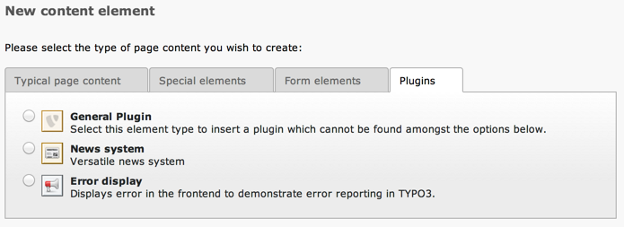

.. include:: ../../../Includes.txt

.. _content-element-wizard:

Adding elements to the Content Element Wizard
^^^^^^^^^^^^^^^^^^^^^^^^^^^^^^^^^^^^^^^^^^^^^

The content element wizard can be fully configured using TSConfig.
The API described here should not be used for the purpose of customizing
this wizard.

However for extension authors, it provides a way of registering their
plugin with the new content element wizard.

Basically it is about adding a class reference to the
:code:`$GLOBALS['TBE_MODULES_EXT']['xMOD_db_new_content_el']['addElClasses']`
global array. The keys in this array are class names and the values are the absolute
paths to these class. The class must have a :code:`proc()` method.

Here is some code from the "examples" extension, to register the "pierror"
plugin with the wizard. First of all, the class is declared in :file:`ext_tables.php`::

   // Add "pierror" plugin to new element wizard
   if (TYPO3_MODE == 'BE') {
      $TBE_MODULES_EXT['xMOD_db_new_content_el']['addElClasses']['tx_examples_pierror_wizicon'] = \TYPO3\CMS\Core\Utility\ExtensionManagementUtility::extPath($_EXTKEY) . 'pierror/class.tx_examples_pierror_wizicon.php';
   }

The :file:`EXT:examples/pierror/class.tx_examples_pierror_wizicon.php` file looks like::

   class tx_examples_pierror_wizicon {

      /**
       * Processing the wizard items array
       *
       * @param array $wizardItems The wizard items
       * @return array Modified array with wizard items
       */
      function proc($wizardItems)   {
         $wizardItems['plugins_tx_examples_pierror'] = array(
            'icon' => 'EXT:examples/Resources/Public/Images/PiErrorWizard.png',
            'title' => $GLOBALS['LANG']->sL('LLL:EXT:examples/locallang.xlf:pierror_wizard_title'),
            'description' => $GLOBALS['LANG']->sL('LLL:EXT:examples/locallang.xlf:pierror_wizard_description'),
            'params' => '&defVals[tt_content][CType]=list&&defVals[tt_content][list_type]=examples_pierror'
         );

         return $wizardItems;
      }
   }

The :code:`proc()` method receives the list of existing items
in the wizard and adds a new one to it. The first three properties
are quite easy to understand. The "params" property defines the default values
to be added to the new record link so that the right type of content element
(and plugin in this case) is already selected. This uses the syntax demonstrated
in the :ref:`edit-links` chapter.

The result can be seen in the new content element wizard:

   The entry added in the plugin list of the new content element wizard
