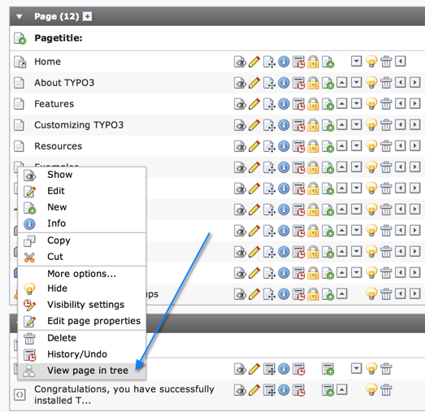
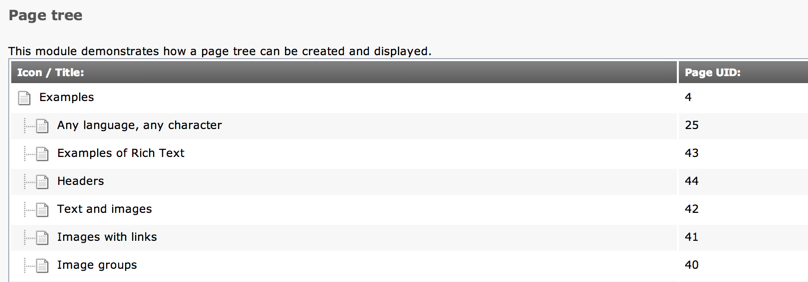

.. ==================================================
.. FOR YOUR INFORMATION
.. --------------------------------------------------
.. -*- coding: utf-8 -*- with BOM.

.. include:: ../../../Includes.txt

.. _csm:

Context-Sensitive Menus
^^^^^^^^^^^^^^^^^^^^^^^

.. warning::

   The context-sensitive menu for the page tree is built using
   :ref:`a different approach <context-menu>`.

.. _csm-adding:

Adding menu items
"""""""""""""""""

The context-sensitive menu (CSM) is made of a list of menu items.
Before that list is actually rendered into a HTML pop-up menu,
it is passed to external processing scripts, which can be configured
in the following global array::

   $GLOBALS['TBE_MODULES_EXT']['xMOD_alt_clickmenu']['extendCMclasses'];

Each script can manipulate the list of menu items, in particular add
or remove some. Registration example (taken from the :file:`ext_tables.php`
file of the "examples" extension)::

	$GLOBALS['TBE_MODULES_EXT']['xMOD_alt_clickmenu']['extendCMclasses'][] = array(
		'name' => 'Documentation\\Examples\\Service\\ContextMenuOptions'
	);

.. note::

   There's an additional :code:`path:` property, which would point to the
   PHP file to include, but it is not necessary when using namespaced classes.
   They will be autoloaded.

The class (:code:`\Documentation\Examples\Service\ContextMenuOptions`) looks like this::

	class ContextMenuOptions {
		/**
		 * Adds a sample item to the CSM
		 *
		 * @param \TYPO3\CMS\Backend\ClickMenu\ClickMenu $parentObject Back-reference to the calling object
		 * @param array $menuItems Current list of menu items
		 * @param string $table Name of the table the clicked on item belongs to
		 * @param integer $uid Id of the clicked on item
		 *
		 * @return array Modified list of menu items
		 */
		public function main(\TYPO3\CMS\Backend\ClickMenu\ClickMenu $parentObject, $menuItems, $table, $uid) {
			// Activate the menu item only for "pages" table
			if ($table == 'pages') {
				// URL for the menu item. Point to the page tree example module, passing the page id.
				$baseUrl = 'mod.php?M=tools_ExamplesExamples&tx_examples_tools_examplesexamples%5Baction%5D=tree&tx_examples_tools_examplesexamples%5Bcontroller%5D=Default';
				$baseUrl .= '&tx_examples_tools_examplesexamples%5Bpage%5D=' . $uid;

				// Add new menu item with the following parameters:
				// 1) Label
				// 2) Icon
				// 3) URL
				// 4) = 1 disable item in docheader
				$menuItems[] = $parentObject->linkItem(
					$GLOBALS['LANG']->sL('LLL:EXT:examples/Resources/Private/Language/locallang.xml:csm_view_page'),
					\TYPO3\CMS\Backend\Utility\IconUtility::getSpriteIcon('extensions-examples-page-tree'),
					$parentObject->urlRefForCM($baseUrl),
					1
				);
			}
			return $menuItems;
		}
	}

The important points to notice are what properties are used for defining
a new menu item and what API calls are used (namely
:code:`\TYPO3\CMS\Backend\ClickMenu\ClickMenu\linkItem()` and
:code:`\TYPO3\CMS\Backend\ClickMenu\ClickMenu\urlRefForCM()`).
The new menu item now appears when clicking a "pages" record icon in the
TYPO3 CMS backend.

   The new context-sensitive menu item

As an example action, our item points to the "Page tree" demo screen
of the "examples" BE module, transferring the id of the page that was clicked.
The effect is that this page is used as tree root in the module's display.

   The examples Page Tree module, using the selected page as root

.. tip::

   In the example class above, a test is performed early on to add the menu
   item only for a record from the "pages" table. When an element representing
   a file is clicked on, the "table" parameter will be filled with the
   file path. The best way to check whether it is a file or not is to simply
   call :code:`is_file()` on it.

.. _csm-implementation:

Implementing a Context Sensitive Menu
"""""""""""""""""""""""""""""""""""""

Implement a CSM in your own backend modules is quite straightforward.
The examples below are taken from the "beuser" system extension and
assume that the module is Extbase-based. For old style modules, refer
to older versions of this manual.

The first step is to include the needed JavaScript using an argument
of the standard BE container Fluid view helper. Actually the CSM-related
JavaScript is included by default, so just using:

.. code-block:: xml

   <f:be.container>
   	...
   </f:be.container>

in your Layout is sufficient (see :file:`typo3/sysext/beuser/Resources/Private/Layouts/Default.html`).
Looking under the hood (in class :code:`\TYPO3\CMS\Fluid\ViewHelpers\Be\ContainerViewHelper`),
the relevant JS inclusion is::

   if ($enableClickMenu) {
   	$doc->loadJavascriptLib('js/clickmenu.js');
   }

The second step is to activate the click menu on the icons. This kind of markup
is required (taken from :file:`typo3/sysext/beuser/Resources/Private/Templates/BackendUser/Index.html`):

.. code-block:: xml
   :emphasize-lines: 2,2

	<td class="col-icon">
		<a href="#" onClick="Clickmenu.show('be_users', '{backendUser.uid}', '1', '', '', ''); return false;" title="id={backendUser.uid}">
			<bu:spriteIconForRecord table="be_users" object="{backendUser}" />
		</a>
	</td>

the relevant line being highlighted.

The same code works for files. In this case however, the first argument to
:code:`Clickmenu.show()` should be the absolute file path (instead of the table)
and the second parameter (the uid) should be left blank.
