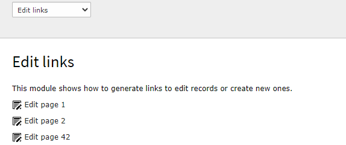
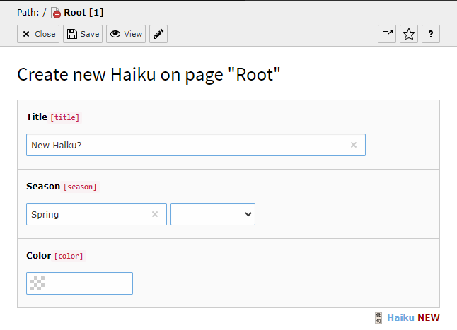

.. include:: /Includes.rst.txt

.. --- EDIT NOTE ---
.. please see this open issue:
.. https://github.com/TYPO3-Documentation/TYPO3CMS-Reference-CoreApi/issues/73
.. If this is resolved, please close the issue and remove this note.
.. 2018-04-24
.. ------------------

.. _edit-links:

=====================
Links to Edit Records
=====================

It is often needed to create links to edit records in the TYPO3 backend.
The same syntax is also used for creating new records.
`TYPO3`:pn: provides an API for creating such links, namely
:code:`\TYPO3\CMS\Backend\Routing\UriBuilder`.

.. hint::

   Make sure to use :code:`\TYPO3\CMS\Backend\Routing\UriBuilder` to create
   backend links and not :code:`\TYPO3\CMS\Extbase\Mvc\Web\Routing\UriBuilder`.

   The variable available as :code:`$this->uriBuilder` in a controller is the
   web routing UriBuilder and can only be used for frontend links.

When using `Fluid`:pn: templates, you cannot call PHP code directly. Therefore the uri
either has to be created via PHP in the controller or a viewhelper to be used.

Below are a different examples, how edit links can be output in the backend.

.. code-block:: xml

   <html data-namespace-typo3-fluid="true"
			xmlns:f="http://typo3.org/ns/TYPO3/CMS/Fluid/ViewHelpers"
			xmlns:core="http://typo3.org/ns/TYPO3/CMS/Backend/ViewHelpers"
			xmlns:be="http://typo3.org/ns/TYPO3/CMS/Core/ViewHelpers"
			xmlns:ex="http://typo3.org/ns/T3docs/Examples/ViewHelpers"
   >
      

         <a href="{editPage1Link}">
            <core:icon identifier="actions-document-open"/>
            <f:translate key="function_links_edit_page_1"/>
         </a>
      

      

         <f:comment>Would only output the uri: <be:uri.editRecord uid="2" table="pages"
            returnUrl="foo/bar" /></f:comment>
         <a href="{be:uri.editRecord(uid:1, table:'pages', returnUrl:'foo/bar')}">
            <core:icon identifier="actions-document-open"/>
            <f:translate key="function_links_edit_page_2"/>
         </a>
      

   </html>

The links appear as one can expect:

   The two links in the "examples" backend module

For the first link the variable :code:`editPage1Link` has to be set in the controler
for example like this:

.. code-block:: php

    public function linksAction()
    {
        $backendUriBuilder = GeneralUtility::makeInstance(\TYPO3\CMS\Backend\Routing\UriBuilder::class);
        $uriParameters = ['edit' => ['pages' => [1 => 'edit']]];
        $editPage1Link = $backendUriBuilder->buildUriFromRoute('record_edit', $uriParameters);
        $this->view->assignMultiple(
            [
                'editPage1Link' => $editPage1Link,
            ]
        );
    }

.. _edit-links-edit:

Editing a Record
================

The examples above leads to the normal edit form for a page:

.. figure:: ../../../Images/EditLinksEditFull.png
   :alt: The standard form for editing a page

   Page 1 ready for editing with the standard form

.. _edit-links-edit-restricted:

Additional options for editing redords
======================================

When creating the link via php it is possible to add more options.

You can specify as many tables and uids you like and you will get them all in
one single form!
(short way of editing more records from the same table at once).

Also the fields to be displayed can be restricted.

.. code-block:: php

   $uriParameters =
      [
         'edit' =>
            [
               'pages' =>
                  [
                     1 => 'edit',
                     2 => 'edit'
                  ],
               'tx_examples_haiku' =>
                  [
                     1 => 'edit'
                  ]
            ],
         'columnsOnly' => 'title,doktype'
      ];
   $editPagesDoktypeLink = $backendUriBuilder->buildUriFromRoute('record_edit', $uriParameters);

The fields to be included can be listed in the "columnsOnly" parameter, as a comma-separated list.
The order of the fields doesn't matter, they get displayed in the order they appear in the `TCA`:pn:.
If a field is missing or access restricted in one of the tables it just doesn't appear.
However if one record to be edited is missing none of the records gets displayed.

The example above results in the following:

.. figure:: ../../../Images/EditLinksEditRestricted.png
   :alt: The restricted form for editing a page

   Editing of fields of two pages and one haiku at once

.. _edit-links-new:

Display a Link to Create a New Record
=====================================

There is a backend viewhelper to display a "create new record" link:

.. code-block:: xml

   <f:comment>Would only output the uri: <be:uri.newRecord pid="1" table="tx_examples_haiku" returnUrl="foo/bar" /></f:comment>
	<a href="{be:uri.newRecord(pid:1, table:'tx_examples_haiku', returnUrl:'foo/bar')}">
		<core:icon identifier="actions-document-new"/>
		<f:translate key="function_links_new_haiku"/>
	</a>

If you create the backend link via php it is possible to add more options like
default values for certain fields.

.. code-block:: php

   $uriParameters =
   [
      'edit' =>
         [
            'tx_examples_haiku' =>
               [
                  1 => 'new'
               ]
         ],
      'defVals' =>
         [
            'tx_examples_haiku' =>
               [
                  'title' => 'New Haiku?',
                  'season' => 'Spring'
               ]
         ]

      'columnsOnly' => 'title,season,color'
   ];
   $createHaikuLink = $backendUriBuilder->buildUriFromRoute('record_edit', $uriParameters);

The link triggers the creation a new record for the table "tx_examples_haiku"
on page 1. It also sets a default value for the "title" field ("New haiku") and
selects the season "Spring". It only displays the fields defined by "columnsOnly".

Note the following things:

- the first parameter is still called "edit" even if this is about creating a new record.
  The creation of a record is indicated by the value "new".

- the key of the entry with value "new" indicates the pid on which the record is to be created.

- the values get automatically url-encoded so you can use any special char in the defaults

This results in the following new record form with a pre-filled
title and season field.

   Form for creating a new haiku with pre-filled title and season and restricted columns
