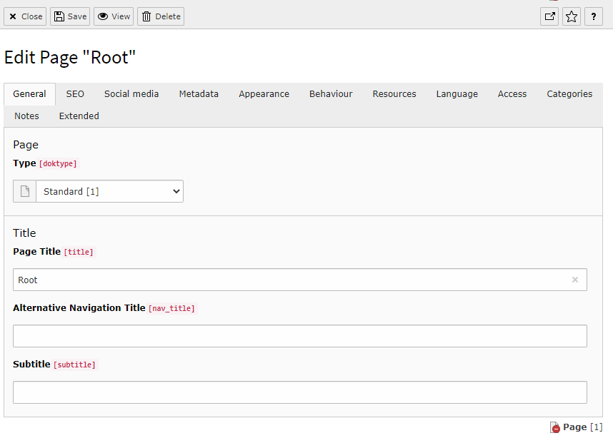

.. include:: ../../../Includes.txt

.. --- EDIT NOTE ---
.. please see this open issue:
.. https://github.com/TYPO3-Documentation/TYPO3CMS-Reference-CoreApi/issues/73
.. If this is resolved, please close the issue and remove this note.
.. 2018-04-24
.. ------------------

.. _edit-links:

=====================
Links to Edit Records
=====================

It is often needed to create links to edit records in the TYPO3 backend.
The same syntax is also used for creating new records.
TYPO3 provides an API for creating such links, namely
:code:`\TYPO3\CMS\Backend\Utility\BackendUtility::editOnClick()`.
This script will create an onclick-JavaScript event preparing the necessary route for the operation.

This is not always needed, especially in backend modules using the
dispatcher method (which should be **all** backend modules, since
the dispatched was introduced in TYPO3 4.1).

Furthermore when using Fluid templates, you cannot call PHP code directly
but have to wrap it in a view helper. The "examples" extensions demonstrates
with the "edit link" view helper (:code:`\TYPO3\CMS\Backend\ViewHelpers\Link\EditRecordViewHelper`).

This can then be used in the Fluid template. Below are a few examples,
also demonstrating what kind of parameters must be passed to achieve
various results:

.. code-block:: xml

   

      <Ex:be.editLink parameters="edit[pages][1]=edit" returnUrl="mod.php?M=tools_ExamplesExamples&tx_examples_tools_examplesexamples[action]=links" title="{f:translate(key: 'function_links_edit_page_1')}">
         <Ex:be.icon icon="actions-document-open" title="{f:translate(key: 'function_links_edit_page_1')}" />
         <f:translate key="function_links_edit_page_1" />
      </Ex:be.editLink>
   

   

      <Ex:be.editLink parameters="edit[pages][1]=edit&columnsOnly=title,hidden" returnUrl="mod.php?M=tools_ExamplesExamples&tx_examples_tools_examplesexamples[action]=links" title="{f:translate(key: 'function_links_edit_page_1_restricted')}">
         <Ex:be.icon icon="actions-document-open" title="{f:translate(key: 'function_links_edit_page_1_restricted')}" />
         <f:translate key="function_links_edit_page_1_restricted" />
      </Ex:be.editLink>
   

   

      <Ex:be.editLink parameters="&edit[tx_examples_haiku][1]=new&defVals[tx_examples_haiku][title]=New%20haiku" returnUrl="mod.php?M=tools_ExamplesExamples&tx_examples_tools_examplesexamples[action]=links" title="{f:translate(key: 'function_links_new_haiku')}">
         <Ex:be.icon icon="actions-document-new" title="{f:translate(key: 'function_links_new_haiku')}" />
         <f:translate key="function_links_new_haiku" />
      </Ex:be.editLink>
   

The links appear as one can expect:

.. figure:: ../../../Images/EditLinksDisplay.png
   :alt: Edit links in the examples BE module

   The three different links in the "examples" BE module

.. _edit-links-edit:

Editing a Record
================

The first example (:code:`edit[pages][1]=edit`) opens the page with uid 1
for editing.

The general syntax is thus "&edit[*tablename*][*uid*]=edit".
You can specify as many tables and uids you like and you will get them all in
one single form! The "uid" variable can even be a comma list of uids
(short way of editing more records from the same table at once).

The examples above leads to the normal edit form for a page:

   Page 1 ready for editing with the standard form

.. _edit-links-edit-restricted:

Editing Only a Few Fields From a Record
=======================================

The second example does the same, but restricts the display to
only the "title" and "hidden" fields (:code:`edit[pages][1]=edit&columnsOnly=title,hidden`).

The fields can be listed in the "columnsOnly" parameter, as a comma-separated list.
The example above results in the following:

   Page 1 ready for editing with a form showing only selected fields

.. _edit-links-new:

Creating a Form for New Elements
================================

The third example uses somewhat more complex parameters::

   &edit[tx_examples_haiku][1]=new&defVals[tx_examples_haiku][title]=New%20haiku

The link triggers the creation a new record for the table "tx_examples_haiku"
on page 1. It also sets a default value for the "title" field ("New haiku").
Note the following things:

- the first parameter is still called "edit" even if this is about creating a new record.
  The creation of a record is indicated by the value "new".

- the value in the second pair of square brackets (:code:`[1]`) indicates the page
  where the new record will be stored.

- you need to URL-encode the values yourself, if needed (e.g. :code:`New%20haiku`).

This results in the following form, standard but with a pre-filled
title field.

.. figure:: ../../../Images/EditLinksNew.png
   :alt: Creating a new haiku

   Form for creating a new haiku with pre-filled title
