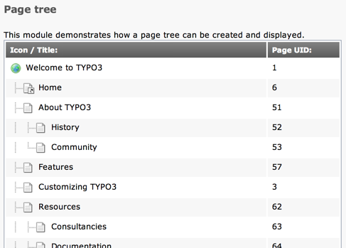

.. include:: ../../../Includes.txt

.. _examples-page-tree:

Rendering page trees
^^^^^^^^^^^^^^^^^^^^

In your backend modules you might like to show information or perform
processing for a part of the page tree. There is a whole family of
libraries in the core for making trees from records, static page trees
or page trees that can be browsed (open/close nodes).

This simple example demonstrates how to produce the HTML for a static
page tree. The result looks like:

   A static page tree in TYPO3 Backend

The tree object itself is prepared this way (taken from
:code:`EXT:examples/Classes/Controller/DefaultController.php`):

.. code-block:: php
   :linenos:

   public function treeAction() {
      // Get page record for tree starting point
      $startingPoint = 1;
      $pageRecord = \TYPO3\CMS\Backend\Utility\BackendUtility::getRecord(
         'pages',
         $startingPoint
      );

      // Create and initialize the tree object
      /** @var $tree \TYPO3\CMS\Backend\Tree\View\PageTreeView */
      $tree = \TYPO3\CMS\Core\Utility\GeneralUtility::makeInstance('TYPO3\\CMS\\Backend\\Tree\\View\\PageTreeView');
      $tree->init('AND ' . $GLOBALS['BE_USER']->getPagePermsClause(1));

      // Creating the icon for the current page and add it to the tree
      $html = \TYPO3\CMS\Backend\Utility\IconUtility::getSpriteIconForRecord(
         'pages',
         $pageRecord,
         array(
            'title' => $pageRecord['title']
         )
      );
      $tree->tree[] = array(
          'row' => $pageRecord,
          'HTML' => $html
      );

      // Create the page tree, from the starting point, 2 levels deep
      $depth = 2;
      $tree->getTree(
         $startingPoint,
         $depth,
         ''
      );

      // Pass the tree to the view
      $this->view->assign(
         'tree',
         $tree->tree
      );
   }

- At the top of the code we define the starting page and get the corresponding
  page record using :code:`\TYPO3\CMS\Backend\Utility\BackendUtility::getRecord()`.

- Next we create an instance of :code:`\TYPO3\CMS\Backend\Tree\View\PageTreeView`,
  which we use for generating the tree. Notice how the :ref:`BE\_USER object <be-user>` is
  called to get a SQL where clause that will ensure that only pages
  that are accessible for the user will be shown in the tree!

- As a next step we manually add the starting page to the page tree.
  This is not done automatically because it is not always a desirable
  behavior. Note the use of :code:`\TYPO3\CMS\Backend\Utility\IconUtility::getSpriteIconForRecord()`
  to fetch the right icon for the page.

- Finally we get the tree to prepare itself, up to a certain depth.
  Internally this will - in particular - generate a HTML part containing
  the tree elements and the page icon itself.

- The rendered page tree is stored in a data array inside of the tree
  object. We need to traverse the tree data to create the tree in HTML.
  This gives us the chance to organize the tree in a table for instance.
  It is this part that we pass on to the view.

The result is rendered with a very simple Fluid template:

.. code-block:: xml

   <f:for each="{tree}" as="page">
      <tr class="db_list_normal">
         <td>{page.depthData -> f:format.raw()}<f:format.raw>{page.HTML}</f:format.raw> {page.row.title}</td>
         <td>{page.row.uid}</td>
      </tr>
   </f:for>

We do a simple loop on the tree array of pages and display the relevant
elements.
