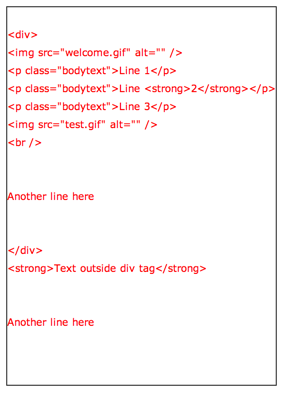

.. include:: ../../../Includes.txt

.. _parsing-html:

Parsing HTML
^^^^^^^^^^^^

TYPO3 CMS provides its own HTML parsing class:
:code:`\TYPO3\CMS\Core\Html\HtmlParser`. This chapter
shows some example uses.

.. _parsing-html-extraction-blocks:

Extracting blocks from an HTML document
"""""""""""""""""""""""""""""""""""""""

The first example shows how to extract parts of a document.
Consider the following code::

	$testHTML = '
		

			
			
Line 1

			
Line <B class="test">2</B>

			
Line <b><i>3</i>

			
			  
			<TABLE>
				<tr>
					<td>Another line here</td>
				</tr>
			</TABLE>
		

		<B>Text outside div tag</B>
		<table>
			<tr>
				<td>Another line here</td>
			</tr>
		</table>
	';

		// Splitting HTML into blocks defined by 
 and <table> tags
	$parseObj = \TYPO3\CMS\Core\Utility\GeneralUtility::makeInstance('TYPO3\\CMS\\Core\\Html\\HtmlParser');
	$result = $parseObj->splitIntoBlock('div,table', $testHTML);

After loading some dummy HTML code into a variable, we create an instance of
:code:`\TYPO3\CMS\Core\Html\HtmlParser` and ask it to split the HTML structure
on "div" and "table" tags. A debug output of the result shows the following:

.. figure:: ../../../Images/HtmlParsingBlocks.png
   :alt: Debug output of HTML parsing

   The HTML parsed into several blocks

As you can see the HTML source has been divided so the "div"
section and the "table" section are found in key 1 and 3. Odd key always
correspond to the extracted content and even keys to the content outside
of the extracted parts.

Notice that the table **inside** of the "div" section was not "found".
When you split content like this you get only elements on the same
block-level in the source. You have to traverse the content
recursively to find all tables - or just split on <table> only (which
will not give you tables nested inside of tables though).

Note also how the HTML parser does not care for case (upper or lower,
all tags were found).

.. _parsing-html-extraction-single:

Extracting single tags
""""""""""""""""""""""

It is also possible to split by non-block tags, for example "img" and "br"::

	$result = $parseObj->splitTags('img,br', $testHTML);

with the following result:

.. figure:: ../../../Images/HtmlParsingTags.png
   :alt: Debug output of HTML parsing

   The HTML split along some tags

Again, all the odd keys in the array contain the tags that
were found. Note how the parser handled transparently simple
tags or self-closing tags.

.. _parsing-html-cleanup:

Cleaning HTML content
"""""""""""""""""""""

The HTML parsing class also provides a tool for manipulating HTML
with the :code:`HTMLcleaner()` method. The cleanup configuration
is quite extensive. Please refer to the phpDoc comments of the
:code:`HTMLcleaner()` method for more details.

Here is a sample usage::

	$tagCfg = array(
		'b' => array(
			'nesting' => 1,
			'remap' => 'strong',
			'allowedAttribs' => 0
		),
		'img' => array(),
		'div' => array(),
		'br' => array(),
		'p' => array(
			'fixAttrib' => array(
				'class' => array(
					'set' => 'bodytext'
				)
			)
		)
	);
	$result = $parseObj->HTMLcleaner(
		$testHTML,
		$tagCfg,
		FALSE,
		FALSE,
		array('xhtml' => 1)
	);

We first define our cleanup/transformation configuration.
We define that only five tags should be kept ("b", "img", "div",
"br" and "p"). All others are removed (:code:`HTMLcleaner()`
can be configured to keep all possible tags).

Additionally we indicate that "b" tags should be changed to "strong"
and that correct nesting is required (otherwise the tag is removed).
Also no attributed are allowed on "b" tags.

For "p" tags we indicate that the "attribute" should be added with
value "bodytext".

Lastly - in the call to :code:`HTMLcleaner()` itself, we request
"xhtml" cleanup.

This is the result:

   The cleaned up HTML code

.. _parsing-html-advanced:

Advanced processing
"""""""""""""""""""

There's much more that can be achieved with
:code:`\TYPO3\CMS\Core\Html\HtmlParser` in particular
more advanced processing using callback methods that
can perform additional work on each parsed element, including
calling the HTML parser recursively.

This is too extensive to cover here.
