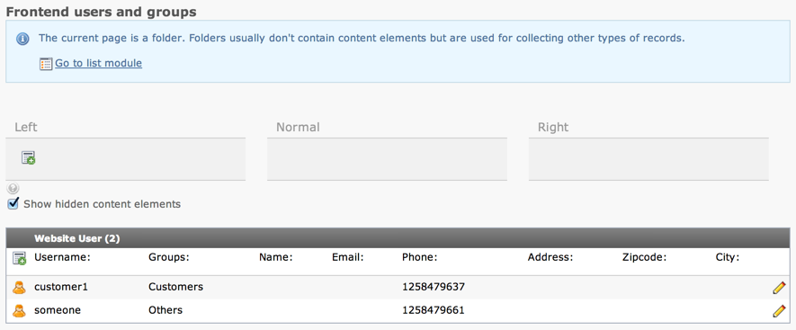

.. ==================================================
.. FOR YOUR INFORMATION
.. --------------------------------------------------
.. -*- coding: utf-8 -*- with BOM.

.. include:: ../../../Includes.txt

.. _page-module-tables:

Support for custom tables in the Page module
^^^^^^^^^^^^^^^^^^^^^^^^^^^^^^^^^^^^^^^^^^^^

In the Web > Page module you can have listings of other records than
Content Elements. Any table can be displayed by adding to the array
:code:`$TYPO3_CONF_VARS['EXTCONF']['cms']`.

The TYPO3 CMS Core itself defines such a listing for the "fe_users" table::

	'EXTCONF' => array(
		'cms' => array(
			'db_layout' => array(
				'addTables' => array(
					'fe_users' => array(
						0 => array(
							'MENU' => '',
							'fList' => 'username,usergroup,name,email,telephone,address,zip,city',
							'icon' => TRUE
						)
					)
				)
			)
		)
	),

as found in :file:`t3lib/stddb/DefaultConfiguration.php`.

The "fList" key value is a list of field names separated first by
comma and then ";" (semi-colon). The comma separates table columns
while the semi-colon allows you to list more than one field to be
displayed inside a single column.

So placing yourself on a page containing frontend users in the Web > Page module,
you will see the following:

   List of FE users in the Web > Page module
