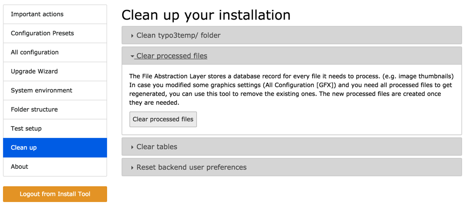

.. include:: ../../Includes.txt

.. _administration-maintenance:

Maintenance
^^^^^^^^^^^

There are various maintenance tasks which can be performed
to  maintain a healthy TYPO3 CMS installation with the
File Abstraction Layer.

.. _administration-maintenance-scheduler:

Scheduler tasks
"""""""""""""""

Two base tasks provided by the Scheduler are related to the
File Abstraction Layer.

File Abstraction Layer: Update storage index
  This task goes through a Storage and makes sures that every file
  is properly indexed. When files are manipulated only via the TYPO3 CMS
  backend, they are always indexed. However if files get added via other
  means (e.g. FTP) or if some Storages are based on drivers accessing
  remote systems, it is crucial to run this task regularly so that
  the TYPO3 CMS installation knows about all existing files in order
  to make them available to users.

  This task is defined per Storage.

File Abstraction Layer: Extract metadata in storage
  This task goes through all files in a Storage and updates their
  metadata. Again this is especially important when files can be
  manipulated by other means or actually reside on external systems.

  This task is defined per Storage.

.. _administration-maintenance-processed-files:

Processed files
"""""""""""""""

If you change some graphics-related settings, it may be necessary
to force a regeneration of all processed files. This can be achieved
by deleting all existing processed files via the Install Tool.

   Removing all processed files in the Install Tool

This cleanup is also good if processed files have accumulated for a
long time. Many of them may then be obsolete.
