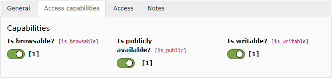

.. include:: /Includes.rst.txt

.. _fal-administration-storages:

=============
File Storages
=============

File Storages can be administered through the List module. They have a few properties which deserve further explanation.

   Special properties in the Access tab of a File Storage

Is browsable?
  If this box is not checked, the Storage will not be browsable by
  users via the **FILE > Filelist** module, not via the link browser
  window.

Is publicly available?
  When this box is unchecked, the "publicUrl" property of files is
  replaced by an eID call pointing to a file dumping script provided
  by the TYPO3 CMS Core. The public URL looks something like
  :code:`index.php?eID=dumpFile&t=f&f=1230&token=135b17c52f5e718b7cc94e44186eb432e0cc6d2f`.
  Behind the scene, class :php:`\TYPO3\CMS\Core\Controller\FileDumpController`
  is invoked to manage the download. The class itself does not implement
  any access check, but provides a hook for doing so.

  .. warning::

     This does not magically protect your files if they are within your web root
     (e.g. below the :file:`fileadmin` folder). They will still be available to
     anyone who knows the path to the file. To implement a strict access restriction
     the Storage must point to some path outside the web root or the folder it points
     to must contain web server restrictions to block direct access to the files it
     contains (for example, in an Apache :file:`.htaccess` file).

Is writable?
  This property simply enables to make any Storage read-only.

Is online?
  A Storage which is not online cannot be accessed in any way. This flag will
  generally not be set voluntarily. It will be set automatically when someone
  tries to access files in that Storage but the underlying Driver detects that
  the files are not accessible (for whatever reason particular to that Driver,
  but generally because some third-party storage service is not available at the
  time).

  The important thing to note is that a Storage must be turned online again
  manually.
