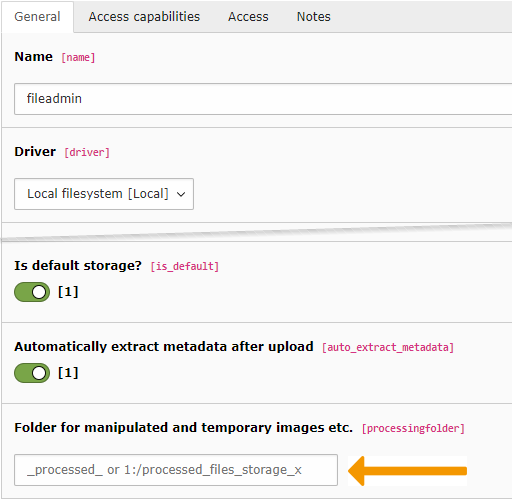

.. include:: ../../../Includes.txt

.. _architecture-folders:

=======
Folders
=======

The actual storage structure depends on which Driver each Storage
is based on. When using the local file system Driver provided by
the TYPO3 CMS Core, a Storage will correspond to some existing
folder on the local storage system (e.g. hard drive). Other
Drivers may use virtual structures.

By default, a Storage pointing to the :file:`fileadmin` folder
is created automatically in every TYPO3 CMS installation.

.. _fal-architecture-folders-processed-files:

Processed Files
===============

Inside each Storage there will be a folder named :file:`_processed_`
which contains all resized images, be they rendered in the frontend
or thumbnails from the backend. The name of this folder is not
hard-coded. It can be defined as a property of the Storage.
It may even point to a different storage.

   Editing a File Storage to define a location for processed files

.. _fal-architecture-folders-migrated-files:

Migrated Files
==============

When upgrading from a pre-FAL installation (i.e. a TYPO3 CMS version
older than 6.0), files will have been moved from various locations
(but generally the :file:`uploads` folder and its sub-folders) to
a folder named :file:`_migrated` in the default Storage (or other
Storages if you had several). Such a folder may also be used by
custom processes provided by extensions.

This folder contains active files from your older TYPO3 CMS
installation. It should not be deleted unless you are sure that
you are not using any of these files anymore. It would be advisable
to move all files out if this folder over time and into a more
explicit structure.
