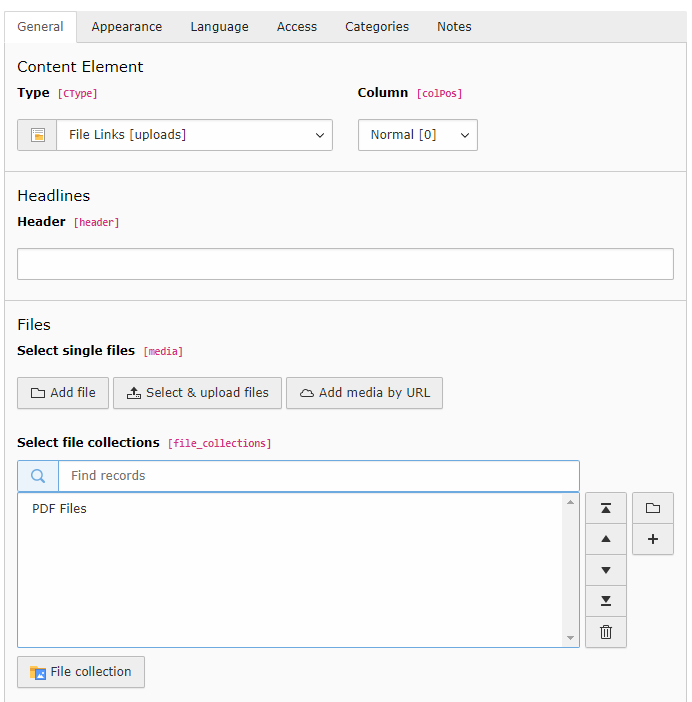
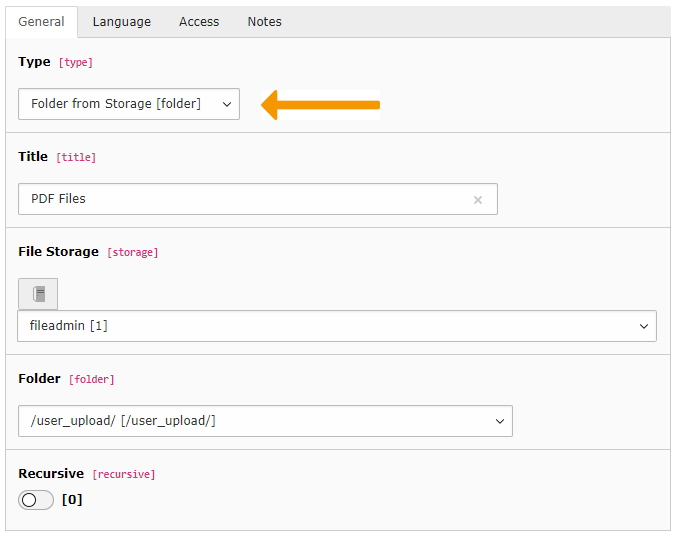
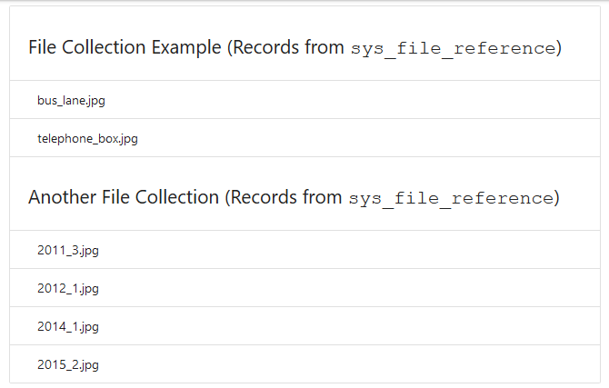

.. include:: /Includes.rst.txt
.. index:: pair: File abstraction layer; File collections
.. _collections:
.. _collections-records:
.. _collections-files:

================
File collections
================

File collections are collections of file references.
They are used by the "File links" (download) content element.

   A "File links" content element referencing a file collection

File collections are stored in the :sql:`sys_file_collection` table.
The selected files are stored in the :sql:`sys_file_reference` table.

Note that a file collection may also reference a folder, in which case
all files inside the folder will be returned when calling that collection.

   A file collection referencing a folder

.. _collections-api:

Collections API
===============

The TYPO3 CMS Core provides an API to enable usage of collections
inside extensions. The most important classes are:

:code:`\TYPO3\CMS\Core\Resource\FileCollectionRepository`
  Used to retrieve collections. It's not exactly an Extbase repository
  but works in a similar way. The default "find" methods refer
  to the "sys_file_collection" table and will fetch "static"-type collections.

:code:`\TYPO3\CMS\Core\Resource\Collection\StaticFileCollection`
  This class models the static file collection. It is important to note
  that collections returned by the repository (described above) are "empty".
  If you need to access their records, you need to load them first, using
  method :code:`loadContents()`. On top of some specific API methods,
  this class includes all setters and getters that you may need to access
  the collection's data. For accessing the selected files, just loop
  on the collection (see example).

:code:`\TYPO3\CMS\Core\Resource\Collection\FolderBasedFileCollection`
  Similar to the :php:`StaticFileCollection`, but for file collections based on a folder.

:code:`\TYPO3\CMS\Core\Resource\Collection\CategoryBasedFileCollection`
  File collection based on a single category.

.. _collections-example:

Example
=======

The `"examples" extension <https://github.com/TYPO3-Documentation/TYPO3CMS-Code-Examples>`_
provides a simple frontend plugin to demonstrate
usage of collections. Here is what happens in the controller:

.. code-block:: php
   :emphasize-lines: 17-27

   /**
    * @var \TYPO3\CMS\Core\Resource\FileCollectionRepository
    */
   protected $collectionRepository;

   public function __construct(FileCollectionRepository $collectionRepository) {
     $this->collectionRepository = $collectionRepository;
   }

   /**
    * Renders the list of all existing collections and their content
    *
    * @return void
    */
   public function indexAction()
   {
     // Get all existing collections
     /** @var \TYPO3\CMS\Core\Resource\Collection\AbstractFileCollection[] $collections */
     $collections = $this->collectionRepository->findAll();

     // Load the records in each collection
     foreach ($collections as $aCollection) {
         $aCollection->loadContents();
     }

     // Assign the "loaded" collections to the view
     $this->view->assign('collections', $collections);
   }

The base is code is quite simple: all collections are fetched and passed
to the view. The one specific step is the loop over all collections to load
their referenced records. Remember that a collection is otherwise "empty".

In the view we can then either use collection member variables as usual
(like their title) or put them directly in a loop to iterate over the
record selection:

.. code-block:: xml

   <f:section name="main">
       <ul class="collection with-header">
           <f:for each="{collections}" as="collection">
               <li class="collection-header"><h4>{collection.title} (Records from <code>{collection.itemTableName}</code>)</h4></li>
               <f:for each="{collection}" as="record">
                   <li class="collection-item">{record.name}</li>
               </f:for>
           </f:for>
       </ul>
   </f:section>

Here is what the result may look like (the exact result will obviously
depend on the content of the selection):

   Typical output from the "Collections" plugin of extension "examples"

