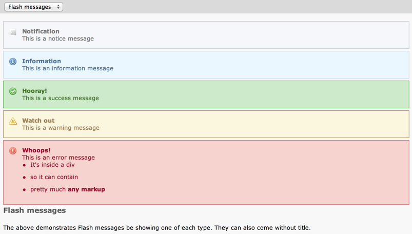
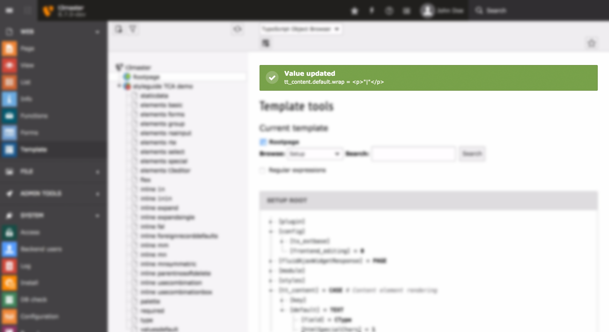

.. ==================================================
.. FOR YOUR INFORMATION
.. --------------------------------------------------
.. -*- coding: utf-8 -*- with BOM.

.. include:: ../../Includes.txt

.. _flash-messages:

Flash messages
--------------

There exists a generic system to show users that an action
was performed successfully, or more importantly, failed. This system
is known as "flash messages". The screenshot below shows the various
severity levels of messages that can be emitted.

   The "examples" BE module shows one of each type of flash message

The different severity levels are described below:

- Notifications are used to show very low severity information. Such
  information usually is so unimportant that it can be left out, unless
  running in some kind of debug mode.

- Information messages are to give the user some information that might
  be good to know.

- OK messages are to signal a user about a successfully executed action

- Warning messages show a user that some action might be dangerous,
  cause trouble or might have partially failed.

- Error messages are to signal failed actions, security issues, errors
  and the like.

.. _flash-messages-api:

Flash messages API
^^^^^^^^^^^^^^^^^^

Creating a flash message is achieved by simply instantiating an object
of class :code:`\TYPO3\CMS\Core\Messaging\FlashMessage`::

   $message = \TYPO3\CMS\Core\Utility\GeneralUtility::makeInstance('TYPO3\\CMS\\Core\\Messaging\\FlashMessage',
   	'My message text',
   	'Message Header', // the header is optional
   	\TYPO3\CMS\Core\Messaging\FlashMessage::WARNING, // the severity is optional as well and defaults to \TYPO3\CMS\Core\Messaging\FlashMessage::OK
   	TRUE // optional, whether the message should be stored in the session or only in the \TYPO3\CMS\Core\Messaging\FlashMessageQueue object (default is FALSE)
   );

The severity is defined by using class constants provided by
:code:`\TYPO3\CMS\Core\Messaging\FlashMessage`:

- :code:`\TYPO3\CMS\Core\Messaging\FlashMessage::NOTICE` for notifications

- :code:`\TYPO3\CMS\Core\Messaging\FlashMessage::INFO` for information messages

- :code:`\TYPO3\CMS\Core\Messaging\FlashMessage::OK` for success messages

- :code:`\TYPO3\CMS\Core\Messaging\FlashMessage::WARNING` for warnings

- :code:`\TYPO3\CMS\Core\Messaging\FlashMessage::ERROR` for errors

The fourth parameter passed to the constructor is a flag that
indicates whether the message should be stored in session or not (the
default is not). Storage in session should be used if you need the
message to be still present after a redirection.

In backend modules you can then make that message appear on top of the
module after a page refresh / the rendering of the next page request
or render it on your own where ever you want.

This example adds the flash message at the top of modules when
rendering the next request::

   $messageQueue = $objectManager->get('\TYPO3\CMS\Core\Messaging\FlashMessageQueue');
   $messageQueue->addMessage($message);

The message is added to the queue and then the template class calls
:code:`\TYPO3\CMS\Core\Messaging\FlashMessageQueue::renderFlashMessages()` which renders all
messages from the queue. Here's how such a message looks like in a
module:

   A typical (success) message shown at the top of a module

By default flash messages are shown atop the content of a
module. However, if needed, you can change where the messages are
shown by manipulating a module's template and inserting the
:code:`###FLASHMESSAGES###` marker. Messages will then replace that marker
instead of appearing at the top of the module.

It is also possible to render a single message directly, instead of
adding it to the queue. This makes it possible to display flash
messages absolutely anywhere. Here's how this is achieved::

   $message->render();

.. _flash-messages-extbase:

Flash messages in Extbase
^^^^^^^^^^^^^^^^^^^^^^^^^

In Extbase the standard way of issuing flash messages is to add them
in the controller. Code from the "examples" extension:

.. code-block:: php

   $this->addFlashMessage('This is a simple success message');

The full API of this function is:

.. code-block:: php

   $this->addFlashMessage(
     $messageBody,
     $messageTitle = '',
     $severity = \TYPO3\CMS\Core\Messaging\AbstractMessage::OK,
     $storeInSession = TRUE
   );

The messages are then displayed by Fluid with the relevant View Helper,
as shown in this excerpt of :file:`EXT:examples/Resources/Private/Layouts/Module.html`:

.. code-block:: html

   

   	

   		<f:flashMessages renderMode="div" />
   		<f:render section="main" />
   	

   

Where to display the flash messages in an Extbase-based BE module is
as simple as moving the View Helper around.

.. _flash-messages-javascript:

JavaScript-based flash messages
^^^^^^^^^^^^^^^^^^^^^^^^^^^^^^^

Flash messages can also be fired up from JavaScript, coming up
as small pop up windows. Here is sample code taken from the
"examples" extension::

   TYPO3.Flashmessage.display(
   	TYPO3.Severity.ok,
   	title,
   	message,
   	5
   );

The last parameter is the duration (in seconds) after which
the message should fade out.

