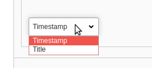
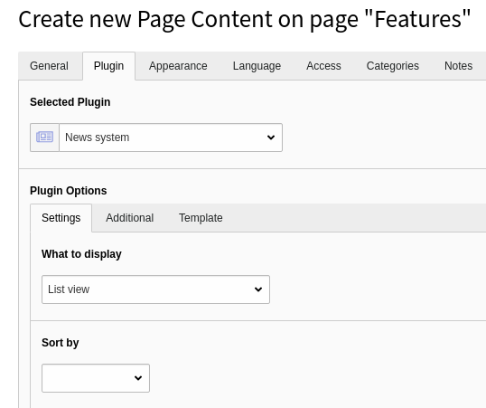

.. include:: ../../Includes.txt

.. _flexforms:

==============
Flexforms
==============

Flexforms can be used to store data within an XML structure inside a single DB
column.

You may want to configure
individual plugins differently, depending on where they are added. The
configuration set via the Flexform mechanism applies to only the content
record it has been configured for. The Flexforms configuration for a plugin
can be changed by editors in the backend. This gives editors more control
over plugin features and what is to be rendered.

Using Flexforms you have all the features of TCA, so it is possible to
to use input fields, select lists, show options conditionally and more.

Example Use Cases
=================

* The `bootstrap_package <https://extensions.typo3.org/extension/bootstrap_package/>`__
  uses Flexforms to configure rendering options,
  e.g. a transition interval and transition type (slide, fade)
  for the carousel.

.. image:: Images/FlexFormCarousel.png
   :class: with-shadow

How it Works
============

#. In the extension, a configuration schema is defined and attached to one or more plugins.
#. When the plugin is added to a page, it can be configured as defined by the configuration
   schema.
#. The configuration for this content element is automatically saved to `tt_content.pi_flexform`.
#. The extension can read current configuration and act according to
   the configuration.

Steps to Perform (Extension Developer)
======================================

.. rst-class:: bignums-xxl

#. Create configuration schema in :ref:`T3DataStructure <t3ds>` format (XML)

   Example: :file:`Configuration/FlexForms/Registration.xml`.

   .. code-block:: xml

        <?xml version="1.0" encoding="utf-8" standalone="yes" ?>
        <T3DataStructure>
            <sheets>
                <sDEF>
                    <ROOT>
                        <TCEforms>
                            <sheetTitle>LLL:EXT:extkey/Resources/Private/Language/Backend.xlf:settings.registration.title</sheetTitle>
                        </TCEforms>
                        <type>array</type>
                        <el>
                            <!-- Add settings here ... -->

                            <!-- Example setting: input field with name settings.timeRestriction -->
                            <settings.includeCategories>
                                <TCEforms>
                                    <label>LLL:EXT:example/Resources/Private/Language/Backend.xlf:settings.registration.includeCategories</label>
                                    <config>
                                        <type>check</type>
                                        <default>0</default>
                                        <items type="array">
                                            <numIndex index="0" type="array">
                                                <numIndex index="0">LLL:EXT:bootstrap_package/Resources/Private/Language/Backend.xlf:setting.registration.includeCategories.title</numIndex>
                                            </numIndex>
                                        </items>
                                    </config>
                                </TCEforms>
                            </settings.includeCategories>

                            <!-- end of settings -->

                        </el>
                    </ROOT>
                </sDEF>
            </sheets>
        </T3DataStructure>

#. The configuration schema is attached to one or more plugins

   The vendor name is **Myvendor**, the extension key is **example**
   and the plugin name is **Registration**.

   In :file:`Configuration/TCA/Overrides/tt_content.php` add the following:

   .. code-block:: php

       $GLOBALS['TCA']['tt_content']['types']['list']['subtypes_addlist']['example_registration'] = 'pi_flexform';
       \TYPO3\CMS\Core\Utility\ExtensionManagementUtility::addPiFlexFormValue(
           // plugin signature: <extension key without underscores> '_' <plugin name in lowercase>
           'example_registration',
           // Flexform configuration schema file
           'FILE:EXT:example/Configuration/FlexForms/Registration.xml'
       );

   .. tip::

      The plugin signature is used in the database field `tt_content.list_type`
      as well, when the tt_content record is saved. If you are confused about
      how to handle underscores and upper / lowercase, check there to see
      what your plugin signature is.

      Also look on the page :ref:`extension-naming`.

#. Access the settings in your extension:

   The settings can be read using one of the methods described below, e.g.
   :ref:`from an Extbase controller action <read-flexforms-extbase>`,
   :ref:`from a PHP function <read-flexforms-php>` (without using the
   Extbase framework), from :ref:`TypoScript <read-flexforms-ts>` or
   from within a :ref:`Fluid template <read-flexforms-fluid>`.

More Examples
=============

The definition of the data types and parameters used complies to the
:ref:`column types defined by TCA <t3tca:columns-types>`.

The settings must be added within the :html:`<el>` element in the Flexform
configuration schema file.

Select Field
------------

.. code-block:: xml

    <settings.orderBy>
        <TCEforms>
            <label>LLL:EXT:example/Resources/Private/Language/Backend.xlf:settings.registration.orderBy</label>
            <config>
                <type>select</type>
                <renderType>selectSingle</renderType>
                <items>
                    <numIndex index="0">
                        <numIndex index="0">LLL:EXT:example/Resources/Private/Language/Backend.xlf:settings.registration.orderBy.crdate</numIndex>
                        <numIndex index="1">crdate</numIndex>
                    </numIndex>
                    <numIndex index="1">
                        <numIndex index="0">LLL:EXT:example/Resources/Private/Language/Backend.xlf:settings.registration.orderBy.title</numIndex>
                        <numIndex index="1">title</numIndex>
                    </numIndex>
                </items>
            </config>
        </TCEforms>
    </settings.orderBy>

.. seealso::

   * :ref:`t3tca:columns-select` in TCA reference.

.. _flexforms-itemsProcFunc:

Populate a `select` Field with a PHP Function (itemsProcFunc)
-------------------------------------------------------------

.. code-block:: xml

    <settings.orderBy>
        <TCEforms>
            <label>LLL:EXT:example/Resources/Private/Language/Backend.xlf:settings.registration.orderBy</label>
            <config>
                <type>select</type>
                <itemsProcFunc>Myvendor\Example\Backend\ItemsProcFunc->user_orderBy</itemsProcFunc>
                <renderType>selectSingle</renderType>
                <items>
                    <!-- empty by default -->
                </items>
            </config>
        </TCEforms>
    </settings.orderBy>

The function :php:`user_orderBy` populates the select field in
:file:`Backend\ItemsProcFunc.php`:

.. code-block:: php

    class ItemsProcFunc
    {
         /**
         * Modifies the select box of orderBy-options.
         *
         * @param array &$config configuration array
         */
        public function user_orderBy(array &$config)
        {
            // simple and stupid example
            // change this to dynamically populate the list!
            $config['items'] = [
                // label, value
                ['Timestamp', 'timestamp'],
                ['Title', 'title']
            ];
        }

        // ...
     }

How this looks when configuring the plugin:

.. seealso::

   * :ref:`t3tca:columns-select-properties-itemsprocfunc` in TCA reference.

Display Fields Conditionally (displayCond)
------------------------------------------

Some settings may only make sense, depending on other settings.
For example in one setting you define a sorting order (by date, title etc.)
and all sort orders except "title" have additional settings. These
should only be visible, if sort order "title" was not selected.

You can define conditions using displayCond. This dynamically defines
whether a setting should be displayed when the plugin is configured.
The conditions may for example depend on one or more other settings in the Flexform,
on database fields of current record or be defined by a user function.

.. code-block:: xml

    <config>
        <type>select</type>
        <!-- Hide field if value of neighbour field "settings.orderBy" on same sheet is not "title" -->
        <displayCond>FIELD:settings.orderBy:!=:title</displayCond>
    </config>

Again, the syntax and available fields and comparison operators is documented
in the TCA reference:

.. seealso::

   * :ref:`t3tca:columns-properties-displaycond` in TCA Reference

.. _read-flexforms:
.. _read-flexforms-extbase:

How to Read Flexforms From an Extbase Controller Action
-------------------------------------------------------

The settings can be read using :php:`$this->settings` in an
Extbase controller.

.. code-block:: php

   $includeCategories = (bool) ($this->settings['includeCategories'] ?? false);

.. important::

   If you wish to access a setting from your controller via
   :php:`$this->settings`, the name of the setting must begin with
   **settings** directly followed by a dot (`.`).

.. _read-flexforms-php:

How to Read and Write Flexforms From PHP
----------------------------------------

Some situation make it necessary to access Flexforms via PHP. The following APIs
are available to work with Flexforms from within PHP:

In order to convert a Flexform to a PHP array, the :php:`xml2array` method can
be used:

.. code-block:: php

   $flexFormArray = \TYPO3\CMS\Core\Utility\GeneralUtility::xml2array($flexFormString);

In order to convert an PHP array into an Flexform, the :php`flexArray2Xml`
method can be used:

.. code-block:: php

   $flexFormTools = new \TYPO3\CMS\Core\Configuration\FlexForm\FlexFormTools();
   $flexFormString = $flexFormTools->flexArray2Xml($flexFormArray, true);

.. _read-flexforms-ts:

How to Access Flexforms From TypoScript
---------------------------------------

.. versionadded:: 8.4
   It is now possible to read Flexform properties from TypoScript,
   see :doc:`t3core:Changelog/8.4/Feature-17309-AccessFlexformValueViaTS`.

.. code-block:: typoscript

    lib.flexformContent = CONTENT
    lib.flexformContent {
        table = tt_content
        select {
            pidInList = this
        }

        renderObj = COA
        renderObj {
            10 = TEXT
            10 {
                data = flexform: pi_flexform:settings.categories
            }
        }
    }
    
The key `flexform` is followed by the field which holds the Flexform data (`pi_flexform`) and the name of the property whose content should be retrieved (`settings.categories`).

.. seealso::

   * :ref:`TypoScript: flexform <t3tsref:data-type-gettext-flexform>`

.. _read-flexforms-fluid:

How to Access FlexFroms From Fluid
----------------------------------

Flexform settings can be read from within a Fluid template using
:html:`{settings}`.

Steps to Perform (Editor)
=========================

After inserting a plugin, the editor can configure this plugin by switching
to the tab "Plugin" or whatever string you defined to replace this.

Credits
=======

Some of the examples were taken from the extensions
`news <https://extensions.typo3.org/extension/news/>`__ (by Georg Ringer)
and `bootstrap_package <https://extensions.typo3.org/extension/bootstrap_package/>`__
(by Benjamin Kott).

Further enhancements by the TYPO3 community are welcome!

