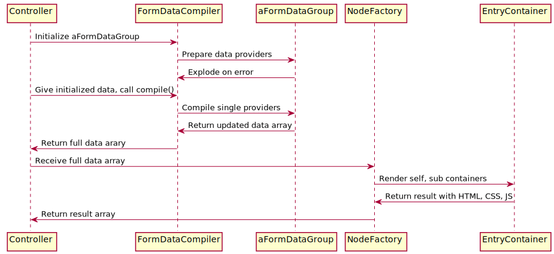

.. include:: ../../../Includes.txt

.. _FormEngine-Overview:

=======================
Main Rendering Workflow
=======================

This is done by example. The details to steer and how to use only sub-parts of the rendering chain are
explained in more detail in the following sections.

Editing a record in the backend - often from within the `Page` or `List` module - triggers the
:php:`EditDocumentController` by routing definitions using :php:`UriBuilder->buildUriFromRoute($moduleIdentifier)`
and handing over which record of which table should be edited. This can be an existing record, or it could be a command
to create the form for a new record. The EditDocumentController is the main logic triggered whenever
an editor changes a record!

The :php:`EditDocumentController` has two main jobs: Trigger rendering of one or multiple records
via FormEngine, and hand over any given data by a FormEngine :code:`POST` result over to the DataHandler
to persist stuff in the database.

The rendering part of the :php:`EditDocumentController` job splits into these parts:

* Initialize main FormEngine data array using :code:`POST` or :code:`GET` data to specify which specific record(s)
  should be edited.

* Select which group of DataProviders should be used.

* Trigger FormEngine DataCompiler to enrich the initialized data array with further data by calling all data
  providers specified by selected data provider group.

* Hand over DataCompiler result to an entry "render container" of FormEngine and receive a result array.

* Take result array containing HTML, CSS and JavaScript details and put them into :php:`FormResultCompiler` which
  hands them over to the :php:`PageRenderer`.

* Let the :php:`PageRenderer` output its compiled result.

The controller does two distinct things here: First, it initializes a data array and lets it get enriched by
data providers of FormEngine which add all information needed for the rendering part. Then feed this data array
to the rendering part of FormEngine to end up with a result array containing all HTML, CSS and JavaScript.

In code, this basic workflow looks like this:

.. code-block:: php

    $formDataGroup = GeneralUtility::makeInstance(TcaDatabaseRecord::class);
    $formDataCompiler = GeneralUtility::makeInstance(FormDataCompiler::class, $formDataGroup);
    $nodeFactory = GeneralUtility::makeInstance(NodeFactory::class);
    $formResultCompiler = GeneralUtility::makeInstance(FormResultCompiler::class);
    $formDataCompilerInput = [
        'tableName' => $table,
        'vanillaUid' => (int)$theUid,
        'command' => $command,
    ];
    $formData = $formDataCompiler->compile($formDataCompilerInput);
    $formData['renderType'] = 'outerWrapContainer';
    $formResult = $nodeFactory->create($formData)->render();
    $formResultCompiler->mergeResult($formResult);

This basically means the main FormEngine concept is a two-fold process: First create an array to gather all
render-relevant information, then call the render engine using this array to come up with output.

This two-fold process has a number of advantages:

* The data compiler step can be regulated by a controller to only enrich with stuff that is needed in any given context.
  This part is supported by encapsulating single data providers in data groups, single data providers can be omitted if
  not relevant in given scope.

* Data providing and rendering is split: Controllers could re-use the rendering part of FormEngine while
  all or parts of the data providers are omitted, or their data comes from "elsewhere". Furthermore, controllers can
  re-use the data providing part of FormEngine and output the result in an entirely different way than HTML. The
  latter is for instance used when FormEngine is triggered for a TCA tree by an ajax call and thus outputs a JSON array.

* The code constructs behind "data providing" and "rendering" can be different to allow higher re-use and more
  flexibility with having the "data array" as main communication base in between. This will become more obvious
  in the next sections where it is shown that data providers are a linked list, while rendering is a tree.
