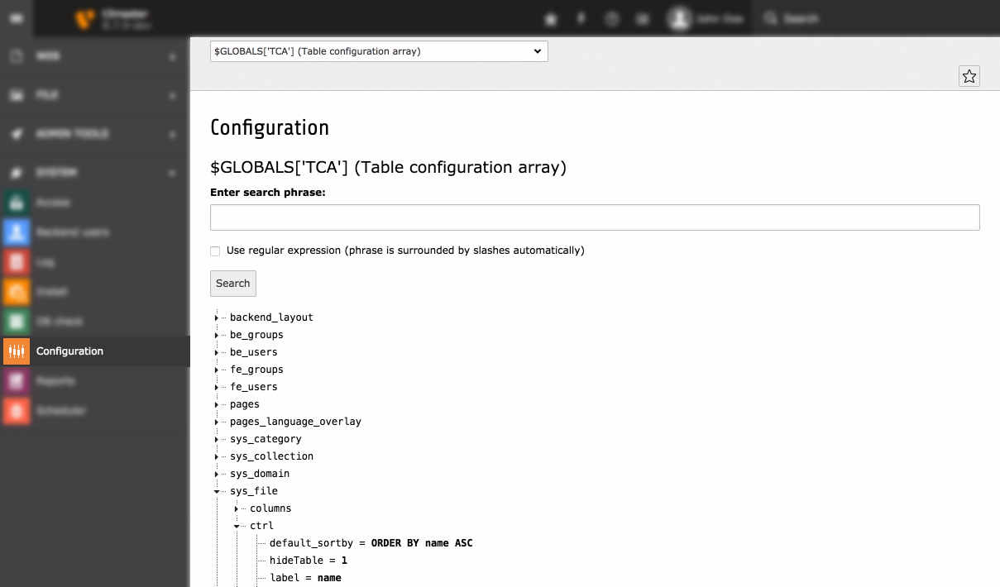

.. include:: ../../../Includes.txt

.. _globals-variables:

================
Global Variables
================

.. note::

   Variables in italics *may* be set in a script prior to
   the bootstrap process so they are optional.

.. note::

   To make the table below a bit more compact, namespaces were left out. Here
   are the fully qualified class names referred to below:

   - "SystemEnvironmentBuilder" = :php:`\TYPO3\CMS\Core\Core\SystemEnvironmentBuilder`
   - "Bootstrap" = :php:`\TYPO3\CMS\Core\Core\Bootstrap`
   - "PackageManager" = :php:`\TYPO3\CMS\Core\Package\PackageManager`

.. t3-field-list-table::
 :header-rows: 1

 - :Variable,20: Global variable
   :Defined,20: Defined in
   :Description,50: Description
   :FE,10: Avail. in FE

 - :Variable:
         $GLOBALS['TYPO3\_CONF\_VARS']
   :Defined:
         :file:`typo3/sysext/core/Configuration/DefaultConfiguration.php`
   :Description:
         TYPO3 configuration array. Please refer to file
         :file:`typo3/sysext/core/Configuration/DefaultConfigurationDescription.php`
         where each option is described in detail in the comments. The same comments
         are also available in the *Install Tool* when you choose "All Configuration".
   :FE:
         Yes

 - :Variable:
         $GLOBALS['TYPO3\_LOADED\_EXT']
   :Defined:
         :php:`PackageManager::loadPackageManagerStatesFromCache()`
         :php:`PackageManager::initializeCompatibilityLoadedExtArray()`
   :Description:
         Array with all loaded extensions listed with a set of paths. You can
         check if an extension is loaded by the function
         :php:`\TYPO3\CMS\Core\Utility\ExtensionManagementUtility::isLoaded($key)` where :php:`$key` is the extension key.
   :FE:
         Yes

 - :Variable:
         $GLOBALS['EXEC\_TIME']
   :Defined:
         :php:`SystemEnvironmentBuilder::initializeGlobalTimeTrackingVariables()`
   :Description:
         Is set to :php:`time()` so that the rest of the script has a common value
         for the script execution time.

         .. note::

           Should not be used anymore, rather use the :ref:`DateTime Aspect <context_api_aspects_datetime>`.

   :FE:
         Yes

 - :Variable:
         $GLOBALS['SIM\_EXEC\_TIME']
   :Defined:
         :php:`SystemEnvironmentBuilder::initializeGlobalTimeTrackingVariables()`
   :Description:
         Is set to :php:`$GLOBALS['EXEC_TIME']` but can be altered later in the script if we
         want to simulate another execution-time when selecting from e.g. a
         database (used in the frontend for preview of future and past dates)

         .. note::

           Should not be used anymore, rather use the :ref:`DateTime Aspect <context_api_aspects_datetime>`.

   :FE:
         Yes

 - :Variable:
         $GLOBALS['PAGES\_TYPES']
   :Defined:
         :file:`typo3/sysext/core/ext_tables.php`
   :Description:
         See :ref:`page-types`
   :FE:
         (occasionally)

 - :Variable:
         $GLOBALS['TCA']
   :Defined:
         :php:`Bootstrap::loadExtensionTables()`
   :Description:
         See :ref:`TCA Reference<t3tca:start>`
   :FE:
         Yes, partly

 - :Variable:
         $GLOBALS['TBE\_MODULES']
   :Defined:
         :file:`typo3/sysext/core/ext_tables.php`
   :Description:
         The backend main/sub-module structure. See section elsewhere plus
         source code of class :php:`\TYPO3\CMS\Backend\Module\ModuleLoader` which also includes some
         examples.
   :FE:
         (occasionally)

 - :Variable:
         $GLOBALS['TBE\_STYLES']
   :Defined:
         :file:`typo3/sysext/core/ext_tables.php`
   :Description:
         Contains information related to BE skinning.
   :FE:
         (occasionally)

 - :Variable:
         $GLOBALS['T3\_SERVICES']
   :Defined:
         :php:`SystemEnvironmentBuilder::initializeGlobalVariables()`
   :Description:
         Global registration of services.
   :FE:
         Yes

 - :Variable:
         $GLOBALS['T3\_VAR']
   :Defined:
         :php:`SystemEnvironmentBuilder::initializeGlobalVariables()`
   :Description:
         Space for various internal global data storage in TYPO3. Each key in
         this array is a data space for an application. Keys currently defined
         for use is:

         ['callUserFunction'] + ['callUserFunction\_classPool']: Used by
         :php:`\TYPO3\CMS\Core\Utility\GeneralUtility::callUserFunction` to store singleton objects.

         ['RTEobj'] : Used to hold the current RTE object if any. See
         :php:`\TYPO3\CMS\Backend\Utility\BackendUtility`.

         ['ext'][ *extension-key* ] : Free space for extensions.
   :FE:
         Yes

 - :Variable:
         $GLOBALS['BE\_USER']
   :Defined:
         :php:`Bootstrap::initializeBackendUser()`
   :Description:
         Backend user object. See :ref:`be-user`.
   :FE:
         (depends)

 - :Variable:
         *$GLOBALS['TBE\_MODULES\_EXT']*
   :Defined:
         [In :file:`ext_tables.php` files of extensions]
   :Description:
         Used to store information about modules from extensions that should be
         included in "function menus" of real modules. See the Extension API
         for details.
   :FE:
         (occasionally)

 - :Variable:
         *$GLOBALS['TCA\_DESCR']*
   :Defined:
         [:file:`tables.php` files]
   :Description:
         Can be set to contain file references to local lang files containing
         :php:`TCA_DESCR` labels. See section about Context Sensitive Help.
   :FE:
         No

.. _globals-exploring:

Exploring Global Variables
==========================

Many of the global variables described above can be inspected using the
**ADMIN TOOLS > Configuration** module.

.. warning::
   This module is always viewed in the BE context. Variables defined
   only in the FE context will not be visible there.

.. note::

   This module is purely a browser. It does not let you change
   values.

   It also lets you browse a number of other global arrays.
   Just be curious and investigate!

   Viewing the :php:`$GLOBALS['TYPO3_CONF_VARS]` array using the **ADMIN TOOLS > Configuration** module

