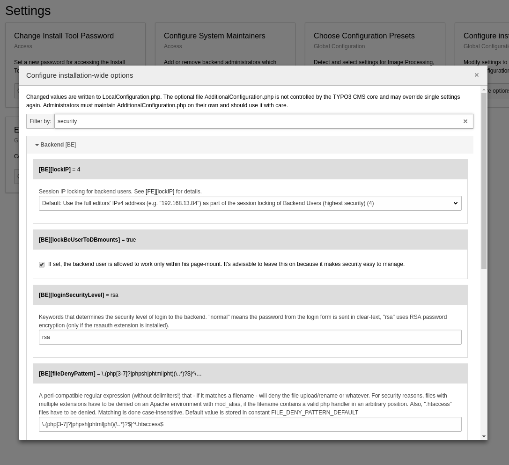

.. include:: ../../../Includes.txt

.. _typo3ConfVars:

TYPO3_CONF_VARS
^^^^^^^^^^^^^^^

However the main configuration is achieved via a set of global settings
stored in a global array called :code:`$GLOBALS['TYPO3_CONF_VARS']`.

This chapter describes this global configuration in more details and hints
at other configuration possibilities.

.. _typo3ConfVars-localConfiguration:

File LocalConfiguration.php
"""""""""""""""""""""""""""

The global configuration is stored in file :file:`typo3conf/LocalConfiguration.php`.
This file overrides default settings from :file:`typo3/sysext/core/Configuration/DefaultConfiguration.php`.

.. important::

   Since configuration settings can be manipulated from within the
   TYPO3 CMS backend, the :file:`typo3conf/LocalConfiguration.php`
   must be writable by the web server user.

The local configuration file is basically a long array which is simply returned
when the file is included. It represents the global TYPO3 CMS configuration.
This configuration can be modified/extended/overridden by extensions,
by setting configuration options inside an extension's
:file:`ext_localconf.php` file. :ref:`See extension files and locations <extension-files-locations>`
for more details about extension structure.

A typical content of :file:`typo3conf/LocalConfiguration.php` looks like this:

.. code-block:: php

   <?php
   return [
      'BE' => [
         'debug' => true,
         'explicitADmode' => 'explicitAllow',
         'installToolPassword' => '$P$Cbp90UttdtIKELNrDGjy4tDxh3uu9D/',
         'loginSecurityLevel' => 'rsa',
      ],
      'DB' => [
         'Connections' => [
            'Default' => [
               'charset' => 'utf8',
               'dbname' => 'empty_typo3',
               'driver' => 'mysqli',
               'host' => '127.0.0.1',
               'password' => 'foo',
               'port' => 3306,
               'user' => 'bar',
            ],
         ],
      ],
      'EXT' => [
         'extConf' => [
            'css_styled_content' => 'a:1:{s:32:"loadContentElementWizardTsConfig";s:1:"1";}',
            'doc_tut_templating' => 'a:0:{}',
            'rsaauth' => 'a:1:{s:18:"temporaryDirectory";s:0:"";}',
            'saltedpasswords' => 'a:2:{s:3:"BE.";a:4:{s:21:"saltedPWHashingMethod";s:41:"TYPO3\\CMS\\Saltedpasswords\\Salt\\PhpassSalt";s:11:"forceSalted";i:0;s:15:"onlyAuthService";i:0;s:12:"updatePasswd";i:1;}s:3:"FE.";a:5:{s:7:"enabled";i:1;s:21:"saltedPWHashingMethod";s:41:"TYPO3\\CMS\\Saltedpasswords\\Salt\\PhpassSalt";s:11:"forceSalted";i:0;s:15:"onlyAuthService";i:0;s:12:"updatePasswd";i:1;}}',
            't3editor' => 'a:0:{}',
         ],
      ],
      'FE' => [
         'debug' => true,
         'loginSecurityLevel' => 'rsa',
      ],
      'GFX' => [
         'jpg_quality' => '80',
      ],
      'MAIL' => [
         'transport_sendmail_command' => '/usr/sbin/sendmail -t -i ',
      ],
      'SYS' => [
         'devIPmask' => '*',
         'displayErrors' => 1,
         'encryptionKey' => '0396e1b6b53bf48b0bfed9e97a62744158452dfb9b9909fe32d4b7a709816c9b4e94dcd69c011f989d322cb22309f2f2',
         'exceptionalErrors' => 28674,
         'sitename' => 'New TYPO3 site',
         'systemLogLevel' => 0,
      ],
   ];

As you can see, the array is structured on two main levels. The first level
corresponds roughly to a category, the second one being properties, which
may themselves be arrays.

The configuration categories are:

BE
  Options related to the TYPO3 CMS backend

DB
  Database connection configuration

EXT
  Extension configuration options. The settings of each extension is stored as
  a serialized array.

FE
  Frontend-related options.

GFX
  Options related to image manipulation.

MAIL
  Options related to the sending of emails (transport, server, etc.).

SYS
  General options which may affect both the frontend and the backend.

Details on the various configuration-options can be found in the install-tool
as well as the TYPO3-source at
:file:`typo3/sysext/core/Configuration/DefaultConfigurationDescription.yml`.
The documentation shown in the install-tool is automatically extracted from
those values of :file:`DefaultConfigurationDescription.yml`.

The Install Tool provides various dedicated modules that change parts of
:file:`LocalConfiguration.php`, those can be found in **Admin tools > Settings**,
most importantly section **Configure installation-wide options**:

.. _typo3ConfVars-additionalConfiguration:

File AdditionalConfiguration.php
""""""""""""""""""""""""""""""""

Although you can manually edit the :file:`typo3conf/LocalConfiguration.php`
file, it is limited in scope because the file is expected to return
a PHP array. Also the file is rewritten every time an option is
changed in the Install Tool or some other operation (like changing
an extension configuration in the Extension Manager). Thus custom
code cannot reside in that file.

Such code should be placed in the :file:`typo3conf/AdditionalConfiguration.php`
file. This file is never touched by TYPO3, so any code will be
left alone.

Furthermore this file is loaded **after** :file:`typo3conf/LocalConfiguration.php`,
which means it represents an opportunity to change global configuration
values programmatically if needed.

:file:`typo3conf/AdditionalConfiguration.php` is a plain PHP file.
There are no specific rules about what it may contain. However since
the code it contains is included on **every** request to TYPO3 CMS
- whether frontend or backend - you should avoid inserting code
which requires heavy duty processing.

.. _typo3ConfVars-defaultConfiguration:

File DefaultConfiguration.php
"""""""""""""""""""""""""""""

TYPO3 CMS comes with some default settings, which are defined in
file :file:`typo3/sysext/core/Configuration/DefaultConfiguration.php`.

This is the base configuration, the other files like :file:`LocalConfiguration.php`
just overlay it.

Here is an extract of that file:

.. code-block:: php

	return [
		'GFX' => [
			'thumbnails' => true,
			'thumbnails_png' => true,
			'gif_compress' => true,
			'imagefile_ext' => 'gif,jpg,jpeg,tif,tiff,bmp,pcx,tga,png,pdf,ai,svg',
			// ...
		],
		// ...
	];

You will probably find it interesting to take a look at that file,
which also contains values not displayed in the Install Tool and thus
not easily available for modification.

