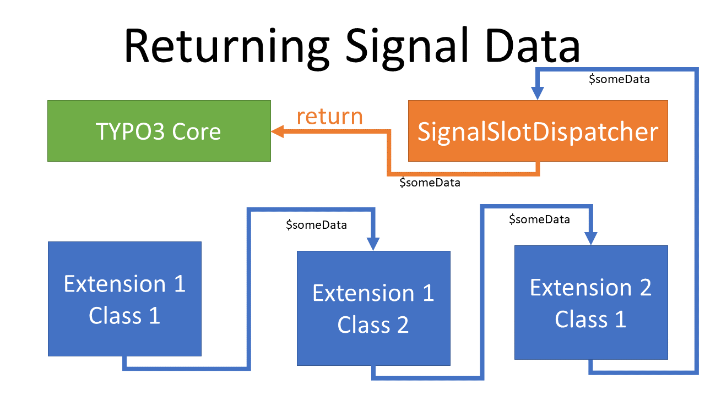

.. include:: /Includes.rst.txt

.. _signals-slots:

==============================
Signals and Slots (deprecated)
==============================

.. warning::

   The extbase :php:`SignalSlotDispatcher` and the concept of using Signals and Slots
   has been superseded by :ref:`PSR-14 events <EventDispatcher>`

Signals and Slots provide a way to extend TYPO3s Core functionality or the functionality of Extensions. Signals roughly
follow the `observer pattern <https://en.wikipedia.org/wiki/Observer_pattern>`__.

Signals and Slots decouple the sender (sending a signal) and the receiver(s)
(called slots). :ref:`Hooks <hooks-general>` depend on directly calling functions in the implementing class.

.. _signals-concept:

Concept of Signals and Slots
============================

Whenever the sender (i.e. a core class or the class of an extension) wants to send a signal it calls :php:`dispatch` on
the SignalSlot :php:`Dispatcher`. The sender does not have or need any information about the receivers (slots). (See
:ref:`Dispatching Signals <signals-dispatch>`)

The receiver generates a slot by calling :php:`connect` on the SignalSlot :php:`Dispatcher` on startup. A slot always listens for
signals with name i.e. "afterExtensionUninstall" on a certain class, i.e. "InstallUtility::class". (See `Using Signals
<signals-basics>`)

.. image:: ../../../Images/Hooks/RegisteringSignalsAndSlots.png
   :class: with-shadow

The function representing the slot will be called automatically by the SignalSlot :php:`Dispatcher` whenever a signal gets
dispatched. The slot will be called with one array parameter. If several slots registered for a
signal all of them will be called. However the order in which they are being called cannot be defined or depended upon.

.. image:: ../../../Images/Hooks/EmittingASignal.png
   :class: with-shadow

The slot may provide an array as return value that may or may not be used be the dispatching class depending on its
implementation. In the case of several slots being connected to the signal and one or all of them have return values the
return value of the previous slot will be fed into the next slot as input data. As there is no way of knowing in which
order the slots will be called, several slots manipulations of the same part of the array might override each other.

As the data returned by a slot will be used as input for the next slot it must forward the entire information
from the input data plus the changes being made by this slot.

Slots should never take the content of the input data array for granted, because
there is no programmatic way of ensuring the returned array contains all expected data, .

.. _signals-dispatch:

Dispatching Signals
===================

.. _signals-basics:

Emitting a signal is a mere call of the function :php:`dispatch` on the SignalSlot :php:`Dispatcher`::

   # use TYPO3\CMS\Core\Utility\GeneralUtility;
   # use TYPO3\CMS\Extbase\Object\ObjectManager;
   # use TYPO3\CMS\Extbase\SignalSlot\Dispatcher;

   $signalSlotDispatcher = GeneralUtility::makeInstance(ObjectManager::class)->get(Dispatcher::class);
   $signalArguments = [
      'someData' => $someData,
      'otherData' => $otherData,
      'caller' => $this
   ];
   $signalArguments = $signalSlotDispatcher->dispatch(__CLASS__, 'signalName', $signalArguments);

The data returned by the dispatch should not be taken for granted. Always perform sanity checks before using it.

Using Signals
=============

To connect a slot to a signal, use the :php:`\TYPO3\CMS\Extbase\SignalSlot\Dispatcher::connect()` method.
This method accepts the following arguments:

1. :php:`$signalClassName`: Name of the class containing the signal
2. :php:`$signalName`: Name of the class containing the signal
3. :php:`$slotClassNameOrObject`: Name of the class containing the slot or the instantiated class or a :php:`\Closure` object
4. :php:`$slotMethodName`: Name of the method to be used as a slot. If :php:`$slotClassNameOrObject` is a :php:`\Closure` object, this parameter is ignored and can be skipped
5. :php:`$passSignalInformation`: If set to :php:`true`, the last argument passed to the slot will be information about the signal (:php:`EmitterClassName::signalName`)

Usage example:

.. code-block:: php
   :linenos:

   $signalSlotDispatcher = `\TYPO3\CMS\Core\Utility\GeneralUtility::`
makeInstance(\TYPO3\CMS\Extbase\SignalSlot\Dispatcher::class);
   $signalSlotDispatcher->connect(
     `\TYPO3\CMS\Extensionmanager\Utility\InstallUtility::class,  // Signal class name`
'afterExtensionUninstall',                                  // Signal name
     `\TYPO3\CMS\Core\Core\ClassLoadingInformation::class,        // Slot class name`
'dumpClassLoadingInformation'                               // Slot name
   );

In this example, we define that we want to call the method
:php:`dumpClassLoadingInformation` of the class
:php:`\TYPO3\CMS\Core\Core\ClassLoadingInformation::class` when the signal
:php:`afterExtensionUninstall` of the class
:php:`\TYPO3\CMS\Extensionmanager\Utility\InstallUtility::class` is dispatched.

To find out which parameters/variables are available, open the signal's class
and take a look at the dispatch call:

:php:`$this->signalSlotDispatcher->dispatch(__CLASS__, 'afterExtensionUninstall', [$extensionKey, $this]);`

In this case, the :php:`dumpClassLoadingInformation` method will get the
extension key and an instance of the dispatching class as parameters.

Finding Signals
===============

There is no complete list of signals available, but they are easily found by
searching the TYPO3 core or the extensions code for :php:`dispatch(`.

For finding hooks, look in the :ref:`Hooks Configuration <hooks-configuration>`.
