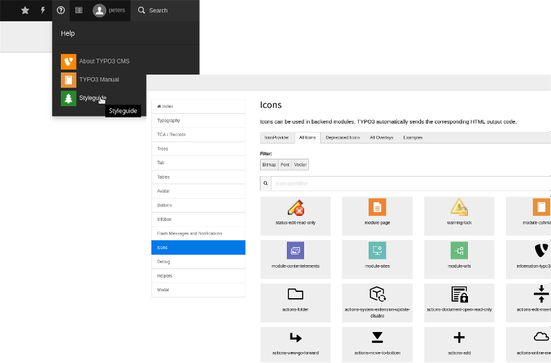

.. include:: /Includes.rst.txt
.. index::
   Backend; Icon API
   Icon API
.. _icon:

========
Icon API
========

Since version 7.5 `TYPO3 CMS`:pn: provides an Icon API for all icons in the TYPO3 backend.

.. index:: IconRegistry; registerIcon
.. _icon-registration:

Registration
============

All icons must be registered in the :php:`IconRegistry`.
To register icons for your own extension use the following
code in your :php:`ext_localconf.php` file:

.. code-block:: php

   $iconRegistry = \TYPO3\CMS\Core\Utility\GeneralUtility::makeInstance(
      \TYPO3\CMS\Core\Imaging\IconRegistry::class
   );
   $iconRegistry->registerIcon(
      $identifier, // Icon-Identifier, for example tx-myext-action-preview
      \TYPO3\CMS\Core\Imaging\IconProvider\SvgIconProvider::class,
      ['source' => 'EXT:myext/Resources/Public/Icons/action-preview.svg']
   );

.. index:: Icon API; IconProviderInterface

IconProvider
------------

The `TYPO3 Core`:pn: ships three icon providers which can be used:

* :php:`BitmapIconProvider` – For all kinds of bitmap icons (GIF, PNG, JPEG, etc.)
* :php:`SvgIconProvider` – For SVG icons
* :php:`FontawesomeIconProvider` – For all icons which can be found in the fontawesome.io icon font

In case you need a custom icon provider, you can add your own by writing a
class which implements the :php:`IconProviderInterface`.

.. _icon-usage:

Using icons in your code
========================

You can use the Icon API to receive icons in your PHP
code or directly in `Fluid`:pn:.

.. index:: Icon API; IconFactory

The PHP way
-----------

You can use the :php:`IconFactory` to request an icon:

.. code-block:: php

   $iconFactory = \TYPO3\CMS\Core\Utility\GeneralUtility::makeInstance(
      \TYPO3\CMS\Core\Imaging\IconFactory::class
   );
   $icon = $iconFactory->getIcon(
      'tx-myext-action-preview',
      \TYPO3\CMS\Core\Imaging\Icon::SIZE_SMALL,
      'overlay-identifier'
   );
   $this->view->assign('icon', $icon);

.. index::
   Fluid; Core icon
   pair: Icon API; Fluid

The `Fluid`:pn: `ViewHelper`:pn:
--------------------------------

You can also use the :ref:`Fluid core:icon ViewHelper <t3viewhelper:typo3-core-icon>` to render an icon in your view:

.. code-block:: html

   {namespace core = TYPO3\CMS\Core\ViewHelpers}
   <core:icon identifier="my-icon-identifier" size="small" />

This will render the desired icon using an `img`-tag. If you prefer having the SVG inlined into your HTML (for example for being able to change colors with CSS), you can set the optional `alternativeMarkupIdentifier` attribute to `inline`. By default, the icon will pick up the font-color of its surrounding element if you use this option.

.. code-block:: html

   {namespace core = TYPO3\CMS\Core\ViewHelpers}
   <core:icon identifier="my-icon-identifier" size="small" alternativeMarkupIdentifier="inline" />

.. index:: JavaScript; getIcon

The `JavaScript`:pn: way
------------------------

In `JavaScript`:pn:, icons can be only fetched from the Icon Registry. To achieve this,
add the following dependency to your RequireJS module: :js:`TYPO3/CMS/Backend/Icons`.
In this section, the module is known as `Icons`.

The module has a single public method :js:`getIcon()` which accepts up to five arguments:

.. rst-class:: dl-parameters

identifier
   :sep:`|` :aspect:`Condition:` required
   :sep:`|` :aspect:`Type:` string
   :sep:`|`

   Identifier of the icon as registered in the Icon Registry.

size
   :sep:`|` :aspect:`Condition:` required
   :sep:`|` :aspect:`Type:` string
   :sep:`|`

   Desired size of the icon. All values of the :js:`Icons.sizes` enum are allowed, these are: `small`, `default`, `large` and `overlay`.

overlayIdentifier
   :sep:`|` :aspect:`Condition:` optional
   :sep:`|` :aspect:`Type:` string
   :sep:`|`

   Identifier of an overlay icon as registered in the Icon Registry.

state
   :sep:`|` :aspect:`Condition:` optional
   :sep:`|` :aspect:`Type:` string
   :sep:`|`

   Sets the state of the icon. All values of the :js:`Icons.states` enum are allowed, these are: `default` and `disabled`.

markupIdentifier
   :sep:`|` :aspect:`Condition:` optional
   :sep:`|` :aspect:`Type:` string
   :sep:`|`

   Defines how the markup is returned. All values of the :js:`Icons.markupIdentifiers` enum are allowed, these are: `default` and `inline`. Please note that `inline` is only meaningful for SVG icons.

The method :js:`getIcon()` returns a jQuery Promise object, as internally an AJAX request is done.

.. note::
   Since TYPO3 9, the icons are cached in the localStorage of the client to reduce the workload off the server.

Here's an example code how a usage of the `JavaScript`:pn: Icon API may look like:

.. code-block:: js

   define(['jquery', 'TYPO3/CMS/Backend/Icons'], function($, Icons) {
       // Get a single icon
       Icons.getIcon('spinner-circle-light', Icons.sizes.small).done(function(spinner) {
           console.log(spinner);
       });
   });

.. index:: Icon Api; Available icons
.. _available-icons:

Available icons
===============

The `TYPO3 Core`:pn: comes with a number of icons that may be used in your extensions.

To search for available icons, you can use one of these possibilities:

Install styleguide extension
----------------------------

Install the extension *styleguide* as described in the Readme in the `installation
<https://github.com/TYPO3/styleguide#installation>`__ section.

Once, installed, you can view available icons by selecting help (?) on the top in the
`TYPO3`:pn: backend, then *Styleguide* and then *Icons*, *All Icons*.

There, browse through existing icons. Use the name under the icon (for example
:code:`actions-add`) as first parameter for :php:`IconFactory::getIcon()` in PHP or as value for
the argument :code:`identifier` in `Fluid`:pn: (see code examples above).

Use TYPO3.Icons
---------------

An alternative way to look for existing icons is to browse through `TYPO3.Icons <https://typo3.github.io/TYPO3.Icons/>`__.
