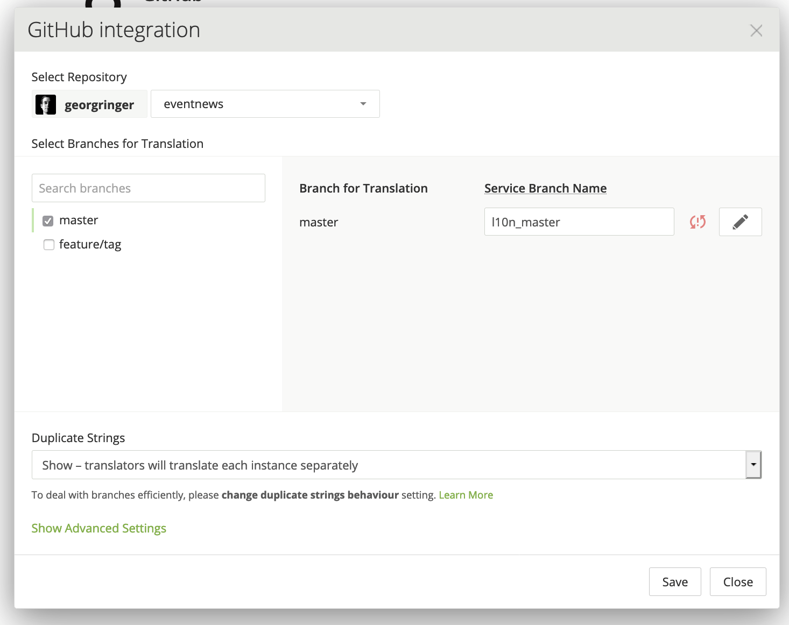
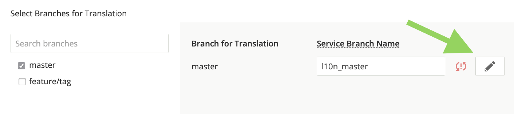

.. include:: ../../../../Includes.txt

.. _crowdin-extension-integration:

=====================
Extension Integration
=====================

This section describes how an extension author can get his extension setup at Crowdin.

.. tip::

   **Important to know**

   - Your extension must be on GitHub, BitBucket or GitLab
   - Currently TYPO3 can only handle one branch/version for languages, more to that later.

Setup
=====

Get in contact with the team in the TYPO3 slack channel *cig-crowdin-localization* with the following information:

#. Extension name
#. Information if your extension is already available on the previous translation server
#. Your email address for an invitation to Crowdin, so you will get the correct role for your project.

Integration
===========

You need to handle the integration yourself as you got the permissions on GitHub.

Go to the url of your project at Crowdin (e.g. `https://crowdin.com/project/typo3-extension-ttaddress`_) and switch to **Settings** & then switch to the tab **Integrations**. Click on the button **Setup integration**.

.. figure:: ../../../../Images/I18n/Crowdin/crowdin-integration-setup.png
   :alt: Start of Crowdin integration for an extension
   :width: 600px

   Start of Crowdin integration for an extension

A modal will open and will allow you to to select the proper repository.

Select branches
~~~~~~~~~~~~~~~
Select the **main** branch you want to be translated.

   Branch configuration

.. important::

   TYPO3 can currently handle one branch for an extension!
   Typically you should select the master branch.

Push translations
~~~~~~~~~~~~~~~~~
Click on the *Show advanced settings* link below to decide now how you want your translations to behave:

.. figure:: ../../../../Images/I18n/Crowdin/crowdin-integration-push-translations.png
   :alt: Setting for translation pushes
   :width: 600px

   Setting for translation pushes

Uncheck the checkbox to avoid pushing back the translations to your project directly.

Branch configuration
~~~~~~~~~~~~~~~~~~~~
Now click on the edit button next to the branch name to setup your branch configuration.

This will open a new modal and will ask for the _Configuration file name_. We propose the file name `.crowdin.yaml`

.. figure:: ../../../../Images/I18n/Crowdin/crowdin-integration-configuration-file.png
   :alt: Setting for translation pushes
   :width: 600px

Adopt the file name and press **Continue**.

Now you need to define where the language files are located.

.. figure:: ../../../../Images/I18n/Crowdin/crowdin-integration-overview.png
   :alt: Location of translation files
   :width: 600px

Typically the following setup will workout fine:

- Source file path: `/Resources/Private/Language/`
- Translated file path: `/%original_path%/%two_letters_code%.%original_file_name%`

Please check in the right area of the model if all xlf files have been identified.

Now press the green save button in upper left corner and then the save button in lower right corner.

Now press the last save button and you are done!

After a short time you should see something like that

.. figure:: ../../../../Images/I18n/Crowdin/crowdin-integration-result.png
   :alt: Result
   :width: 600px

Happy translating!

.. tip::

   Checkout the :ref:`crowdin-faq` for solutions to common pitfalls.
