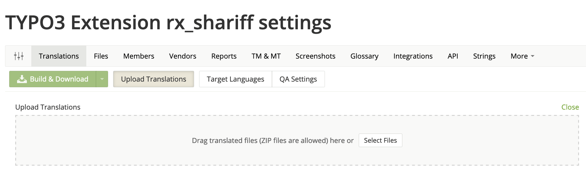

.. include:: /Includes.rst.txt
.. index:: Crowdin; FAQ
.. _crowdin-faq:

================================
Frequently Asked Questions (FAQ)
================================

.. only:: html

.. contents::
        :local:
        :depth: 2

.. note::

   If you miss a question, please share it in the slack channel `cig-crowdin-localization`.

General Questions
=================

.. _crowdin-faq-pootle:

Will the old translation server be disabled?
--------------------------------------------
The existing translation server will be turned off some time after Crowdin will have been announced stable.

The existing and exported translations which are downloaded within the Install Tool will be available for longer time.

.. _crowdin-faq-extension-missing:

My favorite extension is not available on Crowdin
-------------------------------------------------
If you miss an extension on Crowdin, contact the extension owner to create a project on Crowdin.
It is a simple process and done within minutes.

.. _crowdin-faq-extension-language-missing:

My favorite language is not available for an extension
------------------------------------------------------
If you are missing the support for a specific language in an extension on Crowdin please contact either the maintainer
of the extension or the :ref:`crowdin-initiative`.

.. seealso::

   The language needs to be supported by TYPO3 itself as well, see :ref:`i18n_languages` for a list of all languages.

Questions about extension integration
=====================================

.. _crowdin-faq-duplicated-labels:

Why does Crowdin show me translations in source language?
---------------------------------------------------------
If you just have setup Crowdin and you ship translated xlf files within your extension, those will be shown as well as to be translated.

You need to exlude those in your `.crowdin.yaml` configuration which can be found in the extension root directory.

.. code-block:: yaml

    files:
      - source: /Resources/Private/Language/
        translation: /%original_path%/%two_letters_code%.%original_file_name%
        ignore:
          - /Resources/Private/Language/de.*

.. important::

   In the long run, you should remove the translations from your extension as those will be provided by the translation server.

More information can be found in the documentation on crowdin: https://support.crowdin.com/configuration-file/

.. index:: Crowdin; Migration from Pootle

How can I migrate translations from Pootle?
-------------------------------------------
If translations exist on Pootle there is no need to retranslate everything on Crowdin again - you can import those.

#. **Fetch translations**
   Download the translations you need. You will need to download them directly from the TER with the following URL pattern:

   `https://extensions.typo3.org/fileadmin/ter/{e}/{x}/{extension_key}-l10n/{extension_key}-l10n-{lang}.zip`

   Here `{extension_key}` is the full extension key, `{e}` the 1st and `{x}` the 2nd letter of that extension key.
   Finally `{lang}` is the 2-lettered language identifier, e.g. `de`.

   For example to download the German translations of the extension *powermail*:
   `wget 'https://extensions.typo3.org/fileadmin/ter/p/o/powermail-l10n/powermail-l10n-de.zip'`

#. **Open and Cleanup**
   Unzip the translations and switch to e.g. `Resources/Private/Language` which is the typical directory
   of translations. Remove the *xml* files as only the *xlf* files are important.

#. **Match the Files**
   The attribute `original` of the translations must match the ones of the default translations.
   **Example**: The file :file:`Resources/Private/Language/locallang.xlf` starts with the following snippet:

   .. code-block:: xml

      <?xml version="1.0" encoding="utf-8" standalone="yes" ?>
         <xliff version="1.0">
            <file source-language="en" datatype="plaintext" original="EXT:powermail/Resources/Private/Language/locallang.xlf">

   The file :file:`de.locallang.xlf` must be modified and `original="messages"` must be changed to `original="EXT:powermail/Resources/Private/Language/locallang.xlf"`

#. **Upload the Translations**
   Just keep on reading the next question.

.. index:: Crowdin; Upload xlf files

Can I upload translated xlf files?
----------------------------------
Yes, you can! Switch to the settings area of your project (you need to have the proper permissions for that) and you can upload xlf files or even zip files containg the xlf files.

   Upload translations

After triggering the upload Crowdin tries to find the matching source files and the target languages.
It might be that you need to adopt both if not found automatically.
