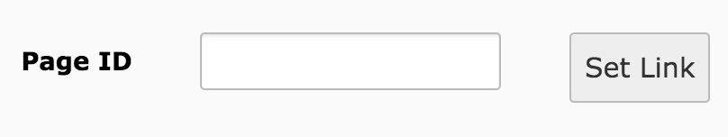

.. include:: ../../../Includes.txt
.. highlight:: typoscript

.. _linkhandler:

===============
LinkHandler Api
===============

.. versionadded:: 8.6
    The LinkHandler Api has been included in the core with the change
    :doc:`t3core:Changelog/8.6/Feature-79626-IntegrateRecordLinkHandler`.
    Before, it had only been available as third party extension.

The LinkHandler enables editors to link to single records i.e. a single news record.

The configuration consists of the following parts:

.. rst-class:: bignums-xxl

#. PageTSconfig is used to create a new tab in the LinkBrowser to be able to select records.

   .. code-block:: typoscript

      TCEMAIN.linkHandler.anIdentifier {
          handler = TYPO3\CMS\Recordlist\LinkHandler\RecordLinkHandler
          label = LLL:EXT:extension/Resources/Private/Language/locallang.xlf:link.customTab
          configuration {
              table = tx_example_domain_model_item
          }
          scanAfter = page
      }

   You can position your own handlers in order as defined in the :ref:`linkbrowser-api`.

   The links are now stored in the database with the syntax
   `<a href="t3://record?identifier=anIdentifier&amp;uid=456">A link</a>`.

#. TypoScript is used to generate the actual link in the frontend.

   .. code-block:: typoscript

      config.recordLinks.anIdentifier {
          // Do not force link generation when the record is hidden
          forceLink = 0
          typolink {
              parameter = 123
              additionalParams.data = field:uid
              additionalParams.wrap = &tx_example_pi1[item]=|&tx_example_pi1[controller]=Item&tx_example_pi1[action]=show
          }
      }

   .. important::

      Do not change the identifier after links have been created  using the LinkHandler. The identifier will be
      stored as part of the link in the database.

.. _linkhandler-pagetsconfig:

LinkHandler PageTSconfig Options
================================

The minimal PageTSconfig Configuration is::

   TCEMAIN.linkHandler.anIdentifier {
       handler = TYPO3\CMS\Recordlist\LinkHandler\RecordLinkHandler
       label = LLL:EXT:extension/Resources/Private/Language/locallang.xlf:link.customTab
       configuration {
           table = tx_example_domain_model_item
       }
   }

The following optional configuration is available:

:ts:`configuration.hidePageTree = 1`
   Hide the page tree in the link browser

:ts:`configuration.storagePid = 84`
   The link browser starts with the given page

:ts:`configuration.pageTreeMountPoints = 123,456`
   Only records on these pages and their children will be displayed

Furthermore the following options are available from the LinkBrowser Api:

:ts:`configuration.scanAfter = page` or :ts:`configuration.scanBefore = page`
   define the order in which handlers are queried when determining the responsible tab for an existing link

:ts:`configuration.displayBefore = page` or :ts:`configuration.displayAfter = page`
   define the order how the various tabs are displayed in the link browser.

Example: news records from one storage pid
------------------------------------------

The following configuration hides the page tree and shows news records only from the defined storage page::

   TCEMAIN.linkHandler.news {
       handler = TYPO3\CMS\Recordlist\LinkHandler\RecordLinkHandler
       label = News
       configuration {
           table = tx_news_domain_model_news
           storagePid = 123
           hidePageTree = 1
       }
       displayAfter = mail
   }

It is possible to have another configuration using another storagePid which also contains news records.
This configuration shows a reduced page tree starting at page with uid 42::

   TCEMAIN.linkHandler.bookreports {
       handler = TYPO3\CMS\Recordlist\LinkHandler\RecordLinkHandler
       label = Book Reports
       configuration {
           table = tx_news_domain_model_news
           storagePid = 42
           pageTreeMountPoints = 42
           hidePageTree = 0
       }
   }

The PageTSconfig of the LinkHandler is being used in sysext `recordlist`
in class :php:`\TYPO3\CMS\Recordlist\LinkHandler\RecordLinkHandler`
which does not contain Hooks or Slots.

Enable Page id field
--------------------

It is possible to enable an additional field in the link browser to enter the uid of a page.
The uid will be used directly instead of selecting it from the page tree.

This only works for the :php:`PageLinkHandler`.
It will **not** work for custom added LinkHandler configurations.

Enable the field with the following User-/PageTSConfig::

   TCEMAIN.linkHandler.page.configuration.pageIdSelector.enabled = 1

.. _linkhandler-typoscript:

LinkHandler TypoScript Options
================================

A configuration could look like this::

   config.recordLinks.anIdentifier {
       forceLink = 0

       typolink {
           parameter = 123
           additionalParams.data = field:uid
           additionalParams.wrap = &tx_example_pi1[item]=|
       }
   }

The TypoScript Configuration of the LinkHandler is being used in sysext `frontend`
in class :php:`TYPO3\CMS\Frontend\Typolink\DatabaseRecordLinkBuilder`.

Example: news records displayed on fixed detail page
----------------------------------------------------

The following displays the link to the news on a detail page::

   config.recordLinks.news {
      typolink {
         parameter = 123
         additionalParams.data = field:uid
         additionalParams.wrap = &tx_news_pi1[controller]=News&tx_news_pi1[action]=detail&tx_news_pi1[news]=|
      }
   }

Once more if the book reports that are also saved as `tx_news_domain_model_news` record should be displayed on their own
detail page you can do it like this::

   config.recordLinks.news {
      typolink {
         parameter = 123
         additionalParams.data = field:uid
         additionalParams.wrap = &tx_news_pi1[controller]=News&tx_news_pi1[action]=detail&tx_news_pi1[news]=|
      }
   }
