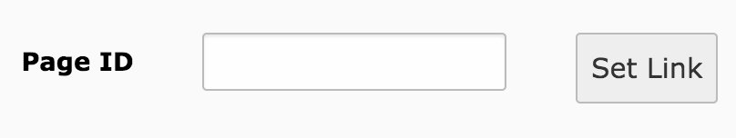

.. include:: /Includes.rst.txt
.. highlight:: typoscript
.. index:: LinkHandlers; PageLinkHandler
.. _pagelinkhandler:

===================
The PageLinkHandler
===================

The PageLinkHandler enables editors to link to pages and content.

It is implemented in class :php:`\TYPO3\CMS\Recordlist\LinkHandler\PageLinkHandler`
of the system extension :file:`recordlist`. The class is marked as
:php:`@internal` and contains neither hooks nor events.

The PageLinkHandler is preconfigured in the page TSconfig as::

   TCEMAIN.linkHandler {
      page {
         handler = TYPO3\\CMS\\Recordlist\\LinkHandler\\PageLinkHandler
         label = LLL:EXT:recordlist/Resources/Private/Language/locallang_browse_links.xlf:page
      }
   }

Enable direct input of the page id
==================================

It is possible to enable an additional field in the link browser to enter the uid of a page.
The uid will be used directly instead of selecting it from the page tree.

Enable the field with the following User-/PageTSConfig::

   TCEMAIN.linkHandler.page.configuration.pageIdSelector.enabled = 1

