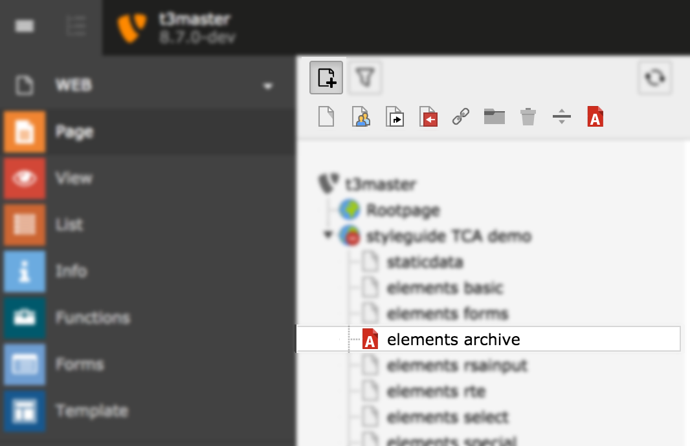

.. include:: /Includes.rst.txt
.. index:: Create new Page Type

.. _page-types-example:

====================
Create new Page Type
====================

The following example adds a new page type called "Archive".

   The new page type visible in the TYPO3 backend

The whole code to add a page type is shown below with the according file names above.

The first step is to add the new page type to the global array described above. Then you need to add
the icon chosen for the new page type and allow users to drag and drop the new page type to the page
tree.

.. note::

   You have to change :code:`example` in the argument of the anonymous function
   to your own extension key.

The new page type is added to :php:`$GLOBALS['PAGES_TYPES']` in :file:`ext_tables.php`::

   (function ($extKey='example') {
      $archiveDoktype = 116;

      // Add new page type:
      $GLOBALS['PAGES_TYPES'][$archiveDoktype] = [
          'type' => 'web',
          'allowedTables' => '*',
      ];

   })();

User TSconfig is added and an icon is registed in :file:`ext_localconf.php`::

   (function ($extKey='example') {
      // Provide icon for page tree, list view, ... :
      $iconRegistry = \TYPO3\CMS\Core\Utility\GeneralUtility::makeInstance(\TYPO3\CMS\Core\Imaging\IconRegistry::class);
      $iconRegistry
          ->registerIcon(
              'apps-pagetree-archive',
              TYPO3\CMS\Core\Imaging\IconProvider\SvgIconProvider::class,
              [
                  'source' => 'EXT:' . $extKey . '/Resources/Public/Icons/Archive.svg',
              ]
          );
      $iconRegistry
          ->registerIcon(
              'apps-pagetree-archive-contentFromPid',
              TYPO3\CMS\Core\Imaging\IconProvider\SvgIconProvider::class,
              [
                  'source' => 'EXT:' . $extKey . '/Resources/Public/Icons/ArchiveContentFromPid.svg',
              ]
          );
      // ... register other icons in the same way, see below.

      // Allow backend users to drag and drop the new page type:
      \TYPO3\CMS\Core\Utility\ExtensionManagementUtility::addUserTSConfig(
          'options.pageTree.doktypesToShowInNewPageDragArea := addToList(' . $archiveDoktype . ')'
      );
   })();

Furthermore we need to modify the configuration of "pages" records. As one can modify the pages, we
need to add the new doktype as select item and associate it with the configured icon. That's done in
:file:`Configuration/TCA/Overrides/pages.php`::

   (function ($extKey='example', $table='pages') {
      $archiveDoktype = 116;

      // Add new page type as possible select item:
      \TYPO3\CMS\Core\Utility\ExtensionManagementUtility::addTcaSelectItem(
          $table,
          'doktype',
          [
              'LLL:EXT:' . $extKey . '/Resources/Private/Language/locallang.xlf:archive_page_type',
              $archiveDoktype,
              'EXT:' . $extKey . '/Resources/Public/Icons/Archive.svg'
          ],
          '1',
          'after'
      );

      \TYPO3\CMS\Core\Utility\ArrayUtility::mergeRecursiveWithOverrule(
          $GLOBALS['TCA'][$table],
          [
              // add icon for new page type:
              'ctrl' => [
                  'typeicon_classes' => [
                      $archiveDoktype => 'apps-pagetree-archive',
                      $archiveDoktype . '-contentFromPid' => "apps-pagetree-archive-contentFromPid",
                      $archiveDoktype . '-root' => "apps-pagetree-archive-root",
                      $archiveDoktype . '-hideinmenu' => "apps-pagetree-archive-hideinmenu",
                  ],
              ],
              // add all page standard fields and tabs to your new page type
              'types' => [
                  (string) $archiveDoktype => [
                      'showitem' => $GLOBALS['TCA'][$table]['types'][\TYPO3\CMS\Core\Domain\Repository\PageRepository::DOKTYPE_DEFAULT]['showitem']
                  ]
              ]
          ]
      );
   })();

As you can see from the example, to make sure you get the correct icons, you can utilize :php:`typeicon_classes`.

For the following cases you need to configure icons explicitly, otherwise they will automatically fall back to the
variant for regular page doktypes.

* Page contains content from another page (`<doktype>-contentFromPid`)
* Page is hidden in navigation (`<doktype>-hideinmenu`)
* Page is site-root (`<doktype>-root`)

.. note::

   Make sure to add the additional icons using the icon registry!

