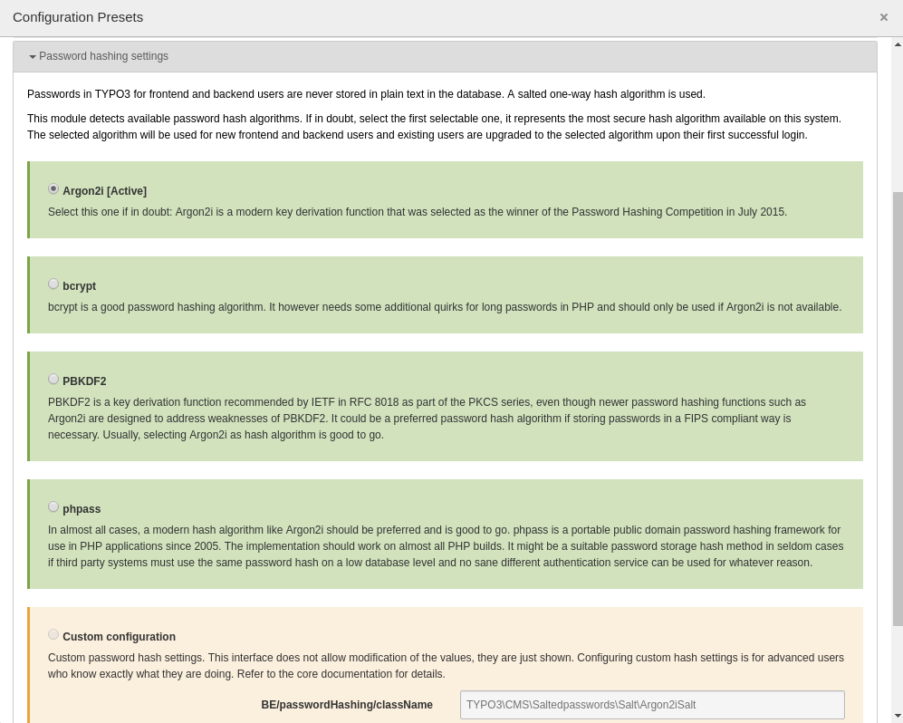

.. include:: ../../Includes.txt

.. _password-hashing:

================
Password hashing
================

.. _password-hashing-introduction:

Introduction
============

TYPO3 never stores passwords in plain text in the database and updates stored frontend and
backend user password hashes to the latest configured hash algorithm upon user login.

TYPO3 uses modern hash algorithms suitable for the given PHP platforms, the default since
TYPO3 core version v9 is Argon2i.

This section is for administrators and users who want to know more about TYPO3 password hashing,
their basic understanding and configuration in TYPO3.

.. _password-hashing-basic-knowledge:

Basic knowledge
===============

Storing plain text passwords to simply compare a stored password with a given user password when
the user logs in has been a common attack vector in online systems ever since.
The main risk is that some other system vulnerability or chain of vulnerabilities
allows an attacker to download the frontend or backend database user table and then knows
the plain text passwords of users. These passwords can then be used to log in as the specific
user to get their TYPO3 instance specific privileges (for instance a backend admin)
and - usually even worse - are often abused by attackers to try the same user / password combination
at different services. Maybe, the user uses the same login email and password for his bank account?

To mitigate this risk, one-way `hash`_ algorithms have been invented: The given password is one-way
transformed to some different string (a hash), this hash is stored in the database instead of the
plain text password. The idea is if you see the hash, you can not calculate back to the plain text
password easily. That's why hashes are called "one-way": It's cheap to calculate a hash from given
password, but it is expensive (in terms of computation time) to calculate a password from a given hash. If a user
tries to log in and submits its password, the same one-way transformation is done again, if it is then identical
with the hash stored in the database, the submitted password must have been correct and the login is granted.

The most well-known hash algorithm is md5. Those basic hash algorithms and especially md5 have drawbacks,
tough: First, if you find some other string that resolves to the same hash, you are screwed (that's called
a collision). An attacker could login with a password that is not identical to "your" password, but still matches
the calculated hash. And second, if an attacker just calculates a huge list of all possible password with their
representing hashes (this is called a rainbow table) and puts them into a database to compare any given hash with,
it can easily look up plain text passwords for given hashes. A simple md5 hash is susceptible to both of these
attack vectors and thus deemed insecure. md5 rainbow tables for casual passwords can be found online and md5 collision
creation can be done without too many issues. In short: md5 is not a good idea to secure user passwords.

To mitigate the rainbow table attack vector, the idea of "salting" has been invented: Instead of
hashing the given password directly and always ending up with the same hash for the same password
(if different users use the same password they end up with the same hash in database), a "salt"
is added to the password. This salt is a random string calculated when the password is first set (when the
user record is created) and stored *together* with the hash. The basic thinking is that the salt is
appended to the password before hashing, the "salt+password" combination is then hashed. The salt is stored
next to the hash in the database. If then a user logs in and submits its user name and password, the requested user
is looked up in the database, the salt of this user is looked up in the database, the submitted password
is concatenated with the salt, the salt and password combination are then hashed and compared with the stored
hash. This is pretty clever and leads to the situation that users with the same password end up with different
hashes in the database since their random calculated salt is different. This effectively makes rainbow
tables (direct hash to password lists) unfeasible.

During the past years, further attack vectors to salted password hashes have been found. For example,
md5 hash attacks have been optimized such they are extremely quick on some platforms, those can calculate
billions of hashes per second with decent time and money efforts. This allows password guessing even with
salted hashes. Modern password hash algorithms thus try to mitigate these attack vectors. Their hash calculation
is expensive in terms of memory and CPU time even for short input string like passwords
(short as in "not a book of text") and they can not be easily split into parallel sections to run on many
systems in parallel or optimized into chunks by re-using already computed sections for different input again.

TYPO3 improved its standards in `password hash`_ storing over a long time and always went with more modern
approaches: Core version v4.3 from 2009 added salted password storing, v4.5 from 2011 added salted passwords
storing using algorithm 'phpass' by default, v6.2 from 2014 made salted passwords storing mandatory,
v8 added the improved hash algorithm 'pbkdf2' and used it by default.

With core v9, the password hashing has been refactored and modern hash algorithms like especially
Argon2i have been added. PHP improved in this area a lot and PHP 7.2 brings `Argon2i`_ by default, so this
algorithm could be easily integrated as available core hash mechanism to the existing hash family.
Argon2i is rather resilient against GPU and some other attacks, the default TYPO3 core configuration even raises
the default PHP configuration to make attacks on stored argon2i user password hashes even more unfeasible.

This is the current state if you are reading this document. The rest is about details: It is possible
to register own password hash algorithms with an extension if you really think this is needed, it is possible
to change options for frontend and backend users hash algorithms. By default however, TYPO3 automatically selects
a good password hash algorithm and administrators usually do not have to take care of it. The PHP API
is pretty straight forward and helps you to compare passwords with their stored hashes if needed in
extensions.

One last point on this basic hash knowledge section: Password hashes are always only as secure as
the user submitted password: If a user has a trivial password like "foo", an attacker who got hold
of the salted password hash will always be successful to crack the hash with a common password hash
crack tool, no matter how expensive the calculation is. Good password hashing does **not** rescue
users from short passwords or simple passwords that can be found in a dictionary. It is usually a
good idea to force users to register with a password that for instance at least has some minimum length.

How does it look like?
======================

Below is an example of a frontend user with its stored password hash. Since TYPO3 can handle multiple
different hash mechanisms in parallel, each hash is prefixed with a unique string that identifies the
used password. In this case it is `$argon2i`::

    MariaDB [cms]> SELECT uid,username,password FROM fe_users WHERE uid=2;
    +-----+----------+---------------------------------------------------------------------------------------------------+
    | uid | username | password                                                                                          |
    +-----+----------+---------------------------------------------------------------------------------------------------+
    |   2 | someuser | $argon2i$v=19$m=16384,t=16,p=2$WFdVRjdqVy9TbVJPajNqcA$vMDP/TBSR0MSA6yalyMpBmFRbCD8UR4bbHZma59yNjQ |
    +-----+----------+---------------------------------------------------------------------------------------------------+
    1 row in set (0.01 sec)

Configuration
=============

Configuration of password hashing is done by TYPO3 automatically and administrators usually do not need
to worry about details too much: If installing a TYPO3 instance with core version v9 or higher, the
installation process will configure the best available hash algorithm by default. Since core version v9 requires
at least PHP version 7.2, this is usually Argon2i. Only if the PHP build is incomplete, some less secure
fallback will be selected.

If upgrading from a version smaller than v9, the upgrade process will automatically upgrade to the best
available hash algorithm, which is again usually Argon2i if the PHP 7.2 build on the server has been set up
in a sane way.

Switching between hash algorithms in a TYPO3 instance is unproblematic: Password hashes of the old selected
algorithm are just kept but newly created users automatically use the new hash algorithms. However, if a
user successfully logs in and a hash in the database for that user is found that uses an algorithm no longer
configured as default hash algorithm, the user hash will be upgraded to the currently selected hash algorithm.
This way, existing user password hashes are updated to better hash algorithms over time, upon login.

Note that "dead" users (users that don't use the site anymore and never login) will thus never get their
hashes upgraded to better algorithms. This is an issue that can't be solved on this hash level directly.
However, it is a good idea to clean up dead users from the database anyway, site administrators should
establish processes to comply with the idea of data minimisation of person related data. TYPO3 helps here
for instance with the "Table garbage collection" task of the scheduler extension, details on this are
however out-of-scope of this section.

To verify and select which specific hash algorithm is currently configured for frontend and backend users, a
preset of the settings module has been established with core v9. It can be found in "Admin Tools" -> "Settings"
-> "Configuration presets" -> "Password hashing settings":

The image shows settings for an instance that runs with frontend and backend users having their passwords
stored as Argon2i hashes in the database. The other listed algorithms are deemed less secure, they however
rely on different PHP capabilities and might be suitable fall backs if Argon2i is not available for whatever
reason.

Configuration options
=====================

Configuration of password hashing is stored in :file:`LocalConfiguration.php` with defaults in
:file:`DefaultConfiguration.php` at five places:

* :php:`$GLOBALS['TYPO3_CONF_VARS']['SYS']['availablePasswordHashAlgorithms']`: An array of class names.
  This is the list of available password hash algorithms. Extensions may extend this list if they need to
  register new (and hopefully even more secure) hash algorithms.

* :php:`$GLOBALS['TYPO3_CONF_VARS']['FE']['passwordHashing']['className']`: The salt class name configured
  as default hash mechanism for frontend users.

* :php:`$GLOBALS['TYPO3_CONF_VARS']['FE']['passwordHashing']['options']`: Special options of the configured
  hash algorithm. This is usually an empty array to fall back to defaults, see below for more details.

* :php:`$GLOBALS['TYPO3_CONF_VARS']['BE']['passwordHashing']['className']`: The salt class name configured
  as default hash mechanism for backend users.

* :php:`$GLOBALS['TYPO3_CONF_VARS']['BE']['passwordHashing']['options']`: Special options of the configured
  hash algorithm. This is usually an empty array to fall back to defaults, see below for more details.

Available hash algorithms
=========================

The list of available hash mechanisms is pretty rich since core version v9 and may be extended further
if better hash algorithms over time. Most algorithms have additional configuration options that may be
used to increase or lower the needed computation power to calculated hashes. Administrators usually do
not need to fiddle with these and should go with defaults configured by the core. If changing these options,
administrators should know exactly what they are doing.

Argon2i
-------

`Argon2i`_ is a modern key derivation function that was selected as the winner of the Password Hashing
Competition in July 2015. It should be available on all PHP builds since PHP version 7.2. Options:

* memory_cost: Maximum memory (in kibibytes) that may be used to compute the Argon2 hash. Defaults to 16384.
* time_cost: Maximum amount of time it may take to compute the Argon2 hash. Defaults to 16.
* threads: Number of threads to use for computing the Argon2 hash. Defaults to 2.

bcrypt
------

`bcrypt`_ is a password hashing algorithm based on blowfish and has been presented in 1999. It needs some
additional quirks for long passwords in PHP and should only be used if Argon2i is not available. Options:

* cost: Denotes the algorithmic cost that should be used. Defaults to 12.

PBKDF2
------

`PBKDF2`_ is a key derivation function recommended by IETF in RFC 8018 as part of the PKCS series, even
though newer password hashing functions such as Argon2i are designed to address weaknesses of PBKDF2.
It could be a preferred password hash algorithm if storing passwords in a FIPS compliant way is necessary. Options:

* hash_count: Number of hash iterations. Defaults to 25000.

phpass
------

`phpass`_ phpass is a portable public domain password hashing framework for use in PHP applications since 2005.
The implementation should work on almost all PHP builds. Options:

* hash_count: The default log2 number of iterations for password stretching. Defaults to 14.

blowfish
--------

TYPO3's salted password hash implementation based on `blowfish`_ and PHP`s crypt() function. It has
been integrated very early to TYPO3 but should no longer be used. It is only included for instances
that still need to upgrades users to better mechanisms. Options:

* hash_count: The default log2 number of iterations for password stretching. Defaults to 7.

md5salt
-------

TYPO3's salted password hash implementation based on `md5`_ and PHP`s crypt() function. It should not be used
any longer and is only included for instances that still need to upgrade users to better mechanisms.

PHP API
=======

Creating a hash
---------------

To create a new password hash from a given plain-text password, these are the steps to be done:

* Let the factory deliver an instance of the default hashing class with given context `FE` or `BE`
* Create the user password hash

Example implementation for TYPO3 frontend::

   // Given plain text password
   $password = 'someHopefullyGoodAndLongPassword';
   $hashInstance = GeneralUtility::makeInstance(SaltFactory::class)->getDefaultHashInstance('FE');
   $hashedPassword = $hashInstance->getHashedPassword($password);

Checking a password
-------------------

To check a plain-text password against a password hash, these are the steps to be done:

* Let the factory deliver an instance of the according hashing class
* Compare plain-text password with salted user password hash

Example implementation for TYPO3 frontend::

   // Given plain-text password
   $password = 'someHopefullyGoodAndLongPassword';
   // The stored password hash from database
   $passwordHash = 'YYY';
   $success = GeneralUtility::makeInstance(SaltFactory::class)
       ->get($saltedPassword)
       ->checkPassword($password, $passwordHash);

Adding a new hash mechanism
---------------------------

To add an additional hash algorithm, these steps are necessary:

* Create a new class that implements interface :code:`TYPO3\CMS\Core\Crypto\PasswordHashing\PasswordHashInterface`
* Register the class as additional entry in :code:`$GLOBALS['TYPO3_CONF_VARS']['SYS']['availablePasswordHashAlgorithms']`

.. _hash: https://en.wikipedia.org/wiki/Cryptographic_hash_function
.. _password hash: https://en.wikipedia.org/wiki/Key_derivation_function
.. _Argon2i: https://en.wikipedia.org/wiki/Argon2
.. _bcrypt: https://en.wikipedia.org/wiki/Bcrypt
.. _PBKDF2: https://en.wikipedia.org/wiki/PBKDF2
.. _phpass: http://www.openwall.com/phpass/
.. _blowfish: https://en.wikipedia.org/wiki/Blowfish_(cipher)
.. _md5: https://en.wikipedia.org/wiki/MD5

