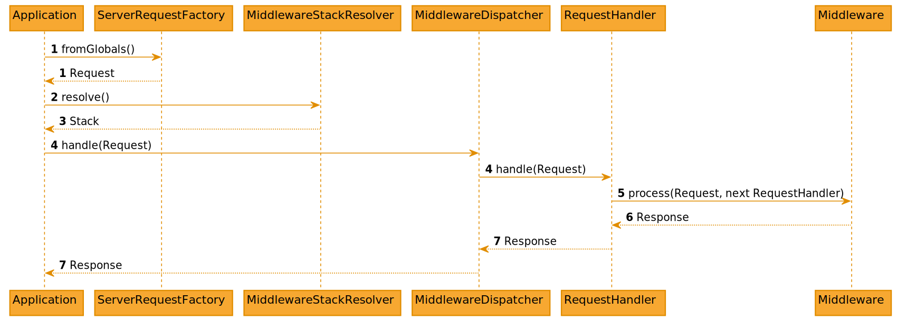

.. include:: ../../Includes.txt

.. highlight:: php

.. _request-handling:

==============================
Request Handling (Middlewares)
==============================

TYPO3 CMS has implemented `PSR-15`_ for handling incoming HTTP requests. The
implementation within TYPO3 is often called "Middlewares", as PSR-15 consists of
two interfaces where one is called :php:`Middleware`.

.. _request-handling-basic-concept:

Basic concept
=============

The most important information is available at
https://www.php-fig.org/psr/psr-15/ and https://www.php-fig.org/psr/psr-15/meta/
where the standard itself is explained.

The idea is to use `PSR-7`_ :php:`Request` and :php:`Response` as a base, and
wrap the execution with middlewares which implement `PSR-15`_. PSR-15 will receive
the incoming request and return the created response. Within PSR-15 multiple
request handlers and middlewares can be executed. Each of them can adjust the
request and response.

.. _request-handling-typo3-implementation:

TYPO3 implementation
====================

TYPO3 has implemented the PSR-15 approach in the following way:

   Figure 1-1: Application flow

.. rst-class:: bignums

#. TYPO3 will create a :ref:`typo3-request`.

#. TYPO3 will collect and sort all configured PSR-15 middlewares.

#. TYPO3 will convert all middlewares to PSR-15 request handlers.

#. TYPO3 will call the first middleware with request and the next middleware.

#. Each middleware is processed, see :ref:`request-handling-middlewares`.

#. In the end each middleware has to return a PSR-7 response.

#. This response is passed back to the execution flow.

.. _request-handling-middlewares:

Middlewares
===========

Each middleware has to implement the PSR-15 :php:`MiddlewareInterface`::

   namespace Psr\Http\Server;

   use Psr\Http\Message\ResponseInterface;
   use Psr\Http\Message\ServerRequestInterface;

   /**
    * Participant in processing a server request and response
    *
    * An HTTP middleware component participates in processing an HTTP message:
    * by acting on the request, generating the response, or forwarding the
    * request to a subsequent middleware and possibly acting on its response.
    */
   interface MiddlewareInterface
   {
       /**
        * Process an incoming server request
        *
        * Processes an incoming server request in order to produce a response.
        * If unable to produce the response itself, it may delegate to the provided
        * request handler to do so.
        */
       public function process(
           ServerRequestInterface $request,
           RequestHandlerInterface $handler
       ): ResponseInterface;
   }

By doing so, the middleware can do one or multiple of the following:

* Adjust the incoming request, e.g. add further information.

* Create and return a PSR-7 response.

* Call next request handler (which again can be a middleware).

* Adjust response received from the next request handler.

.. _request-handling-middleware-examples:

Middleware examples
===================

The following list shows typical use cases for middlewares.

.. _request-handling-returning-custom-response:

Returning a custom response
---------------------------

This middleware will check whether TYPO3 is in maintenance mode and will return
an unavailable response in that case. Otherwise the next middleware will be
called, and its response is returned instead.

::

   public function process(
       ServerRequestInterface $request,
       RequestHandlerInterface $handler
   ): ResponseInterface {
       if (/* if logic */) {
           return GeneralUtility::makeInstance(ErrorController::class)
               ->unavailableAction(
                   $request,
                   'This page is temporarily unavailable.'
               );
       }

       return $handler->handle($request);
   }

.. _request-handling-enriching-request:

Enriching the request
---------------------

The current request can be extended with further information, e.g. the current
resolved site and language could be attached to the request.

In order to do so, a new request is built with additional attributes, before
calling the next request handler with the enhanced request.

::

   public function process(
       ServerRequestInterface $request,
       RequestHandlerInterface $handler
   ): ResponseInterface {
       $routeResult = $this->matcher->matchRequest($request);

       $request = $request->withAttribute('site', $routeResult->getSite());
       $request = $request->withAttribute('language', $routeResult->getLanguage());

       return $handler->handle($request);
   }

.. _request-handling-enriching-response:

Enriching the response
----------------------

This middleware will check the length of generated output, and add a header
with this information to the response.

In order to do so, the next request handler is called. It will return the generated
response, which can be enriched before it gets returned.

::

   public function process(
       ServerRequestInterface $request,
       RequestHandlerInterface $handler
   ): ResponseInterface {
       $response = $handler->handle($request);

       if (/* if logic */) {
           $response = $response->withHeader(
               'Content-Length',
               (string)$response->getBody()->getSize()
           );
       }

       return $response;
   }

.. _request-handling-configuring-middlewares:

Configuring middlewares
=======================

In order to implement a custom middleware, this middleware has to be configured.
TYPO3 already provides some middlewares out of the box. Beside adding your own
middlewares, it's also possible to remove existing middlewares from
the configuration.

The configuration is provided within
:file:`Configuration/RequestMiddlewares.php` of an extension::

   return [
       'frontend' => [
           'middleware-identifier' => [
               'target' => \Vendor\ExtName\Middleware\ConcreteClass::class,
               'before' => [
                   'another-middleware-identifier',
               ],
               'after' => [
                   'yet-another-middleware-identifier',
               ],
           ],
       ],
       'backend' => [
           'middleware-identifier' => [
               'target' => \Vendor\ExtName\Middleware\AnotherConcreteClass::class,
               'before' => [
                   'another-middleware-identifier',
               ],
               'after' => [
                   'yet-another-middleware-identifier',
               ],
           ],
       ],
   ];

TYPO3 has multiple stacks where one middleware might only be necessary in one
of them. Therefore the configuration defines the context on its first level to define the
context. Within each context the middleware is registered as new subsection with
an unique identifier as key.

The default stacks are: `frontend` and `backend`.

Each middleware consists of the following options:

target
   PHP string

   FQCN (=Fully Qualified Class Name) to use as middleware.

before
   PHP Array

   List of middleware identifiers. The middleware itself is
   executed before any other middleware within this array.

after
   PHP Array

   List of middleware identifiers. The middleware itself is
   executed after any other middleware within this array.

disabled
   PHP boolean

   Allows to disable specific middlewares.

Override ordering of middlewares
================================

To change the ordering of middlewares shipped by the core an extension can override the registration in
:file:`Configuration/RequestMiddlewares.php`::

   return [
       'frontend' => [
           'middleware-identifier' => [
               'after' => [
                   'another-middleware-identifier',
               ],
               'before' => [
                   '3rd-middleware-identifier',
               ]
           ],
       ]
   ];

However, this could lead to circular ordering depending on the ordering constraints of other
middlewares. Alternatively an existing middleware can be disabled and reregistered again with a new
identifier. This will circumvent the risk of circularity::

   return [
       'frontend' => [
           'middleware-identifier' => [
               'disabled' => true
           ],
           'overwrite-middleware-identifier' => [
               'target' => \Vendor\Extension\Middleware\MyMiddleware::class,
               'after' => [
                   'another-middleware-identifier',
               ],
               'before' => [
                   '3rd-middleware-identifier',
               ]
           ]
       ]
   ];

.. important::

   Always check the integrity of the middleware stack after changing the default ordering.
   This can be done in the configuration module that comes with EXT:lowlevel.

.. _request-handling-psr-17:

Creating new Request / Response Objects
=======================================

PSR-17_ HTTP Factory interfaces are provided by `psr/http-factory` and should be used as
dependencies for PSR-15_ request handlers or services that need to create PSR-7_ message objects.

It is discouraged to explicitly create PSR-7_ instances of classes from the :php:`\TYPO3\CMS\Core\Http`
namespace (they are not public API). Use type declarations against PSR-17_ HTTP Message Factory
interfaces and dependency injection instead.

Example
-------

A middleware that needs to send a JSON response when a certain condition is met, uses the
PSR-17_ response factory interface (the concrete TYPO3 implementation is injected as constructor
dependency) to create a new PSR-7_ response object:

.. code-block:: php

    use Psr\Http\Message\ResponseFactoryInterface;
    use Psr\Http\Message\ResponseInterface;
    use Psr\Http\Message\ServerRequestInterface;
    use Psr\Http\Server\MiddlewareInterface;
    use Psr\Http\Server\RequestHandlerInterface;

    class StatusCheckMiddleware implements MiddlewareInterface
    {
        /** @var ResponseFactoryInterface */
        private $responseFactory;

        public function __construct(ResponseFactoryInterface $responseFactory)
        {
            $this->responseFactory = $responseFactory;
        }

        public function process(ServerRequestInterface $request, RequestHandlerInterface $handler): ResponseInterface
        {
            if ($request->getRequestTarget() === '/check') {
                $data = ['status' => 'ok'];
                $response = $this->responseFactory->createResponse()
                    ->withHeader('Content-Type', 'application/json; charset=utf-8');
                $response->getBody()->write(json_encode($data));
                return $response;
            }
            return $handler->handle($request);
        }
    }

.. _request-handling-psr-18:

Executing HTTP Requests in Middlewares
======================================

The PSR-18_ HTTP Client is intended to be used by PSR-15_ request handlers in order to perform HTTP
requests based on PSR-7_ message objects without relying on a specific HTTP client implementation.

PSR-18_ consists of a client interface and three exception interfaces:

- :php:`\Psr\Http\Client\ClientInterface`
- :php:`\Psr\Http\Client\ClientExceptionInterface`
- :php:`\Psr\Http\Client\NetworkExceptionInterface`
- :php:`\Psr\Http\Client\RequestExceptionInterface`

Request handlers shall use dependency injection to retrieve the concrete implementation
of the PSR-18_ HTTP client interface :php:`\Psr\Http\Client\ClientInterface`.

The PSR-18_ HTTP Client interface is provided by `psr/http-client` and may be used as
dependency for services in order to perform HTTP requests using PSR-7_ request objects.
PSR-7_ request objects can be created with the :ref:`PSR-17 Request Factory interface<request-handling-psr-17>`.

.. note::

   This does not replace the currently available Guzzle wrapper
   :php:`\TYPO3\CMS\Core\Http\RequestFactory->request()`, but is available as a more generic, 
   framework-agnostic alternative. The PSR-18 interface does not allow you to pass 
   request-specific guzzle options. But global options defined in :php:`$GLOBALS['TYPO3_CONF_VARS']['HTTP']`
   are taken into account because GuzzleHTTP is used as the backend for this PSR-18 implementation.
   The concrete implementation is internal and will be replaced by a native guzzle PSR-18
   implementation once it is available.

Example usage
-------------

A middleware might need to request an external service in order to transform the response
into a new response. The PSR-18 HTTP client interface is used to perform the external
HTTP request. The PSR-17 Request Factory Interface is used to create the HTTP request that
the PSR-18 HTTP Client expects. The PSR-7 Response Factory is then used to create a new
response to be returned to the user. All of these interface implementations are injected
as constructor dependencies:

.. code-block:: php

    use Psr\Http\Client\ClientInterface;
    use Psr\Http\Message\RequestFactoryInterface;
    use Psr\Http\Message\ResponseFactoryInterface;
    use Psr\Http\Message\ResponseInterface;
    use Psr\Http\Message\ServerRequestInterface;
    use Psr\Http\Server\MiddlewareInterface;
    use Psr\Http\Server\RequestHandlerInterface;

    class ExampleMiddleware implements MiddlewareInterface
    {
        /** @var ResponseFactory */
        private $responseFactory;

        /** @var RequestFactory */
        private $requestFactory;

        /** @var ClientInterface */
        private $client;

        public function __construct(
            ResponseFactoryInterface $responseFactory,
            RequestFactoryInterface $requestFactory,
            ClientInterface $client
        ) {
            $this->responseFactory = $responseFactory;
            $this->requestFactory = $requestFactory;
            $this->client = $client;
        }

        public function process(ServerRequestInterface $request, RequestHandlerInterface $handler): ResponseInterface
        {
            if ($request->getRequestTarget() === '/example') {
                $req = $this->requestFactory->createRequest('GET', 'https://api.external.app/endpoint.json')
                // Perform HTTP request
                $res = $this->client->sendRequest($req);
                // Process data
                $data = [
                    'content' => json_decode((string)$res->getBody());
                ];
                $response = $this->responseFactory->createResponse()
                    ->withHeader('Content-Type', 'application/json; charset=utf-8');
                $response->getBody()->write(json_encode($data));
                return $response;
            }
            return $handler->handle($request);
        }
    }

.. _request-handling-debugging:

Debugging
=========

In order to see which middlewares are configured and to see the order of
execution, TYPO3 offers a the menu entry :guilabel:`HTTP Middlewares (PSR-15)`
within the "Configuration" module:

.. figure:: /Images/ConfigurationMiddleware.png
   :align: center

   Figure 1-2: TYPO3 configuration module listing configured middlewares.

.. _PSR-18: https://www.php-fig.org/psr/psr-18/
.. _PSR-17: https://www.php-fig.org/psr/psr-17/
.. _PSR-15: https://www.php-fig.org/psr/psr-15/
.. _PSR-7: https://www.php-fig.org/psr/psr-7/

More Information
================

.. toctree::
   :titlesonly:
   :maxdepth: 1

   Typo3Request
