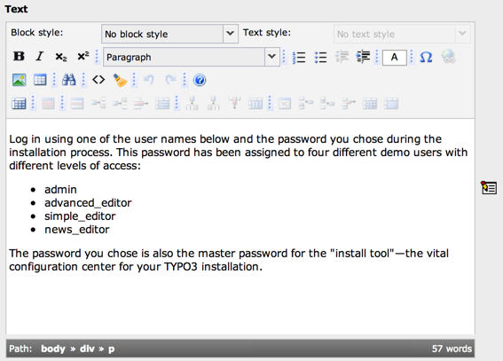

.. include:: /Includes.rst.txt

.. _appendix-a-content-elements:

=======================================
RTE Transformations in Content Elements
=======================================

The RTE is used in the bodytext field of the content elements,
configured for the types "Text" and "Text & Images".

   The Rich-Text Editor in a typical text content element

The configuration of the two 'Text'-types are the same: The toolbar
includes only a subset of the total available buttons. The reason is
that the text content of these types, 'Text' and 'Text & Images' is
*traditionally* not meant to be filled up with HTML-codes. But more
important is the fact that the content is usually (by the standard
TypoScript content rendering used on the vast majority of TYPO3
websites!) parsed through a number of routines.

In order to understand this, here is an outline of what typically
happens with the content of the two Text-types when rendered by
TypoScript for frontend display:

#. All line breaks are converted to :code:` ` codes.

   (Doing this enables us to edit the text in the field rather naturally
   in the backend because line breaks in the edit field comes out as line
   breaks on the page!)

#. All instances of 'http://...' and 'mailto:....' are converted to
   links.

   (This is a quick way to insert links to URLs and email address)

#. The text is parsed for special tags, so called 'typotags', configured
   in TypoScript. The default typotags tags are :code:`<LINK>` (making links),
   :code:`<TYPOLIST>` (making bulletlists), :code:`<TYPOHEAD>` (making headlines) and
   :code:`<TYPOCODE>` (making monospaced formatting).

   (The :code:`<LINK>` tag is used to create links between pages inside TYPO3.
   Target and additional parameters are automatically added which makes
   it a very easy way to make sure, links are correct. :code:`<TYPOLIST>` renders
   each line between the start and end tag as a line in a bulletlist,
   formatted like the content element type 'Bulletlist' would be. This
   would typically result in a bulletlist placed in a table and not using
   the bullet-list tags from HTML. :code:`<TYPOHEAD>` would display the tag
   content as a headline. The type-parameter allows to select between the
   five default layout types of content element headlines. This might
   include graphical headers. :code:`<TYPOCODE>` is not converted).

#. All other 'tags' found in the content are converted to regular text
   (with htmlspecialchars) unless the tag is found in the 'allowTags'
   list.

   (This list includes tags like 'b' (bold) and 'i' (italics) and so
   these tags may be used and will be outputted. However tags like
   'table', 'tr' and 'td' is not in this list by default, so table-html
   code inserted will be outputted as text and not as a table!)

#. Constants and search-words - if set - will be highlighted or inserted.

   (This feature will mark up any found search words on the pages if the
   page is linked to from a search result page.)

#. And finally the result of this processing may be wrapped in
   :code:``-tags, :code:`
`-tags or whatever is configured. This depends on
   whether a stylesheet is used or not. If a stylesheet is used the
   individual sections between the typotags are usually wrapped
   separately.

Now lets see how this behaviour challenges the use of the RTE. This
describes how the situation is handled regarding the two Text-types as
mentioned above. (Numbers refer to the previous bulletlist):

#. Line breaks: The RTE removes all line breaks and makes line breaks
   itself by either inserting a :code:`
...
` section or :code:`
...
`.
   This means we'll have to convert existing lines to :code:`
...
` before
   passing the content to the RTE and further we need to revert the :code:`
`
   and :code:`
` sections in addition to the :code:` `-tagsto line breaks when the
   content is returned to the database from the RTE.

   The greatest challenge here is however what to do if a :code:`
` or :code:`
`
   tag has parameters like 'class' or 'align'. In that case we can't just
   discard the tag. So the tag is preserved.

#. The substitution of http:// and mailto: does not represent any
   problems here.

#. "Typotags": The typotags are not real HTML tags so they would be
   removed by the RTE. Therefore those tags must be converted into
   something else. This is actually an opportunity and the solution to
   the problem is that all :code:`<LINK>`-tags are converted into regular
   :code:`<A>`-tags, all :code:`<TYPOLIST>` tags are converted into :code:`<OL>` or :code:`<UL>` sections
   (ordered/unordered lists, type depends on the type set for the
   :code:`<TYPOLIST>` tag!), :code:`<TYPOHEAD>`-tags are converted to <Hx> tags where the
   number is determined by the type-parameter set for the :code:`<TYPOHEAD>`-tag.
   The align/class-parameter - if set - is also preserved. When the HTML-
   tags are returned to the database they need to be reverted to the
   specific typotags.

   Other typotags (non-standard) can be preserved by being converted to a
   :code:``-section and back. This must be configured through Page
   TSconfig.

   (Update: With "css\_styled\_content" and the transformation "ts\_css"
   only the :code:`<link>` typotag is left. The :code:`<typolist>` and :code:`<typohead>` tags
   are obsolete and regular HTML is used instead)

#. Allowed tags: As not all tags are allowed in the display on the
   webpage, the RTE should also reflect this situation. The greatest
   problem is tables which are (currently) not allowed with the Text-
   types. The reason for this goes back to the philosophy that the field
   content should be human readable and tables are not very 'readable'.

   (Update: With "css\_styled\_content" and the transformation "ts\_css"
   tables are allowed)

#. Constants and search words are no problem.

#. Global wrapping does not represent a problem either. But this issue is
   related more closely to the line break-issue in bullet 1.

Finally images inserted are processed very intelligently because the
'magic' type images are automatically post-processed to the correct
size and proportions after being changed by the RTE in size.

Also if images are inserted by a copy/paste operation from another
website, the image inserted will be automatically transferred to the
server when saved.

In addition all URLs for images and links are inserted as absolute
URLs and must be converted to relative URLs if they are within the
current domain.

.. _appendix-a-content-elements-conclusion:

Conclusion
==========

These actions are done by so called *transformations* which are
configured in the :code:`$TCA`. Basically these transformations are admittedly
very customized to the default behavior of the TYPO3 frontend. And
they are by nature "fragile" constructions because the content is
transformed back and forth for each interaction between the RTE and
the database and may so be erroneously processed. However they serve
to keep the content stored in the database 'clean' and human readable
so it may continuously be edited by non-RTE browsers and users. And
furthermore it allows us to insert TYPO3-bulletlists and headers
(especially graphical headers) visually by the editor while still
having TYPO3 controlling the output.

