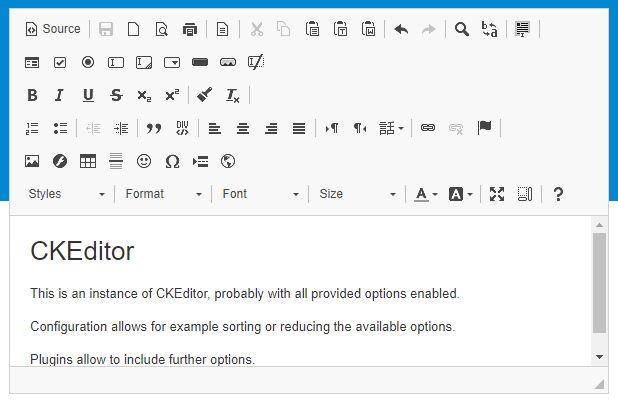

:navigation-title: RTE in frontend forms

..  include:: /Includes.rst.txt
..  _rte-frontend:

=============================================
Rich Text Editors (RTE) in the TYPO3 frontend
=============================================

When you add forms to a website you might want to offer
formatting options like bold, italic etc.. Rich Text Editors offer
extensive options that are configurable for individual needs.

This chapter outlines conceptual and technical information
about adding an RTE on frontend pages.

   The CKEditor integrated in the frontend

The following list describes features and corresponding implementation
effort ordered from simple to complex.

..  _rte-frontend-introduction:

The optional features
=====================

*  Simple text formatting can be achieved using well-known buttons.
   This solution is used to format text (bold, italic, underlined, ...),
   create lists or tables, etc..
   These options are predefined in the RTE and
   and wrap selected content in html-tags, by default without any attributes
   like `id` or `class` for example.

*  Advanced text-formatting can be achieved with predefined blocks and
   according style. Those blocks wrap selected content in html-elements
   with CSS-classes that can be styled in a stylesheet. The formats have
   to be defined by names, short description and according styling.
   CKEditor offers a dropdown button for those block-styles.

   Editing the Source could allow the user optionally to add special
   HTML-elements or attributes like `id`, `class` or more.

*  It might be desired to allow users to upload files like images,
   PDF-documents or other multi-media-content. Images and perhaps some
   other file-types could be displayed in the content, further file-types
   could be linked.

*  Editing data in the frontend requires that applying forms are pre-filled
   with existing data. This might require some considerations concerning
   multiple aspects.

*  Links might be chosen out of the existing pages of the website, those
   links can be added as internal instead of external links but require
   a visual and functional option to select from existing pages.

   *This option requires an Ajax-connection to interact with TYPO3.*

*  For special websites like intranets it might be desired additionally
   to not only allow the upload of media but also to choose media out of
   those that exist already in a public directory on the server.

   *This option requires an Ajax-connection to interact with TYPO3.*

.. attention::

   User input in the frontend always represents a general security risk.

   **A Rich Text Editor might reduce this awareness** because it looks like a
   professional solution but in fact might increase vulnerability if features
   are enabled or included without proper handling on the server.

   It's advised to allow only required input and to disallow any further
   content and features.

   The chapter :ref:`security-threats` informs about possible vulnerabilities
   and concerning forms especially the paragraph about
   :ref:`Cross Site Scripting (XSS) <security-xss>` is important.

..  _rte-frontend-introduction-technical:

Technical Overview
==================

**Files**: Any required files to include a form in the frontend require
an extension, this can be a site package but also a separate extension.
Required filetypes include JavaScript, Fluid templates, CSS and PHP.

**JavaScript**: Rendering the content in the RTE in the frontend is done
with support of JavaScript, so it does not work if the user has disabled
JavaScript, i.e. for accessibility reasons.

**Validation**: The code that is built on base of the user-input should
be filtered. The RTE is doing this based on JavaScript and configuration,
and the server shall receive only this pre-processed code when the form
is sent.
Nevertheless the **transferred data have to be validated on server-side**
again because it's possible to circumvent validation in the frontend by
sending the data without filling the real form or just by disabling
JavaScript.

.. note::

   Extensions like the TYPO3 `form framework` or `powermail` might offer
   solutions to handle some RTE-related challenges. This description is
   not related to any of those extensions, as it would exceed the context
   of this API. If an existing extension is used for forms then the manual
   or support in context of the corresponding extension should help.

..  _rte-frontend-solution:

The solution
============

The chapter :doc:`CKEditor (rte_ckeditor) <ext_rte_ckeditor:Index>` includes examples
and common challenges for the frontend. You can use other editors with TYPO3
and some points, like handling of data on the server, are independent of the
distinct editor in the frontend. Therefore the chapter is advised even if you
use another editor.
