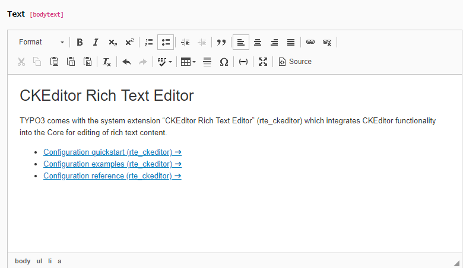

.. include:: /Includes.rst.txt
.. index::
   pair: Rich text editor; Frontend
   pair: Rich text editor; TCA
.. _rte-frontend-introduction:

============
Introduction
============

When forms are added to a website it is sometimes desired to offer
formatting options like bold, italic etc.. Rich Text Editors offer
here extensive options that are configurable for the individual needs.

   The rtehtmlarea RTE activated in the TYPO3 backend

.. tip::

   The description about CKEditor includes challenges and examples for
   the frontend.
   
   Usage of other editors is nevertheless possible and some points like
   handling of data on the server are independent of the distinct editor
   in the frontend.

.. note::

   If you feel eligible to provide a description for other editors
   than CKEditor, this could be included in this documentation.

Efforts to include a RTE can differ very much depending on the offered
features. The features and efforts in the following list increase with
every point.

The optional features
=====================

#. Simple text formatting can be reached with help of a few simple buttons.
   This solution is used to format text bold, italic, underlined, etc..
   Character of these options is that they are predefined in the RTE and
   and wrap selected content in html-tags without further markup.

#. Advanced text-formatting can be achieved with predefined blocks and
   according style. Those blocks wrap selected content in html-elements 
   with CSS-classes that can be styled in a stylesheet. The formats have
   to be defined by names, short description and according styling.
   CKEditor offers a dropdown button for those block-styles.

#. A relatively simple text-field to create formatted text is sometimes not
   enough and the desire to allow users to add elements like links, images,
   PDF-documents or other multi-media-content is raising.

#. Links might be choosen out of the existing pages of the website, those
   links can be added as internal instead of external links but require a visual
   and functional option to existing pages.
   
   This option requires an AJAX-connection to interact with TYPO3.

#. For special websites like intranets it might be desired additionally to not
   only allow the upload of media but also to choose media out of those that
   exist already in a public directory on the server.
   
   This option requires an AJAX-connection to interact with TYPO3.

.. important::

   User input in the frontend represents in general always a security risk.

   A Rich Text Editor might reduce this awarness as it looks like a professional
   solution but in fact might increase the risk if features are enabled
   or included without proper handling on the server.

   It's advised to allow only required input and to disallow any further
   content and features.

Technical Overview
==================

Any required files to include a form in the frontend require an extension, this can
be a sitepackage but also a separated extension. Required filetypes include JavaScript,
fluid-templates, CSS and PHP.

Rendering the content in the RTE in the frontend is done with support of JavaScript,
so it does not work if the user has disabled JavaScript, i.e. for accessibility reasons.
The process of frontend-rendering should filter the code that is built on base of
the user-input. Nevertheless the transferred data have to be verified and validated
on server-side again because it's possible to circumvent the RTE and send the data
without filling the real form.

The TYPO3 `form framework` or extensions like `powermail` might offer solutions to
handle some challenges. This description is not related to any of those extensions,
as it would exceed the context of this API. If an existing extension is used
for forms then the manual or support in context of the corresponding extension
should help.
