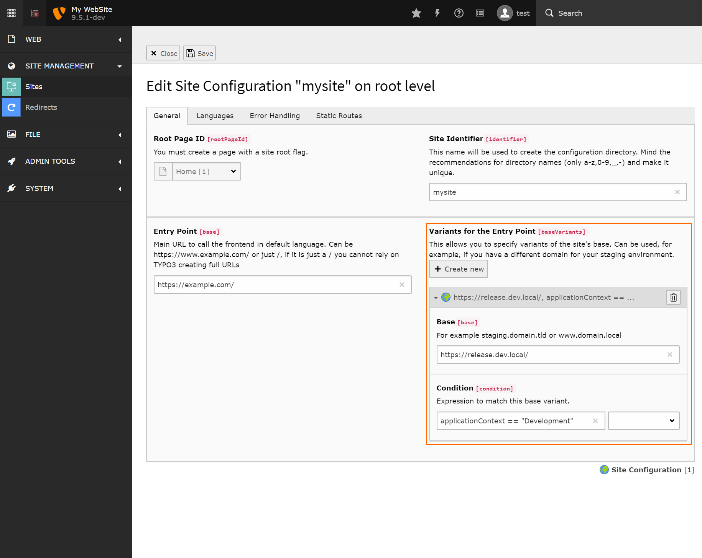

.. include:: /Includes.rst.txt

.. _sitehandling-baseVariants:

=============
Base Variants
=============

In Site Handling base variants represent different bases for a web site depending on a specified
condition. For example a "live" base URL might be `https://example.org` but on local machine
it's `https://example.test` as a domain - that's when variants are used.

Base variants exist for languages, too. Currently these can only be defined
through the respective :file:`*.yml` file, there is no UI available yet.

Variants consist of two parts:

* a base to use for this variant
* a condition that decides when this variant shall be active

Conditions are based on Symfony Expression Language and allow flexible conditions. For example::

    applicationContext == "Development"

would define a base variant to use in Development context.

   A configured base variant for development context.

.. hint::
    For those coming from earlier TYPO3 versions: With site handling, there is no need for `sys_domain` records anymore! :)

.. seealso::
    Read :ref:`application-context` for more information on how to set the application context.

The following variables and functions are available in addition to the default Symfony functionality:

Example
=======

.. code-block:: yaml

    rootPageId: 1
    base: 'https://www.example.com/'
    baseVariants:
      -
        base: 'https://example.local/'
        condition: 'applicationContext == "Development"'
      -
        base: 'https://staging.example.com/'
        condition: 'applicationContext == "Production/Sydney"'
      -
        base: 'https://testing.example.com/'
        condition: 'applicationContext == "Testing/Paris"'
    languages:
      -
        title: 'Global'
        enabled: true
        languageId: '0'
        base: /
        typo3Language: default
        locale: en_UK.UTF-8
        iso-639-1: en
        navigationTitle: English
        hreflang: gb-en
        direction: ''
        flag: gb
      -
        title: 'DE'
        enabled: true
        languageId: '1'
        base: https://example.de/'
        baseVariants:
          -
            base: 'https://de.example.local/'
            condition: 'applicationContext == "Development"'
          -
            base: 'https://staging.example.de/'
            condition: 'applicationContext == "Production/Sydney"'
          -
            base: 'https://testing.example.de/'
            condition: 'applicationContext == "Testing/Paris"'
        typo3Language: de
        locale: de_DE.UTF-8
        iso-639-1: de
        navigationTitle: Deutsch
        hreflang: de-de
        direction: ''
        fallbackType: strict
        flag: de

Properties
==========

typo3.version
-------------

:aspect:`Datatype`
    string

:aspect:`Description`
    The current TYPO3 version

:aspect:`Example`
    `9.5.0`

typo3.branch
------------

:aspect:`Datatype`
    string

:aspect:`Description`
    The current TYPO3 branch

:aspect:`Example`
    `9.5`

typo3.devIpMask
---------------

:aspect:`Datatype`
    string

:aspect:`Description`
    The configured devIpMask taken from `$GLOBALS['TYPO3_CONF_VARS']['SYS']['devIPmask']`

:aspect:`Example`
    `77.176.160.*`

applicationContext
------------------

:aspect:`Datatype`
    string

:aspect:`Description`
    The current application context

:aspect:`Example`
    `Development`

Functions
=========

All functions from TYPO3s `DefaultFunctionsProvider` are available:

ip
--

:aspect:`Datatype`
    string

:aspect:`Description`
    Match an IP address, value or regex, wildcards possible. Special value: `devIp` for matching `devIpMask`.

:aspect:`Example`
    `ip("77.176.160.*")`

compatVersion
-------------

:aspect:`Datatype`
    string

:aspect:`Description`
    Match a TYPO3 version

:aspect:`Example`
    `compatVersion("9.5.0")`, `compatVersion("9.4")`

like
----

:aspect:`Datatype`
    string

:aspect:`Description`
    Comparison function to compare two strings. The first parameter is the "haystack", the
    second the "needle". Wildcards are allowed.

:aspect:`Example`
    `like("foobarbaz", "*bar*")`

getenv
------

:aspect:`Datatype`
    string

:aspect:`Description`
    Wrapper for PHPs `getenv()` function. Allows accessing environment variables.

:aspect:`Example`
    `getenv("TYPO3_BASE_URL")`

date
----

:aspect:`Datatype`
    string

:aspect:`Description`
    Get the current date in given format.

:aspect:`Example for checking the current month`
    `date("j") == 7`

feature
-------

:aspect:`Datatype`
    string

:aspect:`Description`
    Check whether a feature ("feature toggle") is enabled in TYPO3.

:aspect:`Example`
    `feature("TypoScript.strictSyntax")`

traverse
--------

:aspect:`Datatype`
    array and string

:aspect:`Description`
    This function has two parameters: - first parameter is the array to traverse - second parameter is the path to traverse Syntax.

:aspect:`Example`
    `traverse(request.getQueryParams(), 'tx_news_pi1/news') > 0`
