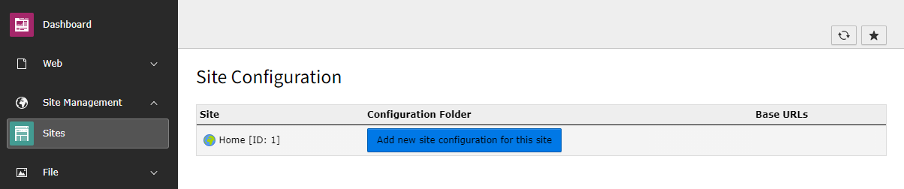
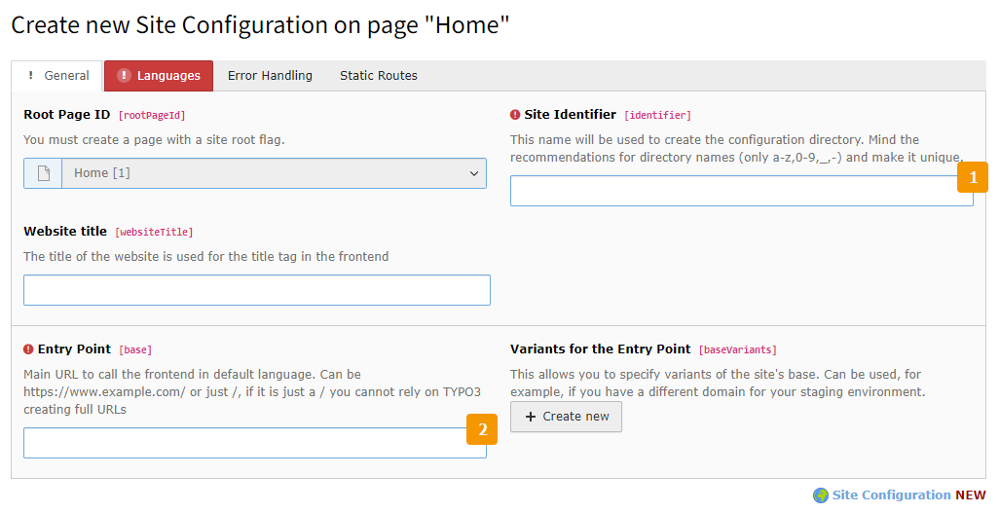
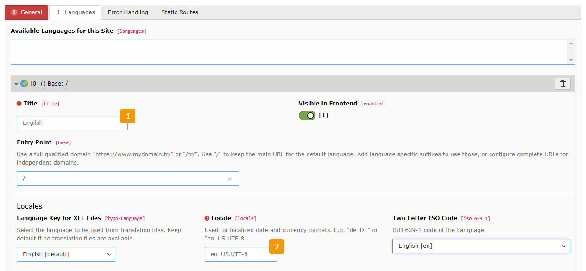

.. include:: /Includes.rst.txt
.. index:: Site handling; Create new
.. _sitehandling-create-new:

===================
Creating a new site
===================

A new site can be created for every page record that either **is on rootLevel (pid = 0)**
or **has `is_siteroot` flag set**. So at least one page is needed in the page tree.

To create a new site configuration, go to the `Site` module at `Site Management`.

   The Site module without any configured sites in the TYPO3 backend.

After pressing the "big blue button" an edit form is displayed:

   A new site creation form.

First, enter an identifier at (1).

.. hint::

    The site identifier is the name of the folder within `<project-root>/config/sites/` that will hold your
    configuration file(s). When choosing an identifier make sure to stick to ASCII but you may also
    use `-`, `_` and `.` for convenience. Examples: `main-site` and `langing-page`.

Then, enter a base for your site at (2).

.. tip::
    Be as specific as you can for your sites without losing flexibility. So, if you have a choice
    between using `https://www.example.org`, `www.example.org` or `/`, then choose `https://www.example.org`.

    This will make resolving pages more reliable as the chance for conflicts with other sites gets minimized.

On the next tab ("Languages") you are required to configure the default language settings for your site.
These will determine the default behavior - setting direction and lang tags in frontend as well as locale settings.

   Set default language settings

All you are required to set here is just the title (1) of the default language and the used locale (which should
be available on the server)(2) - but you should also check and correct all other settings, as they will automatically
be used for features like hreflang tags or displaying language flags in the backend.

That's all that is required for a new site.

.. tip::
    Did you know that just by having a site configuration you get page based routing out of the box? Neat, isn't it?

Learn more about configuring languages, error handling and routing in the corresponding chapters.
