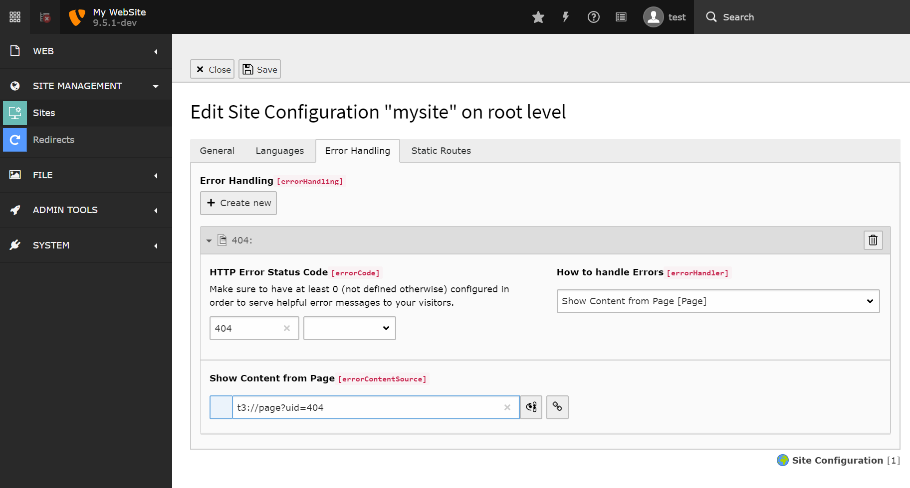

.. include:: ../../../Includes.txt

.. _sitehandling-errorHandling:

Error Handling
--------------

Error handling can be configured on site level and is automatically dependent on the current site and 
language.

The configuration consists of two parts:

- The HTTP Error Status Code that should be handled
- The Error Handler Configuration

You can define one error handler per HTTP error code and add a generic one that serves all error pages.

.. tip::
    No more trouble with translated 404 error pages. With the new site handling getting translated
    404 is easy!

   Add custom error handling.

Properties
^^^^^^^^^^

.. container:: table-row

   Property
        errorCode

   Data type
         int

   Description
         The HTTP (Error) Status Code to handle. The predefined list contains the most common errors,
         a free definition of other error codes is also possible. Special value `0` will take care of 
         all errors.

   Example
         404

.. container:: table-row

   Property
        errorHandler

   Data type
         string / enum

   Description
         Define how to handle these errors. May be `Fluid` for rendering a fluid template, 
         `page` for fetching content from a page or `PHP` for a custom implementation.

   Example
         Fluid

.. container:: table-row

   Property
        errorFluidTemplate

   Data type
         string

   Description
         *ONLY if errorHandler == `fluid`*: Path to fluid template file. Path may be 

         - absolute
         - relative to site root
         - starting with `EXT:` for files from an extension 

   Example
         EXT:sitepackage/Resources/Private/Templates/Error.html

.. container:: table-row

   Property
        errorFluidTemplatesRootPath
        errorFluidPartialsRootPath
        errorFluidLayoutsRootPath

   Data type
         string [optional]

   Description
         *ONLY if errorHandler == `fluid`*: Pathes to Fluid Templates, Partials and Layouts in
         case more flexibility is needed. 

   Example
         EXT:sitepackage/Resources/Private/Templates/
         EXT:sitepackage/Resources/Private/Partials/
         EXT:sitepackage/Resources/Private/Layouts/

.. container:: table-row

   Property
        errorContentSource

   Data type
         string 

   Description
         May be either an External URL or TYPO3 Page that will be fetched with curl and displayed
         in case of an error.

   Example
         t3://page?uid=123

.. container:: table-row

   Property
        errorPhpClassFQCN

   Data type
         string 

   Description
         Fully qualified class name of a custom error handler implementing `PageErrorHandlerInterface`.

   Example
         `My\Site\Error\Handler`
