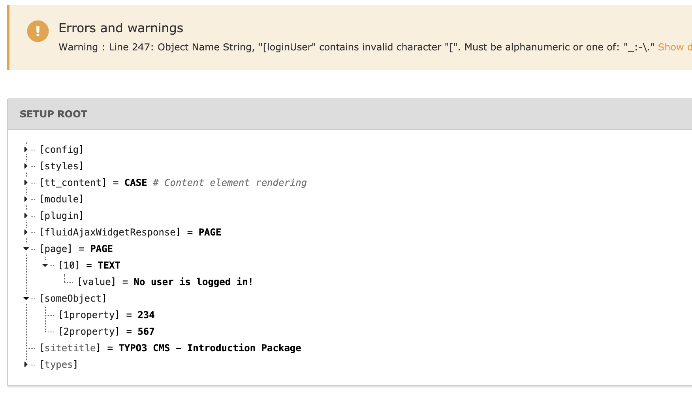

.. include:: ../../../Includes.txt

.. _typoscript-syntax-conditions:

==========
Conditions
==========

There is a *possibility* of using so called *conditions* in
TypoScript. Conditions are simple control structures, that evaluate to
TRUE or FALSE based on some criteria (externally validated) and
thereby determine, whether the TypoScript code following the condition
and ending where the next condition is found, should be parsed or not.

Examples of a condition could be:

- Is a usergroup set for the current session?

- Is it Monday?

- Is the GET parameter "&language=uk" set?

- Is it my mother's birthday?

- Do I feel lucky today?

Of these examples admittedly the first few are the most realistic. In
fact they are readily available in the context of TypoScript
Templates. But a condition can theoretically evaluate any circumstance
and return either TRUE or FALSE which subsequently means the parsing
of the TypoScript code that follows.

.. _typoscript-syntax-conditions-usage:

Where Conditions Can Be Used
============================

The *detection of conditions* is a part of the TypoScript syntax but
the *validation* of the condition content always relies on the
context where TypoScript is used. Therefore in plain syntax
highlighting (no context) conditions are just highlighted and nothing
more. In the context of TypoScript Templates there is a
:ref:`whole section of TSref <t3tsref:conditions>` which defines the
syntax of the condition contents for TypoScript Templates. For "Page
TSconfig" and "User TSconfig" conditions are implemented as well.
Basically they work the same way as conditions in TypoScript
templates do, but there are some small differences. For details see the
:ref:`chapter on conditions in TSconfig <t3tsconfig:conditions>`.

.. _typoscript-syntax-conditions-syntax:

The Syntax of Conditions
========================

A condition is written on its own line and is detected by :code:`[`
(square bracket) being the first character on that line:

.. code-block:: typoscript

   (Some TypoScript)

   [ condition 1 ][ condition 2 ]

   (Some TypoScript only parsed if condition 1 or condition 2 are met.)

   [GLOBAL]

   (Some TypoScript)

As you can see from this example, the line :code:`[GLOBAL]` also is a
condition. It is built into TypoScript and always returns TRUE. The
line :code:`[ condition 1 ][ condition 2 ]` is another condition.
If :code:`[ condition 1 ][ condition 2 ]` is TRUE, then the TypoScript in the
middle would be parsed until :code:`[GLOBAL]` (or :code:`[END]`) resets the
conditions. After that point the TypoScript is parsed for any case
again.

.. note::

   The condition line :code:`[ condition 1 ][ condition 2 ]` conveys
   the idea of *two conditions* being set, but from the TypoScript
   parser point of view the *whole line* is the condition. It is only
   when the condition is actually evaluated that the line content gets
   broken down into smaller units (:code:`[ condition 1 ]` and
   :code:`[ condition 2 ]`) which are individually evaluated and
   connected by a logical OR before they return the resulting
   TRUE or FALSE value. (That is all done within the class
   :code:`\TYPO3\CMS\Core\Configuration\TypoScript\ConditionMatching\AbstractConditionMatcher`.

Here is an example of some TypoScript (from the context of TypoScript
Templates) where another text is output if you are logged in or
working locally:

.. code-block:: typoscript

   pageObj.10 = TEXT
   pageObj.10.value = Hello World
   pageObj.10.stdWrap.case = upper

   [loginUser = *][IP = 127.0.0.01]
   pageObj.20 = TEXT
   pageObj.20 {
      value = Only for logged in users or local setup
      stdWrap.case = upper
   }

   [GLOBAL]
   pageObj.30 = TEXT
   pageObj.30.value = 

You can now use the Object Browser to actually see the difference in
the parsed object tree depending on whether the condition evaluates to
TRUE or FALSE (which can be simulated with that module as you can
see):

.. figure:: ../Images/ConditionsSyntax.png
   :alt: The Object Browser showing different objects depending on whether
         a condition is set or unset.

.. _typoscript-syntax-conditions-combine:

Combining Conditions
====================

As we saw above two or more tests can be written on the same line
and the condition will be TRUE if any of these tests matches. It
is also possible to use logical operators, for more complex
conditions. The following operators are available:

||
  Also available as :code:`OR`. This is equivalent to the default behaviour
  but makes it more explicit.

&&
  Also available as :code:`AND`. Takes precedence over :code:`||` (:code:`OR`).

.. _typoscript-syntax-else-condition:
.. _typoscript-syntax-end-condition:
.. _typoscript-syntax-global-condition:

The Special [ELSE], [END] and [GLOBAL] Conditions
=================================================

The special condition :code:`[ELSE]` which will return TRUE if
the previous condition returned FALSE. To end an :code:`[ELSE]` condition you
can use either :code:`[END]` or :code:`[GLOBAL]`. For all three conditions you can
also use them in lower case.

Here's an example of using the :code:`[ELSE]` condition (also in the context
of TypoScript Templates):

.. code-block:: typoscript

   page.typeNum = 0
   page = PAGE
   page.10 = TEXT

   [loginUser = *]
   page.10.value = Logged in

   [ELSE]
   page.10.value = Not logged in

   [END]

   page.10.stdWrap.wrap = <strong>|</strong>

Here we have one output text if a user is logged in and
another if not. No matter what the text is wrapped in a :code:`<strong>` tag,
because, as we can see, this wrap is added outside of the condition block
(e.g. after the :code:`[END]` condition).

.. figure:: ../Images/ConditionsSyntaxElse.png
   :alt: The TypoScript object browser showing the output of an ELSE condition.

The fact that you can "enable" the condition in the TypoScript Object
Browser is a facility provided to simulate the outcome of any
conditions you insert in a TypoScript Template. Whether or not the
conditions validate correctly is only verified by actually getting
(in this example) a logged in user and hitting the site.

Another example could be if you wanted to do something special in case
a bunch of conditions is NOT true. There's **no negate-character**,
but you could do this:

.. code-block:: typoscript

   [loginUser = *] || [usergroup = 3]
     # Enter nothing here!
   [ELSE]
     page.10.value = This text is only displayed if the conditions above are not TRUE!
   [END]

.. _typoscript-syntax-conditions-confinements:
.. _typoscript-syntax-conditions-braces:

Where to insert conditions in TypoScript?
=========================================

Conditions can be used *outside* of confinements (curly braces) only!

So, this is valid:

.. code-block:: typoscript

   someObject {
      1property = 234
   }
   [loginUser = *]
   someObject {
      2property = 567
   }

But this is **not valid:**

.. code-block:: typoscript

   someObject {
      1property = 234
      [loginUser = *]
      2property = 567
   }

When parsed with syntax highlighting you will see this error:

Clicking on the details link will show the following:

.. figure:: ../Images/ConditionsSyntaxErrorDetails.png
   :alt: The error details

This means that the line was perceived as a regular definition of
TypoScript and not as a condition.

.. _typoscript-syntax-the-global-condition:

The [GLOBAL] Condition
======================

The :code:`[GLOBAL]` special condition (which resets any previous
condition scope) is yet different, in that will be detected at
*any line* except within multiline value definitions.

.. code-block:: typoscript

   someObject {
      1property = 234
      [GLOBAL]
      2property = 567
   }

But you will still get some errors if you syntax highlight it:

.. figure:: ../Images/ConditionsSyntaxErrorGlobal.png
   :alt: Error after having used a GLOBAL condition at thw wrong place.

The reason for this is that the :code:`[GLOBAL]` condition aborts the
confinement started in the first line resulting in the first error
("... short of 1 end brace(s)"). The second error appears because the
end brace is now in excess since the "brace level" was reset by
:code:`[GLOBAL]`.

So, in summary; the special :code:`[global]` (or :code:`[GLOBAL]`) condition will
break TypoScript parsing within braces at any time and return to the
global scope (unless entered in a multiline value). This is true for
any TypoScript implementation whether other condition types are
possible or not. Therefore you can use :code:`[GLOBAL]` (put on a single line
for itself) to make sure that following TypoScript is correctly parsed
from the top level. This is normally done when TypoScript code from
various records is combined.

.. _typoscript-syntax-conditions-expression-language:

Custom Conditions With Symfony Expression Language
==================================================

Further information about how to extend TypoScript with your own custom conditions can be found within :ref:`symfony-expression-language`

.. _typoscript-syntax-conditions-summary:

Summary
=======

- Conditions are detected by :code:`[` as the first line character (whitespace
  ignored).

- Conditions are evaluated in relation to the context where TypoScript
  is used. They are widely used in TypoScript Templates and can also be
  used in Page TSconfig or User TSconfig.

- Special conditions :code:`[ELSE]`, :code:`[END]` and :code:`[GLOBAL]` exist.

- Conditions can be used outside of confinements (curly braces) only.
  However the :code:`[GLOBAL]` condition will always break a confinement if
  entered inside of one.

https://docs.typo3.org/m/typo3/reference-coreapi/master/en-us/ApiOverview/SymfonyExpressionLanguage/Index.html
