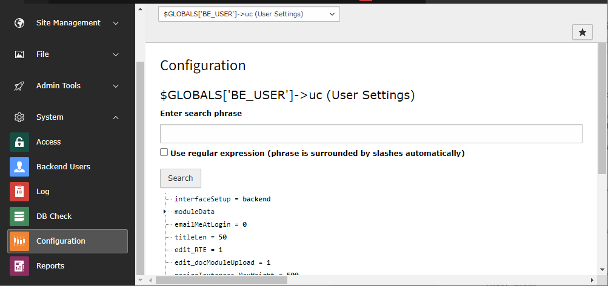

.. include:: ../../Includes.txt

.. _user-settings-checking:

==========================
Checking the Configuration
==========================

It is possible to view the configuration via the **System >
Configuration** module, just like for the :ref:`$TCA <t3tca:start>`.

   Viewing the User Settings configuration
