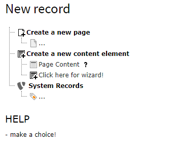

.. ==================================================
.. FOR YOUR INFORMATION
.. --------------------------------------------------
.. -*- coding: utf-8 -*- with BOM.

.. include:: ../../Includes.txt

.. _xclasses:

Extending classes (XCLASSes)
----------------------------

.. _xclasses-intro:

Introduction
^^^^^^^^^^^^

XCLASSing is a mechanism in TYPO3 CMS to extend classes or overwrite methods from the Core or extensions
with one's own code. This enables a developer to easily change a given functionality,
if other options like :ref:`hooks <hooks>`, signals or the extbase dependency injection mechanisms
do not work or do not exist.

However there are :ref:`several limitations <xclasses-limitations>`.

.. note::

   If you need a hook or a signal that does not exist, feel free to submit
   a feature request and - even better - `a patch https://docs.typo3.org/typo3cms/ContributionWorkflowGuide/`_.

.. _xclasses-mechanism:

How does it work?
^^^^^^^^^^^^^^^^^

In general every class instance in the Core and in extensions that stick to
the recommended :ref:`TYPO3 coding guidelines <t3cgl:start>` is created with the API call
:code:`\TYPO3\CMS\Core\Utility\GeneralUtility::makeInstance()`.
The methods takes care of singletons and also searches for existing XCLASSes.
If there is an XCLASS registered for the specific class that should be instantiated,
an instance of that XCLASS is returned instead of an instance of the original class.

.. _xclasses-limitations:

Limitations
^^^^^^^^^^^

- Using XCLASSes is risky: neither the core, nor extensions authors
  can guarantee that XCLASSes will not break if the underlying code changes
  (for example during upgrades). Be aware that your XCLASS can easily break
  and has to be maintained and fixed if the underlying code changes.
  If possible, you should use a hook instead of an XCLASS.

- XCLASSes do **not** work for static classes, static methods or final classes.

- There can be **only one** XCLASS per base class, but an XCLASS can be XCLASSed again.
  Be aware that such a construct is even more risky and definitely not advisable.

- A small number of Core classes are required very early during bootstrap
  before configuration and other things are loaded. XCLASSing those classes will fail if they are singletons
  or might have unexpected side-effects.

.. _xclasses-declaration:

Declaration
^^^^^^^^^^^

The :code:`$GLOBALS['TYPO3_CONF_VARS']['SYS']['Objects']` global array acts as a registry
of overloaded (XCLASSed) classes.

The syntax is as follows and is commonly located in an extension's :file:`ext_localconf.php` file::

       $GLOBALS['TYPO3_CONF_VARS']['SYS']['Objects']['TYPO3\\CMS\\Backend\\Controller\\NewRecordController'] = array(
       	'className' => 'Documentation\\Examples\\Xclass\\NewRecordController'
       );

In this example, we declare that the :code:`\TYPO3\CMS\Backend\Controller\NewRecordController` class
will be overridden by the :code:`\Documentation\Examples\Xclass\NewRecordController` class, the
latter being part of the "examples" extension.

.. note::

   In the above declaration, namespaced classes are entered without the leading
   backslash.

When XCLASSing a class that does not use namespaces, simply use that class' name
in the declaration.

.. note::

   To be compatible with older versions of TYPO3 CMS, you need to also add old-style
   XCLASS declarations. Please refer to older versions of this document for more
   information.

.. _xclasses-coding:

Coding practices
^^^^^^^^^^^^^^^^

The recommended way of writing an XCLASS is to **extend** the original class and
overwrite only the methods where a change is needed. This lowers the chances of the
XCLASS breaking after a code update.

.. tip::

   You're even safer if you can do your changes before or after the parent method
   and just call the latter with :code:`parent::`.

The example below extends the new record wizard screen. It first calls the original
method and then adds its own content::

   class NewRecordController extends \TYPO3\CMS\Backend\Controller\NewRecordController {
      function regularNew() {
      	parent::regularNew();
      	$this->code .= $this->doc->section(
      		$GLOBALS['LANG']->sL('LLL:EXT:examples/locallang.xml:help'),
      		$GLOBALS['LANG']->sL('LLL:EXT:examples/locallang.xml:make_choice'),
      		0,
      		1
      	);
      }
   }

The result can be seen here:

   A help section is added at the bottom of the new record wizard.
