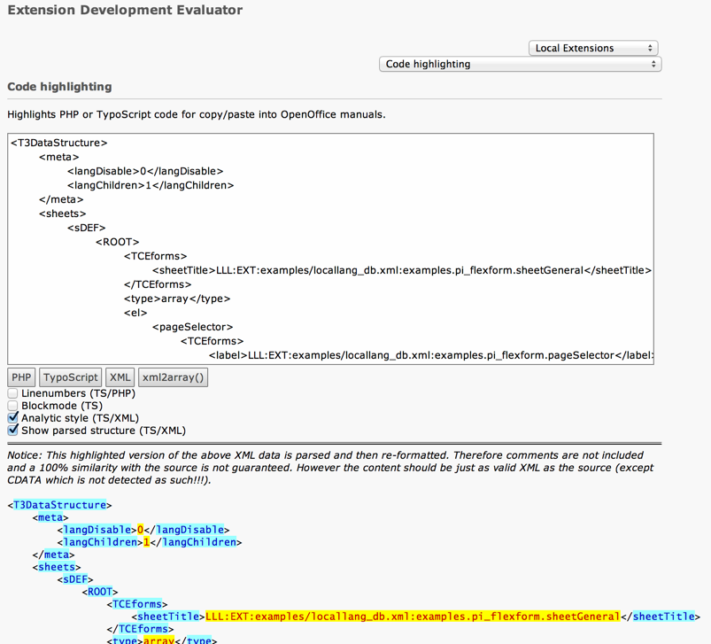

.. ==================================================
.. FOR YOUR INFORMATION
.. --------------------------------------------------
.. -*- coding: utf-8 -*- with BOM.

.. include:: ../../../Includes.txt

.. _t3ds-highlighting:

Syntax highlighting of a Data Structure
^^^^^^^^^^^^^^^^^^^^^^^^^^^^^^^^^^^^^^^

FlexForms being XML any code editor can help in checking out their
syntax and highlighting the various elements inside them. However
extension "extdeveval" contains additional tools and utilities
for highlightind such code. Just copy the DS XML content
into the form:

   Highlighted FlexForm code with various options turned on in extdeveval
