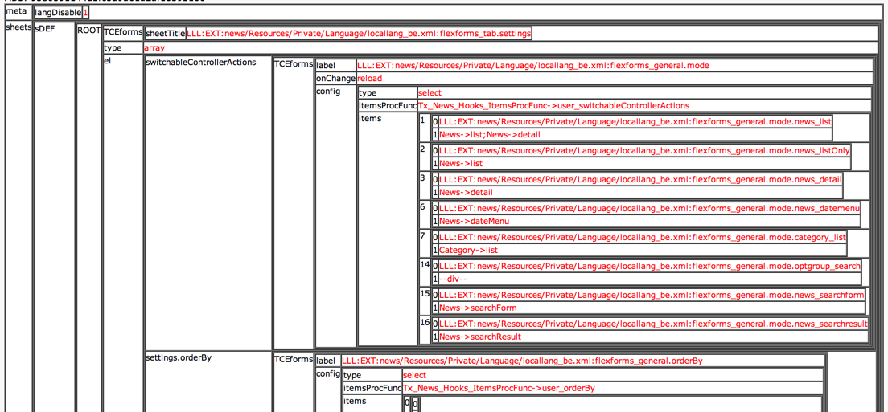
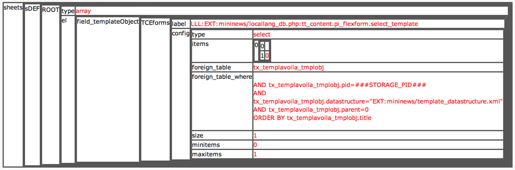

.. ==================================================
.. FOR YOUR INFORMATION
.. --------------------------------------------------
.. -*- coding: utf-8 -*- with BOM.

.. include:: ../../../Includes.txt

.. _t3ds-parsing:

Parsing a Data Structure
^^^^^^^^^^^^^^^^^^^^^^^^

You can convert a Data Structure XML document into a PHP array by the
function :code:`\TYPO3\CMS\Core\Utility\GeneralUtility::xml2array()`. If we do this with the
:ref:`simple example code <t3ds-elements-examples-mininews>` mentioned above,
we get the following result:

   Debug output produced by extdeveval

As you can see the format of the XML generated by
:code:`\TYPO3\CMS\Core\Utility\GeneralUtility::xml2array()` is designed to reflect the array structures
PHP can contain and thus the transformation to and from XML with the
functions :code:`\TYPO3\CMS\Core\Utility\GeneralUtility::array2xml_cs()` and :code:`\TYPO3\CMS\Core\Utility\GeneralUtility::xml2array()` is very
easy and quick.

.. _t3ds-parsing-sheets:

API functions for sheets
""""""""""""""""""""""""

If you have a DS with sheets inside you might need to resolve the
references:

.. code-block:: xml

   <T3DataStructure>
     <sheets>
           <sDEF>fileadmin/sheets/default_sheet.xml</sDEF>
       	   <s_welcome>fileadmin/sheets/welcome_sheet.xml</s_welcome>
     </sheets>
   </T3DataStructure>

This is done using :code:`\TYPO3\CMS\Core\Utility\GeneralUtility::resolveSheetDefInDS()` or
:code:`\TYPO3\CMS\Core\Utility\GeneralUtility::resolveAllSheetsInDS()`. In fact, even if you don't have
sheets in your file but just want to stay compatible with DS XML
*with* sheets you should use this function. For instance these
function calls will parse the DS into an array (screenshot above) and
resolve the sheet definition, in this case creating a default sheet
"sDEF" (screenshot below)::

      $treeDat = \TYPO3\CMS\Core\Utility\GeneralUtility::xml2array($inputCode);
      $treeDat = \TYPO3\CMS\Core\Utility\GeneralUtility::resolveAllSheetsInDS($treeDat);

   Note the "sheets" and "sDEF" dimensions added to the same structure as before

